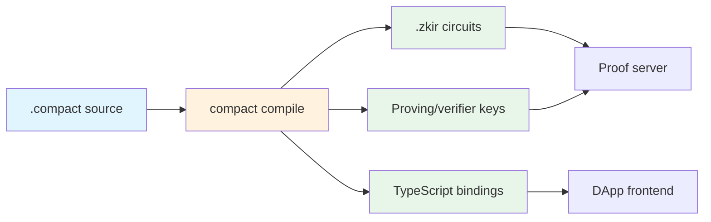

<!--
  Compact Language Reference
  Auto-assembled from outline + grammar + evidence
  Generated: 2026-03-06

  Deterministic sections marked *[deterministic]* are produced by automated
  tools with no AI involvement. AI-generated sections are marked *[AI-generated]*.
  See Appendix C for reproduction instructions.
-->

# Compact Language Reference — Outline

## 1. Introduction

### What is Compact?

High-level explanation: Compact is a domain-specific language for writing
zero-knowledge smart contracts on the Midnight blockchain. A Compact
contract defines:

1. **Ledger state** — publicly visible on-chain data (integers, bytes,
   Merkle trees, maps)
2. **Circuits** — zero-knowledge proof functions that validate state
   transitions. Each circuit takes public and private inputs, performs
   computation, and proves that the state transition is valid — without
   revealing the private inputs.
3. **Witnesses** — off-chain computations that produce the private inputs
   (witness data) for circuits. Witnesses can access private state and
   perform arbitrary computation; circuits can only perform ZK-provable
   computation.

### The three-part architecture

A Compact contract compiles to three artifacts:

| Artifact | What it contains |
|----------|-----------------|
| **ZKIR circuits** (`.zkir`) | Zero-knowledge circuit descriptions that define the constraint system |
| **TypeScript bindings** | JavaScript/TypeScript API for interacting with the contract |
| **Proving keys** | Cryptographic material for proof generation and verification |



### Three oracles for verification

This document uses three deterministic oracles:

**Oracle 1: The compiler.** Given a `.compact` source file, the compiler
either succeeds (producing ZKIR + TypeScript) or fails (producing an error
message). We use this oracle to verify:
- Which constructs compile successfully
- What ZKIR opcodes each construct produces
- What error messages invalid code generates

**Oracle 2: The execution oracle.** Given a compiled contract, witness
values, and a circuit name, the execution oracle loads the contract via the
Compact runtime, executes the circuit, and captures proof data. We use this
oracle to verify:
- That circuits execute correctly with given inputs
- That return values match expectations
- That ledger state changes as documented

**Oracle 3: The ZKIR checker.** Given a `.zkir` circuit and proof data,
the checker either accepts or rejects. We use this oracle (from Phase 1)
to verify that compiled circuits enforce the constraints the documentation
claims. Combined with the execution oracle, this closes the verification
loop: source → compile → execute → verify.

### How to read this document

This document follows the **Aletheia principle**, identical to the ZKIR
reference:

- **\*[deterministic]\*** — produced by automated tools, no AI. Fully
  reproducible.
- **\*[AI-generated]\*** — prose written by an AI to interpret
  deterministic evidence. The evidence it references is always shown
  nearby.

The compiler oracle results are the primary evidence. Every construct
entry shows: the source code that was compiled, whether it compiled
successfully, what ZKIR it produced, and (where meaningful) whether the
ZKIR enforces the expected constraints.

---

## 2. Formal Grammar *[deterministic]*

> Source: `upstream/compact/compiler/langs.ss`, extracted by
> `tools/extract-compact-grammar.mjs`

The complete formal grammar of the Lsrc language — the raw parsed
representation of Compact source code, as defined in the compiler source.
This section is auto-generated — every nonterminal, production form, and
type comes directly from the grammar definition.

## Summary

The Lsrc grammar defines the Compact source language with **32 nonterminals**, **6 terminal types**, and **102 production forms**.

Entry point: `Program`

## Terminal Types

These are the atomic value types used in Compact source-level constructs.

| Type | Grammar Symbols | Description |
|------|----------------|-------------|
| `field` | `nat` | Natural number / finite field element |
| `boolean` | `exported`, `sealed`, `pure-dcl`, `nominal` | Boolean flag |
| `symbol` | `var-name`, `name`, `module-name`, `function-name`, `contract-name`, `struct-name`, `enum-name`, `tvar-name`, `tsize-name`, `elt-name`, `ledger-field-name`, `type-name` | Symbolic identifier name |
| `string` | `prefix`, `mesg`, `opaque-type`, `file` | String literal value |
| `datum` | `datum` | Literal data value (boolean, field element, or bytevector) |
| `source-object` | `src` | Source location metadata (for compiler diagnostics) |

## Nonterminal Overview

| Category | Nonterminals | Count |
|----------|-------------|-------|
| Program Structure | `Program`, `Program-Element` | 2 |
| Declarations | `Include`, `Module-Definition`, `Import-Declaration`, `Import-Element`, `Import-Name`, `Export-Declaration`, `Ledger-Declaration`, `Ledger-Constructor`, `Circuit-Definition`, `Witness-Declaration`, `External-Contract-Declaration`, `External-Contract-Circuit`, `Structure-Definition`, `Enum-Definition`, `Type-Definition` | 15 |
| Statements | `Block`, `Statement` | 2 |
| Expressions | `Expression` | 1 |
| Types | `Type`, `Type-Ref`, `Type-Size`, `Type-Argument` | 4 |
| Patterns | `Pattern` | 1 |
| Functions | `Function` | 1 |
| Other Nonterminals | `Type-Param`, `Pattern-Argument`, `Argument`, `Const-Binding`, `Tuple-Argument`, `New-Field` | 6 |

## Program Structure

### Program (`p`)

- `program src pelt* ...` => `program #f pelt* ...`

### Program-Element (`pelt`)

Forms: `incld` | `mdefn` | `idecl` | `xdecl` | `ldecl` | `lconstructor` | `cdefn` | `wdecl` | `ecdecl` | `structdef` | `enumdef` | `tdefn`

## Declarations

### Include (`incld`)

- `include src file` => `include file`

### Module-Definition (`mdefn`)

- `module src exported? module-name (type-param* ...) pelt* ...` => `module exported? module-name type-param*,... #f pelt* ...`

### Import-Declaration (`idecl`)

- `import src import-name (targ* ...) prefix` => `import import-name targ*,0,... #f prefix`
- `import src import-name (targ* ...) prefix (ielt* ...)` => `import import-name targ*,0,... #f prefix #f ielt*,...`

### Import-Element (`ielt`)

- `src name name^` => `name name^`

### Import-Name (`import-name`)

Forms: `module-name` | `file`

### Export-Declaration (`xdecl`)

- `export src (src* name*) ...` => `export #f name* ...`

### Ledger-Declaration (`ldecl`)

- `public-ledger-declaration src exported? sealed? ledger-field-name type` => `public-ledger-declaration exported? sealed? #f ledger-field-name #f type`

### Ledger-Constructor (`lconstructor`)

- `constructor src (parg* ...) blck` => `constructor parg*,0,... #f blck`

### Circuit-Definition (`cdefn`)

- `circuit src exported? pure-dcl? function-name (type-param* ...) (parg* ...) type blck` => `circuit exported? pure-dcl? function-name type-param*,... parg*,0,... 4 type #f blck`

### Witness-Declaration (`wdecl`)

- `witness src exported? function-name (type-param* ...) (arg* ...) type` => `witness exported? function-name type-param*,... arg*,0,... 4 type`

### External-Contract-Declaration (`ecdecl`)

- `external-contract src exported? contract-name ecdecl-circuit* ...` => `external-contract exported? contract-name #f ecdecl-circuit* ...`

### External-Contract-Circuit (`ecdecl-circuit`)

- `src pure-dcl function-name (arg* ...) type` => `pure-dcl function-name arg*,0,... 4 type`

### Structure-Definition (`structdef`)

- `struct src exported? struct-name (type-param* ...) arg* ...` => `struct exported? struct-name type-param*,... #f arg* ...`

### Enum-Definition (`enumdef`)

- `enum src exported? enum-name elt-name elt-name* ...` => `enum exported? enum-name #f elt-name #f elt-name* ...`

### Type-Definition (`tdefn`)

- `typedef src exported? nominal? type-name (type-param* ...) type` => `typedef exported? nominal? type-name type-param*,... #f type`

## Statements

### Block (`blck`)

- `block src stmt* ...` => `block #f stmt* ...`

### Statement (`stmt`)

- `statement-expression src expr` => `expr`
- `return src expr` => `return expr`
- `return src` => `return tuple`
- `const src cbinding cbinding* ...` => `const cbinding,0,cbinding*,...`
- `if src expr stmt1 stmt2` => `if expr 3 stmt1 3 stmt2`
- `for src var-name expr stmt` => `for var-name expr #f stmt`
- `blck`

## Expressions

### Expression (`expr`, `index`)

- `quote src datum` => `datum`
- `var-ref src var-name` => `var-name`
- `default src type` => `default type`
- `if src expr0 expr1 expr2` => `if expr0 3 expr1 3 expr2`
- `elt-ref src expr elt-name` => `elt-ref expr elt-name`
- `elt-call src expr elt-name expr* ...` => `elt-call expr elt-name expr* ...`
- `= src expr1 expr2` => `= expr1 expr2`
- `+= src expr1 expr2` => `+= expr1 3 expr2`
- `-= src expr1 expr2` => `-= expr1 3 expr2`
- `tuple src tuple-arg* ...` => `tuple tuple-arg* ...`
- `bytes src bytes-arg* ...` => `bytes bytes-arg* ...`
- `tuple-ref src expr index` => `tuple-ref #f expr #f index`
- `tuple-slice src expr index tsize` => `tuple-slice #f expr #f index #f tsize`
- `+ src expr1 expr2` => `+ expr1 expr2`
- `- src expr1 expr2` => `- expr1 expr2`
- `* src expr1 expr2` => `* expr1 expr2`
- `or src expr1 expr2` => `or expr1 3 expr2`
- `and src expr1 expr2` => `and expr1 4 expr2`
- `not src expr` => `not expr`
- `< src expr1 expr2` => `< expr1 expr2`
- `<= src expr1 expr2` => `<= expr1 3 expr2`
- `> src expr1 expr2` => `> expr1 expr2`
- `>= src expr1 expr2` => `>= expr1 3 expr2`
- `== src expr1 expr2` => `== expr1 3 expr2`
- `!= src expr1 expr2` => `!= expr1 3 expr2`
- `map src fun expr expr* ...` => `map fun #f expr #f expr* ...`
- `fold src fun expr0 expr expr* ...` => `fold fun #f expr0 #f expr #f expr* ...`
- `call src fun expr* ...` => `call fun #f expr* ...`
- `new src tref new-field* ...` => `new tref #f new-field* ...`
- `seq src expr* ... expr` => `seq #f expr* ... #f expr`
- `cast src type expr` => `cast type #f expr`
- `disclose src expr` => `disclose expr`
- `assert src expr mesg` => `assert #f expr #f mesg`

## Types

### Type (`type`)

- `tref`
- `tboolean src` => `tboolean`
- `tfield src` => `tfield`
- `tunsigned src tsize` => `tunsigned tsize` *range from 0 to 2^{tsize}-1*
- `tunsigned src tsize tsize^` => `tunsigned tsize tsize^` *range from tsize (inclusive) to tsize^ (exclusive)*
- `tbytes src tsize` => `tbytes tsize`
- `topaque src opaque-type` => `topaque opaque-type`
- `tvector src tsize type` => `tvector tsize type`
- `ttuple src type* ...` => `ttuple type* ...`
- `tundeclared` => `tundeclared`

### Type-Ref (`tref`)

- `type-ref src tvar-name targ* ...` => `type-ref tvar-name #f targ* ...`

### Type-Size (`tsize`)

- `type-size src nat` => `nat`
- `type-size-ref src tsize-name` => `type-size-ref tsize-name`

### Type-Argument (`targ`)

- `targ-size src nat` => `nat`
- `targ-type src type` => `type`

## Patterns

### Pattern (`pattern`)

- `var-name`
- `tuple src (maybe pattern?*) ...` => `pattern?* ...`
- `struct src (pattern* elt-name*) ...` => `pattern*,elt-name* ...`

## Functions

### Function (`fun`)

- `fref src function-name` => `function-name`
- `fref src function-name (targ* ...)` => `fref function-name #f targ* ...`
- `circuit src (parg* ...) type blck` => `circuit parg*,0,... 4 type #f blck`

## Other Nonterminals

### Type-Param (`type-param`)

- `nat-valued src tvar-name` => `nat-valued tvar-name`
- `type-valued src tvar-name` => `tvar-name`

### Pattern-Argument (`parg`)

- `src pattern type` => `bracket pattern type`

### Argument (`arg`)

- `src var-name type` => `bracket var-name type`

### Const-Binding (`cbinding`)

- `src pattern type expr` => `bracket pattern 0 type 0 expr`

### Tuple-Argument (`tuple-arg`, `bytes-arg`)

- `single src expr` => `expr`
- `spread src expr` => `spread expr`

### New-Field (`new-field`)

- `spread src expr` => `spread expr`
- `positional src expr` => `expr`
- `named src elt-name expr` => `elt-name expr`

---

## Source Traceability

This document was generated by parsing the `define-language/pretty Lsrc` form in `upstream/compact/compiler/langs.ss`. Every nonterminal, production form, and terminal type above comes directly from the formal grammar — no manual transcription, no AI interpretation.

Related source files for deeper understanding:

| File | Purpose |
|------|---------|
| `compiler/langs.ss` | Formal grammar (this document's source) |
| `compiler/circuit-passes.ss` | Circuit lowering (Compact -> Lflattened -> Lzkir) |
| `compiler/compiler.md` | Internal compiler documentation |
| `doc/lang-ref.mdx` | Language reference (feeds docs.midnight.network) |


---

## 3. Type System

### 3.1 Primitive Types

#### `Boolean`

**Grammar** *[deterministic]*

```
(tboolean src) => (tboolean)
```

**Description** *[AI-generated]*

The boolean type represents truth values: `true` or `false`. In the
compiled ZKIR, booleans are field elements constrained to be 0 or 1
via `constrain_to_boolean`.

**Test program** *[deterministic]*

`compact-tests/types/boolean-literal.compact` — minimal circuit returning
a boolean literal.

**Compilation evidence** *[deterministic]*

| Test | Source | Expected | Verdict |
|------|--------|----------|---------|
| `boolean-literal: true compiles` | `compact-tests/types/boolean-literal.compact` | compile-success | COMPILED |
| `boolean-literal: false compiles` | `compact-tests/types/boolean-false.compact` | compile-success | COMPILED |

**ZKIR mapping** *[AI-generated]*

Boolean literals compile to `load_imm` with value `"01"` (true) or `"00"`
(false). Boolean operations (`and`, `or`, `not`) compile to combinations
of `mul`, `add`, `neg`, and `constrain_to_boolean`.

---

#### `Field`

**Grammar** *[deterministic]*

```
(tfield src) => (tfield)
```

**Description** *[AI-generated]*

The field type represents a raw element of the BLS12-381 scalar field —
the same field that all ZKIR values inhabit. Field values have no range
constraint; they can be any element of the ~2^253-element field.

In most cases, developers use bounded types (`Uint`, `Bytes`) instead.
`Field` is used when the full field range is needed, e.g., for
cryptographic operations or hash outputs.

**Test program** *[deterministic]*

`compact-tests/types/field-literal.compact` — circuit performing field
arithmetic.

**Compilation evidence** *[deterministic]*

| Test | Source | Expected | Verdict |
|------|--------|----------|---------|
| `field-literal: field arithmetic compiles` | `compact-tests/types/field-literal.compact` | compile-success | COMPILED |

---

#### `Uint<N>` (Unsigned Integer)

**Grammar** *[deterministic]*

```
(tunsigned src tsize)                  ; range from 0 to 2^{tsize}-1
(tunsigned src tsize tsize^)           ; range from tsize (inclusive) to tsize^ (exclusive)
```

**Description** *[AI-generated]*

`Uint<N>` represents an unsigned integer fitting in N bits (range
`[0, 2^N - 1]`). The two-argument form `Uint<lo, hi>` constrains the
range to `[lo, hi)`.

In ZKIR, `Uint` values are field elements with an associated
`constrain_bits` instruction that enforces the bit-width bound.
Without this constraint, the value could be any field element.

Common sizes: `Uint<8>` (byte), `Uint<32>`, `Uint<64>`.

**Test program** *[deterministic]*

`compact-tests/types/uint-types.compact` — circuits using various Uint
widths.

**Compilation evidence** *[deterministic]*

| Test | Source | Expected | Verdict |
|------|--------|----------|---------|
| `uint-types: Uint8 and Uint32 compile` | `compact-tests/types/uint-types.compact` | compile-success | COMPILED |

**ZKIR mapping** *[AI-generated]*

`Uint<N>` values compile with `constrain_bits var N` to enforce the range
constraint. Arithmetic on Uint values includes the range check on the
result.

---

#### `Bytes<N>` (Fixed-Length Byte Array)

**Grammar** *[deterministic]*

```
(tbytes src tsize)
```

**Description** *[AI-generated]*

`Bytes<N>` represents a fixed-length byte array of N bytes. In ZKIR,
bytes are encoded as field elements using `div_mod_power_of_two` (for
extraction) and `reconstitute_field` (for assembly).

**Test program** *[deterministic]*

`compact-tests/types/bytes-type.compact` — circuit using Bytes values.

**Compilation evidence** *[deterministic]*

| Test | Source | Expected | Verdict |
|------|--------|----------|---------|
| `bytes-type: Bytes<32> compiles` | `compact-tests/types/bytes-type.compact` | compile-success | COMPILED |

---

#### Opaque Types

**Grammar** *[deterministic]*

```
(topaque src opaque-type)
```

**Description** *[AI-generated]*

Opaque types represent platform-provided types that Compact treats as
black boxes. The primary example is cryptographic types like
`Jubjub` (an elliptic curve point type).

---

### 3.2 Compound Types

#### Tuples

**Grammar** *[deterministic]*

```
(ttuple src type* ...)
```

**Description** *[AI-generated]*

Tuples are fixed-length, heterogeneous collections. `[Boolean, Uint<8>]`
is a 2-tuple of a boolean and a byte. The empty tuple `[]` is Compact's
unit type.

**Test program** *[deterministic]*

`compact-tests/types/tuple-type.compact`

**Compilation evidence** *[deterministic]*

| Test | Source | Expected | Verdict |
|------|--------|----------|---------|
| `tuple-type: tuple construction and access` | `compact-tests/types/tuple-type.compact` | compile-success | COMPILED |

---

#### Vectors

**Grammar** *[deterministic]*

```
(tvector src tsize type)
```

**Description** *[AI-generated]*

`Vector<N, T>` is a fixed-length array of N elements of type T. Unlike
tuples, all elements have the same type. Vectors support `map` and `fold`
operations.

**Execution evidence** *[deterministic]*

| Test | Witnesses | Expected | Execution | ZKIR |
|------|-----------|----------|-----------|------|
| `vector: v[0] + v[1] = 10` | a=7, b=3 | accept | EXECUTED | ACCEPTED |
| `vector: tampered output rejects` | a=7, b=3 | reject | EXECUTED | REJECTED |

---

#### Structs

**Grammar** *[deterministic]*

```
(struct src exported? struct-name (type-param* ...) arg* ...)
```

**Description** *[AI-generated]*

Named record types with named fields. Structs can be parameterized
with type parameters. Fields are accessed by name using `.fieldName`
syntax.

**Execution evidence** *[deterministic]*

| Test | Witnesses | Expected | Execution | ZKIR |
|------|-----------|----------|-----------|------|
| `struct: field access p.x + p.y = 30` | x=10, y=20 | accept | EXECUTED | ACCEPTED |
| `struct: tampered output rejects` | x=10, y=20 | reject | EXECUTED | REJECTED |

---

#### Enums

**Grammar** *[deterministic]*

```
(enum src exported? enum-name elt-name elt-name* ...)
```

**Description** *[AI-generated]*

Simple enumeration types — a fixed set of named variants with no
associated data. Enums compile to integer tags.

**Execution evidence** *[deterministic]*

| Test | Witnesses | Expected | Execution | ZKIR |
|------|-----------|----------|-----------|------|
| `enum: Color.red == Color.red is true` | is_red=true | accept | EXECUTED | ACCEPTED |
| `enum: Color.green == Color.red is false` | is_red=false | accept | EXECUTED | ACCEPTED |

---

### 3.3 Type References and Type Parameters

**Grammar** *[deterministic]*

```
; Type reference with optional type arguments
(type-ref src tvar-name targ* ...)

; Type parameters (for generic types/circuits)
(nat-valued src tvar-name)     ; size parameter (like N in Uint<N>)
(type-valued src tvar-name)    ; type parameter (like T in Vector<N,T>)

; Type arguments
(targ-size src nat)            ; size argument (a number)
(targ-type src type)           ; type argument (a type)
```

**Description** *[AI-generated]*

Compact supports generic types and circuits parameterized by types
and/or sizes. Type references (`type-ref`) refer to named types with
optional type arguments. Type parameters come in two flavors:
`nat-valued` (for sizes like bit widths) and `type-valued` (for types
like element types).

**Execution evidence** *[deterministic]*

| Test | Witnesses | Expected | Execution | ZKIR |
|------|-----------|----------|-----------|------|
| `ref-type: generic type Maybe<Field> works at runtime` | get_val=0 | accept | EXECUTED | ACCEPTED |

---

## 4. Expressions

### 4.1 Literals and References

#### Literals (`quote`)

**Grammar** *[deterministic]*

```
(quote src datum)
```

**Description** *[AI-generated]*

Literal values: integer constants, boolean constants, byte array
constants. In the compiled ZKIR, literals become `load_imm` instructions.

**Execution evidence** *[deterministic]*

| Test | Witnesses | Expected | Execution | ZKIR |
|------|-----------|----------|-----------|------|
| `quote: literal 42 returned correctly` | (none) | accept | EXECUTED | ACCEPTED |

---

#### Variable References (`var-ref`)

**Grammar** *[deterministic]*

```
(var-ref src var-name)
```

**Description** *[AI-generated]*

References to previously defined variables (circuit parameters, `const`
bindings, loop variables). In ZKIR, these become references to earlier
instruction outputs.

**Execution evidence** *[deterministic]*

| Test | Witnesses | Expected | Execution | ZKIR |
|------|-----------|----------|-----------|------|
| `var-ref: variable reference returns bound value` | get_val=99 | accept | EXECUTED | ACCEPTED |

---

#### Default Values (`default`)

**Grammar** *[deterministic]*

```
(default src type)
```

**Description** *[AI-generated]*

The default value for a type: `false` for Boolean, `0` for integers,
zero-filled for Bytes. Used primarily in ledger constructors.

**Execution evidence** *[deterministic]*

| Test | Witnesses | Expected | Execution | ZKIR |
|------|-----------|----------|-----------|------|
| `default: default<Field> is 0` | (none) | accept | EXECUTED | ACCEPTED |
| `default-jubjub: default<JubjubPoint> == default<JubjubPoint> is true` | (none) | accept | EXECUTED | ACCEPTED |

---

### 4.2 Arithmetic

#### Addition (`+`)

**Grammar** *[deterministic]*

```
(+ src expr1 expr2)
```

**Description** *[AI-generated]*

Field addition. For `Uint` types, the result is range-checked to fit
in the appropriate bit width.

**ZKIR mapping:** `add` (plus `constrain_bits` for bounded types).

**Execution evidence** *[deterministic]*

| Test | Witnesses | Expected | Execution | ZKIR |
|------|-----------|----------|-----------|------|
| `addition: 3 + 4 = 7` | a=3, b=4 | accept | EXECUTED | ACCEPTED |
| `addition: tampered output rejects` | a=3, b=4 | reject | EXECUTED | REJECTED |
| `addition: tampered witness rejects` | a=3, b=4 | reject | EXECUTED | REJECTED |

---

#### Subtraction (`-`)

**Grammar** *[deterministic]*

```
(- src expr1 expr2)
```

**ZKIR mapping:** `add` + `neg` (subtraction is addition of the negation).

**Execution evidence** *[deterministic]*

| Test | Witnesses | Expected | Execution | ZKIR |
|------|-----------|----------|-----------|------|
| `subtraction: 10 - 3 = 7` | a=10, b=3 | accept | EXECUTED | ACCEPTED |
| `subtraction: 5 - 5 = 0` | a=5, b=5 | accept | EXECUTED | ACCEPTED |
| `subtraction: tampered witness rejects` | a=10, b=3 | reject | EXECUTED | REJECTED |

---

#### Multiplication (`*`)

**Grammar** *[deterministic]*

```
(* src expr1 expr2)
```

**ZKIR mapping:** `mul` (plus `constrain_bits` for bounded types).

**Execution evidence** *[deterministic]*

| Test | Witnesses | Expected | Execution | ZKIR |
|------|-----------|----------|-----------|------|
| `multiplication: 3 * 5 = 15` | a=3, b=5 | accept | EXECUTED | ACCEPTED |
| `multiplication: 42 * 0 = 0` | a=42, b=0 | accept | EXECUTED | ACCEPTED |
| `multiplication: tampered witness rejects` | a=3, b=5 | reject | EXECUTED | REJECTED |

---

### 4.3 Comparison

**Description** *[AI-generated]*

Compact has two families of comparison operators with fundamentally
different type constraints:

**Equality** (`==`, `!=`) works on any type — Field, Boolean, Uint,
structs, enums. Two values of the same type can always be tested for
equality. In ZKIR, this compiles to `test_eq`, which compares field
elements directly.

**Ordering** (`<`, `<=`, `>`, `>=`) works **only on `Uint<N>` types**.
This is a mathematical necessity, not an arbitrary restriction: all
values in a ZKIR circuit are elements of a prime field of order ~2^253,
and there is no meaningful "less than" for arbitrary field elements.
(Which is "smaller" — 1, or `r-1`? In the field, `r-1` is the additive
inverse of 1, not a "large number.") But for values known to be in the
range `[0, 2^N - 1]`, standard integer comparison is well-defined. The
compiler enforces this statically: attempting `<` on `Field` values
produces *"incompatible combination of types Field and Field for
relational operator."*

In ZKIR, all ordering operators compile to the `less_than` instruction,
which takes a `bits` parameter specifying the comparison range. The
compiler desugars `<=`, `>`, and `>=` into `<` with operand swapping
and/or boolean negation:

| Source | ZKIR desugaring | Swaps operands? | Status |
|--------|----------------|----------------|--------|
| `a < b` | `less_than(a, b, bits)` | No | OK |
| `a <= b` | `NOT(less_than(b, a, bits))` | **Yes** | **Bug: fails when a != b** |
| `a > b` | `less_than(b, a, bits)` | **Yes** | **Bug: fails when a != b** |
| `a >= b` | `NOT(less_than(a, b, bits))` | No | OK |

#### Equality (`==`)

**Grammar** *[deterministic]*

```
(== src expr1 expr2)
```

**ZKIR mapping:** `test_eq`

**Execution evidence** *[deterministic]*

| Test | Witnesses | Expected | Execution | ZKIR |
|------|-----------|----------|-----------|------|
| `comparison: 42 == 42 is true` | a=42, b=42 | accept | EXECUTED | ACCEPTED |
| `comparison: 42 == 99 is false` | a=42, b=99 | accept | EXECUTED | ACCEPTED |

---

#### Inequality (`!=`)

**Grammar** *[deterministic]*

```
(!= src expr1 expr2)
```

**ZKIR mapping:** `test_eq` + boolean negation

**Execution evidence** *[deterministic]*

| Test | Witnesses | Expected | Execution | ZKIR |
|------|-----------|----------|-----------|------|
| `comparison: 42 != 99 is true` | a=42, b=99 | accept | EXECUTED | ACCEPTED |

---

#### Less than (`<`)

**Grammar** *[deterministic]*

```
(< src expr1 expr2)
```

**ZKIR mapping:** `less_than`

**Execution evidence** *[deterministic]*

| Test | Witnesses | Expected | Execution | ZKIR |
|------|-----------|----------|-----------|------|
| `ordering: 3 < 10 is true` | a=3, b=10 | accept | EXECUTED | ACCEPTED |
| `ordering: 5 < 5 is false` | a=5, b=5 | accept | EXECUTED | ACCEPTED |

---

#### Less than or equal (`<=`)

**Grammar** *[deterministic]*

```
(<= src expr1 expr2)
```

**Note — compiler bug:** The `<=` operator is affected by the same
operand-swap bug as `>`. See the `>` section below for details. The
test below uses equal operands (5 <= 5), which masks the bug. With
unequal operands (e.g., 3 <= 10), verification fails.

**Execution evidence** *[deterministic]*

| Test | Witnesses | Expected | Execution | ZKIR |
|------|-----------|----------|-----------|------|
| `ordering: 5 <= 5 is true` | a=5, b=5 | accept | EXECUTED | ACCEPTED |

---

#### Greater than (`>`)

**Grammar** *[deterministic]*

```
(> src expr1 expr2)
```

**Note — compiler bug:** The `>` and `<=` operators compile and execute
correctly at the JavaScript runtime level, but their compiled ZKIR
circuits fail verification with "Communications commitment mismatch"
**whenever the two operands have different values**. When operands are
equal, the bug is masked. The root cause is that both operators swap
their operands in the ZKIR path (`circuit-passes.ss`) but the TypeScript
path emits them in the original order. The swap causes the ZKIR circuit
to evaluate operands in a different order than the JS runtime, creating
different execution traces and a commitment hash mismatch. The `<` and
`>=` operators do not swap operands and work correctly for all inputs.
See `greater-than-issue.md` for full reproduction steps and analysis.

---

#### Greater than or equal (`>=`)

**Grammar** *[deterministic]*

```
(>= src expr1 expr2)
```

**Execution evidence** *[deterministic]*

| Test | Witnesses | Expected | Execution | ZKIR |
|------|-----------|----------|-----------|------|
| `ordering: 5 >= 5 is true` | a=5, b=5 | accept | EXECUTED | ACCEPTED |

---

### 4.4 Boolean Logic

#### And (`and`)

**Grammar** *[deterministic]*

```
(and src expr1 expr2)
```

**Description** *[AI-generated]*

Short-circuit boolean AND. In ZKIR, this compiles to multiplication
(`mul`) — since for booleans (0 or 1), `a AND b = a * b`.

**Execution evidence** *[deterministic]*

| Test | Witnesses | Expected | Execution | ZKIR |
|------|-----------|----------|-----------|------|
| `boolean: true && true = true` | a=true, b=true | accept | EXECUTED | ACCEPTED |
| `boolean: true && false = false` | a=true, b=false | accept | EXECUTED | ACCEPTED |

---

#### Or (`or`)

**Grammar** *[deterministic]*

```
(or src expr1 expr2)
```

**Description** *[AI-generated]*

Short-circuit boolean OR. In ZKIR, this compiles to
`a + b - a * b` — the boolean OR formula.

**Execution evidence** *[deterministic]*

| Test | Witnesses | Expected | Execution | ZKIR |
|------|-----------|----------|-----------|------|
| `boolean: true \|\| false = true` | a=true, b=false | accept | EXECUTED | ACCEPTED |
| `boolean: false \|\| false = false` | a=false, b=false | accept | EXECUTED | ACCEPTED |

---

#### Not (`not`)

**Grammar** *[deterministic]*

```
(not src expr)
```

**Description** *[AI-generated]*

Boolean negation. In ZKIR: `1 - x` (implemented as `add(neg(x), 1)`
or via `cond_select`).

**Execution evidence** *[deterministic]*

| Test | Witnesses | Expected | Execution | ZKIR |
|------|-----------|----------|-----------|------|
| `boolean: !true = false` | a=true | accept | EXECUTED | ACCEPTED |

---

### 4.5 Conditional

#### If Expression (`if`)

**Grammar** *[deterministic]*

```
(if src expr0 expr1 expr2)
```

**Description** *[AI-generated]*

Conditional expression: `if (cond) then_expr else else_expr`. Both
branches are always evaluated (this is a circuit — no runtime
branching). The result is selected based on the condition.

**ZKIR mapping:** `cond_select` (the conditional multiplexer).

**Execution evidence** *[deterministic]*

| Test | Witnesses | Expected | Execution | ZKIR |
|------|-----------|----------|-----------|------|
| `conditional: flag=true selects first value` | flag=true, a=42, b=99 | accept | EXECUTED | ACCEPTED |
| `conditional: flag=false selects second value` | flag=false, a=42, b=99 | accept | EXECUTED | ACCEPTED |
| `conditional: tampered output rejects` | flag=true, a=42, b=99 | reject | EXECUTED | REJECTED |

---

### 4.6 Data Construction and Access

#### Tuple Construction (`tuple`)

**Grammar** *[deterministic]*

```
(tuple src tuple-arg* ...)
```

**Execution evidence** *[deterministic]*

| Test | Witnesses | Expected | Execution | ZKIR |
|------|-----------|----------|-----------|------|
| `tuple: index t[1] returns second element` | a=10, b=20, c=30 | accept | EXECUTED | ACCEPTED |
| `tuple: slice<2>(t, 1) returns elements 1 and 2` | a=10, b=20, c=30 | accept | EXECUTED | ACCEPTED |
| `tuple: tampered output rejects` | a=10, b=20, c=30 | reject | EXECUTED | REJECTED |

---

#### Bytes Construction (`bytes`)

**Grammar** *[deterministic]*

```
(bytes src bytes-arg* ...)
```

**Execution evidence** *[deterministic]*

| Test | Witnesses | Expected | Execution | ZKIR |
|------|-----------|----------|-----------|------|
| `bytes: Bytes<4> passthrough accepted` | bytes={hex:"01020304"} | accept | EXECUTED | ACCEPTED |
| `bytes: tampered output rejects` | bytes={hex:"01020304"} | reject | EXECUTED | REJECTED |

---

#### Tuple Indexing (`tuple-ref`)

**Grammar** *[deterministic]*

```
(tuple-ref src expr index)
```

**Execution evidence** *[deterministic]*

| Test | Witnesses | Expected | Execution | ZKIR |
|------|-----------|----------|-----------|------|
| `tuple: index t[1] returns second element` | a=10, b=20, c=30 | accept | EXECUTED | ACCEPTED |

---

#### Tuple Slicing (`tuple-slice`)

**Grammar** *[deterministic]*

```
(tuple-slice src expr index tsize)
```

**Execution evidence** *[deterministic]*

| Test | Witnesses | Expected | Execution | ZKIR |
|------|-----------|----------|-----------|------|
| `tuple: slice<2>(t, 1) returns elements 1 and 2` | a=10, b=20, c=30 | accept | EXECUTED | ACCEPTED |

---

#### Struct Field Access (`elt-ref`)

**Grammar** *[deterministic]*

```
(elt-ref src expr elt-name)
```

**Execution evidence** *[deterministic]*

| Test | Witnesses | Expected | Execution | ZKIR |
|------|-----------|----------|-----------|------|
| `struct: field access p.x + p.y = 30` | x=10, y=20 | accept | EXECUTED | ACCEPTED |
| `struct: tampered output rejects` | x=10, y=20 | reject | EXECUTED | REJECTED |

---

#### Method Call (`elt-call`)

**Grammar** *[deterministic]*

```
(elt-call src expr elt-name expr* ...)
```

**Execution evidence** *[deterministic]*

| Test | Witnesses | Expected | Execution | ZKIR |
|------|-----------|----------|-----------|------|
| `maybe: some<Field>(42).is_some is true` | val=42 | accept | EXECUTED | ACCEPTED |
| `maybe: default<Maybe<Field>>.is_some is false` | val=0 | accept | EXECUTED | ACCEPTED |

---

#### Struct/Type Construction (`new`)

**Grammar** *[deterministic]*

```
(new src tref new-field* ...)
```

**Execution evidence** *[deterministic]*

| Test | Witnesses | Expected | Execution | ZKIR |
|------|-----------|----------|-----------|------|
| `struct: field access p.x + p.y = 30` | x=10, y=20 | accept | EXECUTED | ACCEPTED |

---

### 4.7 Assignment

#### Simple Assignment (`=`)

**Grammar** *[deterministic]*

```
(= src expr1 expr2)
```

**Execution evidence** *[deterministic]*

| Test | Witnesses | Expected | Execution | ZKIR |
|------|-----------|----------|-----------|------|
| `assignment: const binding sum = 10` | a=7, b=3 | accept | EXECUTED | ACCEPTED |

---

#### Add-Assign (`+=`)

**Grammar** *[deterministic]*

```
(+= src expr1 expr2)
```

**Execution evidence** *[deterministic]*

| Test | Witnesses | Expected | Execution | ZKIR |
|------|-----------|----------|-----------|------|
| `compound-assign: count += 10 accepted` | (none) | accept | EXECUTED | ACCEPTED |

---

#### Subtract-Assign (`-=`)

**Grammar** *[deterministic]*

```
(-= src expr1 expr2)
```

**Execution evidence** *[deterministic]*

| Test | Witnesses | Expected | Execution | ZKIR |
|------|-----------|----------|-----------|------|
| `compound-assign: count += 10; count -= 3 accepted` | (none) | accept | EXECUTED | ACCEPTED |

---

### 4.8 Higher-Order Operations

#### Map (`map`)

**Grammar** *[deterministic]*

```
(map src fun expr expr* ...)
```

**Description** *[AI-generated]*

Applies a function to each element of one or more vectors, producing
a new vector. In ZKIR, this unrolls to N applications of the function
(since vector lengths are known at compile time).

**Execution evidence** *[deterministic]*

| Test | Witnesses | Expected | Execution | ZKIR |
|------|-----------|----------|-----------|------|
| `map: doubling [10, 20, 30] sums to 120` | a=10, b=20, c=30 | accept | EXECUTED | ACCEPTED |

---

#### Fold (`fold`)

**Grammar** *[deterministic]*

```
(fold src fun expr0 expr expr* ...)
```

**Description** *[AI-generated]*

Reduces a vector to a single value using an accumulator function.
Like `map`, this unrolls at compile time.

**Execution evidence** *[deterministic]*

| Test | Witnesses | Expected | Execution | ZKIR |
|------|-----------|----------|-----------|------|
| `fold: sum of [10, 20, 30] = 60` | a=10, b=20, c=30 | accept | EXECUTED | ACCEPTED |
| `fold: tampered output rejects` | a=10, b=20, c=30 | reject | EXECUTED | REJECTED |

---

#### Function Call (`call`)

**Grammar** *[deterministic]*

```
(call src fun expr* ...)
```

**Execution evidence** *[deterministic]*

| Test | Witnesses | Expected | Execution | ZKIR |
|------|-----------|----------|-----------|------|
| `maybe: some<Field>(42).is_some is true` | val=42 | accept | EXECUTED | ACCEPTED |

---

### 4.9 Special Expressions

#### Sequential Composition (`seq`)

**Grammar** *[deterministic]*

```
(seq src expr* ... expr)
```

**Execution evidence** *[deterministic]*

| Test | Witnesses | Expected | Execution | ZKIR |
|------|-----------|----------|-----------|------|
| `seq-block: val + 2 with block scoping` | val=10 | accept | EXECUTED | ACCEPTED |
| `seq-block: tampered output rejects` | val=10 | reject | EXECUTED | REJECTED |

---

#### Type Cast (`cast`)

**Grammar** *[deterministic]*

```
(cast src type expr)
```

**Description** *[AI-generated]*

Explicit type conversion. Used for coercion between compatible types
(e.g., `Uint<8>` to `Field`, or `Uint<8>` to `Uint<32>`).

**Execution evidence** *[deterministic]*

| Test | Witnesses | Expected | Execution | ZKIR |
|------|-----------|----------|-----------|------|
| `type-cast: Uint<8> as Uint<32> accepted` | val=42 | accept | EXECUTED | ACCEPTED |
| `type-cast: tampered output rejects` | val=42 | reject | EXECUTED | REJECTED |

---

#### Disclose (`disclose`)

**Grammar** *[deterministic]*

```
(disclose src expr)
```

**Description** *[AI-generated]*

Makes a private value public. This is the fundamental privacy boundary
operation in Compact — it moves a value from the private transcript to
the public transcript.

**Execution evidence** *[deterministic]*

| Test | Witnesses | Expected | Execution | ZKIR |
|------|-----------|----------|-----------|------|
| `disclose: private value disclosed correctly` | secret=42 | accept | EXECUTED | ACCEPTED |
| `disclose: tampered witness rejects` | secret=42 | reject | EXECUTED | REJECTED |

---

#### Assert (`assert`)

**Grammar** *[deterministic]*

```
(assert src expr mesg)
```

**Description** *[AI-generated]*

Runtime assertion. Evaluates the expression and aborts with the given
message if it is false. In ZKIR, this compiles to the `assert`
instruction (which enforces the boolean value is 1).

**ZKIR mapping:** `assert`

**Execution evidence** *[deterministic]*

| Test | Witnesses | Expected | Execution | ZKIR |
|------|-----------|----------|-----------|------|
| `assert-expr: true accepted` | flag=true | accept | EXECUTED | ACCEPTED |
| `assert-expr: false rejects at JS level` | flag=false | execute-error | EXECUTE-ERROR | — |

---

## 5. Statements

### `statement-expression`

**Grammar** *[deterministic]*

```
(statement-expression src expr)
```

An expression used as a statement (for its side effects, typically
assignment).

**Execution evidence** *[deterministic]*

| Test | Witnesses | Expected | Execution | ZKIR |
|------|-----------|----------|-----------|------|
| `statement-expression: side effects execute correctly` | (none) | accept | EXECUTED | ACCEPTED |

---

### `return`

**Grammar** *[deterministic]*

```
(return src expr)        ; return with value
(return src)             ; return unit (empty tuple)
```

Returns a value from a circuit. The returned value becomes a circuit
output.

**ZKIR mapping:** `output`

**Execution evidence** *[deterministic]*

| Test | Witnesses | Expected | Execution | ZKIR |
|------|-----------|----------|-----------|------|
| `return: computed value captured as circuit output` | get_a=10, get_b=5 | accept | EXECUTED | ACCEPTED |

---

### `const`

**Grammar** *[deterministic]*

```
(const src cbinding cbinding* ...)
```

Introduces one or more constant bindings. Bindings can destructure
via patterns (tuple destructuring, struct destructuring).

**Execution evidence** *[deterministic]*

| Test | Witnesses | Expected | Execution | ZKIR |
|------|-----------|----------|-----------|------|
| `assignment: const binding sum = 10` | a=7, b=3 | accept | EXECUTED | ACCEPTED |
| `seq-block: val + 2 with block scoping` | val=10 | accept | EXECUTED | ACCEPTED |

---

### `if` (statement)

**Grammar** *[deterministic]*

```
(if src expr stmt1 stmt2)
```

Conditional statement. Both branches are always evaluated (as in
the expression form).

**Execution evidence** *[deterministic]*

| Test | Witnesses | Expected | Execution | ZKIR |
|------|-----------|----------|-----------|------|
| `if-statement: true branch returns val + 1` | flag=true, val=10 | accept | EXECUTED | ACCEPTED |
| `if-statement: false branch returns val` | flag=false, val=10 | accept | EXECUTED | ACCEPTED |

---

### `for`

**Grammar** *[deterministic]*

```
(for src var-name expr stmt)
```

Loop over a vector. The loop is unrolled at compile time (since
vector lengths are known statically).

**Execution evidence** *[deterministic]*

| Test | Witnesses | Expected | Execution | ZKIR |
|------|-----------|----------|-----------|------|
| `for-loop: 4 iterations accepted` | (none) | accept | EXECUTED | ACCEPTED |

---

### `block`

**Grammar** *[deterministic]*

```
(block src stmt* ...)
```

A sequence of statements.

**Execution evidence** *[deterministic]*

| Test | Witnesses | Expected | Execution | ZKIR |
|------|-----------|----------|-----------|------|
| `seq-block: val + 2 with block scoping` | val=10 | accept | EXECUTED | ACCEPTED |

---

## 6. Declarations

### `circuit`

**Grammar** *[deterministic]*

```
(circuit src exported? pure-dcl? function-name (type-param* ...) (parg* ...) type blck)
```

**Description** *[AI-generated]*

A circuit declaration defines a zero-knowledge proof function. Circuits
are the core unit of Compact — each circuit compiles to a ZKIR circuit
that can be proven and verified on-chain.

Parameters:
- `exported?` — whether the circuit is callable from outside the module
- `pure-dcl?` — whether the circuit is pure (no ledger side effects)
- `function-name` — the circuit's name
- `type-param*` — generic type parameters
- `parg*` — input parameters (with patterns and types)
- `type` — return type
- `blck` — the circuit body

---

### `witness`

**Grammar** *[deterministic]*

```
(witness src exported? function-name (type-param* ...) (arg* ...) type)
```

**Description** *[AI-generated]*

A witness declaration defines an off-chain computation that produces
private inputs for circuits. Witnesses run in the user's browser/node,
not on-chain. They have access to private state and can perform
arbitrary computation.

**Execution evidence** *[deterministic]*

| Test | Description | Expected | Execution | ZKIR |
|------|-------------|----------|-----------|------|
| `guarded: correct key accepted` | Correct secret key witness authorizes increment | accept | EXECUTED | ACCEPTED |
| `guarded: wrong key rejects at JS level` | Wrong key causes JS-level circuit assertion failure | execute-error | EXECUTE-ERROR | — |
| `guarded: tampered witness rejects` | Tampered privateTranscript rejected by ZKIR checker | reject | EXECUTED | REJECTED |

---

### `ledger`

**Grammar** *[deterministic]*

```
(public-ledger-declaration src exported? sealed? ledger-field-name type)
```

**Description** *[AI-generated]*

A ledger declaration defines on-chain state. Each ledger field is
publicly visible on the blockchain. The `sealed?` flag indicates
whether the field can be modified by external contracts.

**Execution evidence** *[deterministic]*

| Test | Description | Expected | Execution | ZKIR |
|------|-------------|----------|-----------|------|
| `counter: valid increment` | Counter ledger field incremented by 1 | accept | EXECUTED | ACCEPTED |
| `compound-assign: count += 10 accepted` | Counter incremented by 10 | accept | EXECUTED | ACCEPTED |
| `compound-assign: count += 10; count -= 3 accepted` | Counter increment then decrement | accept | EXECUTED | ACCEPTED |

---

### `constructor`

**Grammar** *[deterministic]*

```
(constructor src (parg* ...) blck)
```

**Description** *[AI-generated]*

The constructor initializes ledger state when the contract is deployed.

**Execution evidence** *[deterministic]*

| Test | Witnesses | Expected | Execution | ZKIR |
|------|-----------|----------|-----------|------|
| `constructor: initializes counter to 5` | (none) | accept | EXECUTED | ACCEPTED |

---

### `module`

**Grammar** *[deterministic]*

```
(module src exported? module-name (type-param* ...) pelt* ...)
```

**Description** *[AI-generated]*

A module declaration groups related types and functions under a namespace.
Modules are accessed via the dollar-prefix import pattern: `import M prefix
$P;` makes `$PType` available. Modules can export structs, enums, and
other declarations.

**Execution evidence** *[deterministic]*

| Test | Witnesses | Expected | Execution | ZKIR |
|------|-----------|----------|-----------|------|
| `module: prefixed access to module-scoped struct` | get_a=7, get_b=3 | accept | EXECUTED | ACCEPTED |

---

### `import` / `export` / `include`

**Grammar** *[deterministic]*

```
(import src import-name (targ* ...) prefix)
(import src import-name (targ* ...) prefix (ielt* ...))
(export src (src* name*) ...)
include "./path"
```

**Description** *[AI-generated]*

`import` brings types and functions from the standard library or from
modules into scope. `export` makes declarations visible outside the
contract. `include` inlines declarations from another `.compact` file
(path is relative, `.compact` extension added automatically).

**Execution evidence** *[deterministic]*

| Test | Witnesses | Expected | Execution | ZKIR |
|------|-----------|----------|-----------|------|
| `import: stdlib some<Field>().is_some works at runtime` | get_flag=true, get_val=42 | accept | EXECUTED | ACCEPTED |
| `export: exported circuit add_ten callable and correct` | get_val=7 | accept | EXECUTED | ACCEPTED |
| `include: included Pair struct works at runtime` | get_a=12, get_b=8 | accept | EXECUTED | ACCEPTED |

---

### `struct` / `enum` / `typedef`

**Grammar** *[deterministic]*

```
(struct src exported? struct-name (type-param* ...) arg* ...)
(enum src exported? enum-name elt-name elt-name* ...)
(typedef src exported? nominal? type-name (type-param* ...) type)
```

**Execution evidence** *[deterministic]*

| Test | Witnesses | Expected | Execution | ZKIR |
|------|-----------|----------|-----------|------|
| `struct: field access p.x + p.y = 30` | get_x=10, get_y=20 | accept | EXECUTED | ACCEPTED |
| `enum: Color.red == Color.red is true` | get_is_red=true | accept | EXECUTED | ACCEPTED |
| `typedef: type alias MyField works at runtime` | get_val=41 | accept | EXECUTED | ACCEPTED |

---

### `external-contract`

**Grammar** *[deterministic]*

```
(external-contract src exported? contract-name ecdecl-circuit* ...)
```

**Description** *[AI-generated]*

Declares an external contract interface — the circuit signatures of
another contract that this contract can call.

**Execution evidence** *[deterministic]*

| Test | Witnesses | Expected | Execution | ZKIR |
|------|-----------|----------|-----------|------|
| `external-contract: contract with external dependency accepts` | get_val=42 | accept | EXECUTED | ACCEPTED |
| `external-contract: tampered witness rejects` | get_val=42 | reject | EXECUTED | REJECTED |

---

## 7. Standard Library

> Source: `upstream/compact/compiler/standard-library.compact` (353 lines)

The Compact standard library (`CompactStandardLibrary`) provides ~30
exports covering generic data types, Merkle trees, elliptic curves,
kernel types, token operations, and block-time queries. Every Compact
program begins with `import CompactStandardLibrary;` to access these.

The exports fall into three testability tiers:

| Tier | Description | Verification |
|------|-------------|-------------|
| **Pure computation** | No kernel calls — standard Compact operations only | Full execution + ZKIR verification |
| **Kernel struct types** | Type definitions used by kernel operations | Construction + field access verified |
| **Kernel-dependent** | Calls `kernel.mintShielded`, `kernel.balance*`, etc. | Full execution + ZKIR verification (kernel ops execute locally with simulated state) |

---

### 7.1 Generic Data Types

#### `Maybe<T>`

**Source** *[deterministic]*

```compact
export struct Maybe<T> {
  is_some: Boolean;
  value: T;
}

export circuit some<T>(value: T): Maybe<T> {
  return Maybe<T>{ is_some: true, value: value };
}

export circuit none<T>(): Maybe<T> {
  return Maybe<T>{ is_some: false, value: default<T> };
}
```

**Description** *[AI-generated]*

`Maybe<T>` is the standard optional type — a struct with an `is_some`
boolean flag and a `value` field. When `is_some` is false, `value`
contains `default<T>` (zero/false for the type). The `some<T>()` and
`none<T>()` constructor circuits provide a clean API.

**Execution evidence** *[deterministic]*

| Test | Witnesses | Expected | Execution | ZKIR |
|------|-----------|----------|-----------|------|
| `maybe: some<Field>(42).is_some is true` | val=42 | accept | EXECUTED | ACCEPTED |
| `maybe: default<Maybe<Field>>.is_some is false` | val=0 | accept | EXECUTED | ACCEPTED |

---

#### `Either<A, B>`

**Source** *[deterministic]*

```compact
export struct Either<A, B> {
  is_left: Boolean;
  left: A;
  right: B;
}

export circuit left<A, B>(value: A): Either<A, B> {
  return Either<A, B>{ is_left: true, left: value, right: default<B> };
}

export circuit right<A, B>(value: B): Either<A, B> {
  return Either<A, B>{ is_left: false, left: default<A>, right: value };
}
```

**Description** *[AI-generated]*

`Either<A, B>` is the standard sum type — it carries either a `left`
value of type `A` or a `right` value of type `B`, distinguished by
the `is_left` boolean flag. The unused branch contains `default<T>`.

`Either` is used extensively in the standard library for representing
choices: `Either<ZswapCoinPublicKey, ContractAddress>` for shielded
token recipients, `Either<ContractAddress, UserAddress>` for unshielded
recipients, and `shieldedBurnAddress()` returns a left Either.

**Execution evidence** *[deterministic]*

| Test | Witnesses | Expected | Execution | ZKIR |
|------|-----------|----------|-----------|------|
| `stdlib-either: left constructor returns value` | flag=true, val=42 | accept | EXECUTED | ACCEPTED |
| `stdlib-either: right constructor returns value` | flag=false, val=99 | accept | EXECUTED | ACCEPTED |
| `stdlib-either: tampered witness rejects` | flag=true, val=42 | reject | EXECUTED | REJECTED |

---

### 7.2 Merkle Trees

**Source** *[deterministic]*

```compact
export struct MerkleTreeDigest { field: Field; }

export struct MerkleTreePathEntry {
  sibling: MerkleTreeDigest;
  goes_left: Boolean;
}

export struct MerkleTreePath<#n, T> {
  leaf: T;
  path: Vector<n, MerkleTreePathEntry>;
}

export circuit merkleTreePathRoot<#n, T>(
  path: MerkleTreePath<n, T>
): MerkleTreeDigest { ... }

export circuit merkleTreePathRootNoLeafHash<#n>(
  path: MerkleTreePath<n, Bytes<32>>
): MerkleTreeDigest { ... }
```

**Description** *[AI-generated]*

Merkle tree types support on-chain authenticated data structures.
`MerkleTreeDigest` wraps a single `Field` element (the hash digest).
`MerkleTreePath<n, T>` represents a proof path of depth `n` for a
leaf of type `T`, where each `MerkleTreePathEntry` contains a sibling
hash and a direction flag.

`merkleTreePathRoot` computes the root hash from a path by hashing
the leaf with `persistentHash`, then folding the path entries using
`transientHash`. `merkleTreePathRootNoLeafHash` skips the leaf
hashing step (for pre-hashed `Bytes<32>` leaves).

The internal helper `merkleTreePathEntryRoot` uses `cond_select` to
order left/right children based on the `goes_left` flag, then hashes
them with `transientHash`.

**Execution evidence** *[deterministic]*

| Test | Witnesses | Expected | Execution | ZKIR |
|------|-----------|----------|-----------|------|
| `stdlib-merkle: merkleTreePathRoot deterministic root` | leaf=0x0102..., sibling=42, goes_left=true | accept | EXECUTED | ACCEPTED |
| `stdlib-merkle: tampered root output rejects` | leaf=0x0102..., sibling=42, goes_left=true | reject | EXECUTED | REJECTED |
| `stdlib-merkle: merkleTreePathRootNoLeafHash deterministic root` | leaf=0x0102..., sibling=42, goes_left=true | accept | EXECUTED | ACCEPTED |
| `stdlib-merkle: goes_left flag affects root` | leaf=0x0102..., sibling=42 | accept | EXECUTED | ACCEPTED |
| `stdlib-merkle-depth2: merkleTreePathRoot with 2-level path` | leaf=0x0102..., sib0=100, sib1=200 | accept | EXECUTED | ACCEPTED |
| `stdlib-merkle-depth2: tampered root output rejects` | leaf=0x0102..., sib0=100, sib1=200 | reject | EXECUTED | REJECTED |
| `stdlib-merkle-depth2: merkleTreePathRootNoLeafHash with 2-level path` | leaf=0x0102..., sib0=100, sib1=200 | accept | EXECUTED | ACCEPTED |

The first four tests use depth-1 paths (`MerkleTreePath<1, Bytes<32>>`):
the accept test returns the computed root field value; the tamper test
proves the root is constrained; the no-leaf-hash variant skips leaf
hashing; and the direction test proves `goes_left` affects the root.

The last three tests use depth-2 paths (`MerkleTreePath<2, Bytes<32>>`),
verifying that the fold composes hash levels correctly across multiple
entries. The depth-2 root circuit has 34 instructions (vs 28 for depth-1),
confirming the fold unrolls an additional hash step. The tamper test
proves the multi-level composition is constrained.

---

### 7.3 Elliptic Curves

**Source** *[deterministic]*

```compact
export new type JubjubPoint = Opaque<'JubjubPoint'>;
```

**Description** *[AI-generated]*

`JubjubPoint` is a nominal opaque type representing a point on the
Jubjub elliptic curve — a twisted Edwards curve embedded in BLS12-381.
As an opaque type, its internal representation is managed by the
runtime; Compact code interacts with it only through ZKIR operations
like `ec_mul`, `ec_mul_generator`, and `hash_to_curve`.

---

### 7.4 Kernel Types

**Source** *[deterministic]*

```compact
export struct ContractAddress { bytes: Bytes<32>; }
export struct ZswapCoinPublicKey { bytes: Bytes<32>; }
export struct UserAddress { bytes: Bytes<32>; }
export struct MerkleTreeDigest { field: Field; }

export struct ShieldedCoinInfo {
  nonce: Bytes<32>;
  color: Bytes<32>;
  value: Uint<128>;
}

export struct QualifiedShieldedCoinInfo {
  nonce: Bytes<32>;
  color: Bytes<32>;
  value: Uint<128>;
  mt_index: Uint<64>;
}

export struct ShieldedSendResult {
  change: Maybe<ShieldedCoinInfo>;
  sent: ShieldedCoinInfo;
}
```

**Description** *[AI-generated]*

These struct types model the entities in Midnight's token and
identity system:

- **`ContractAddress`** — a 32-byte on-chain contract identifier.
  Used by `kernel.self()` to identify the current contract.
- **`ZswapCoinPublicKey`** — a 32-byte public key for receiving
  shielded tokens via the Zswap protocol.
- **`UserAddress`** — a 32-byte user identifier for unshielded
  token transfers.
- **`ShieldedCoinInfo`** — a shielded coin: nonce (unique
  identifier), color (token type hash), and value (amount up to
  2^128).
- **`QualifiedShieldedCoinInfo`** — extends `ShieldedCoinInfo` with
  a Merkle tree index (`mt_index`) for coins already committed
  on-chain.
- **`ShieldedSendResult`** — the return type of `sendShielded()`:
  an optional change coin and the sent coin.

All single-field structs (`ContractAddress`, `ZswapCoinPublicKey`,
`UserAddress`) follow the newtype pattern — they wrap `Bytes<32>`
to provide type safety.

**Execution evidence** *[deterministic]*

| Test | Witnesses | Expected | Execution | ZKIR |
|------|-----------|----------|-----------|------|
| `stdlib-structs: ContractAddress and ZswapCoinPublicKey construction` | bytes=aabb...00 | accept | EXECUTED | ACCEPTED |
| `stdlib-user-addr: UserAddress construction and field access` | bytes=aabb...00 | accept | EXECUTED | ACCEPTED |
| `stdlib-coin: ShieldedCoinInfo construction and field access` | nonce=0x0102..., color=0xaabb..., value=1000 | accept | EXECUTED | ACCEPTED |
| `stdlib-coin: tampered ShieldedCoinInfo output rejects` | nonce=0x0102..., color=0xaabb..., value=1000 | reject | EXECUTED | REJECTED |
| `stdlib-coin: QualifiedShieldedCoinInfo construction and field access` | nonce, color, value=5000, mt_index=42 | accept | EXECUTED | ACCEPTED |
| `stdlib-coin: ShieldedSendResult with nested Maybe<ShieldedCoinInfo>` | nonce, color, value=2500 | accept | EXECUTED | ACCEPTED |

---

### 7.5 Helper Circuits (Pure)

These circuits perform pure computation — no kernel calls. They can
be fully execution-tested and ZKIR-verified.

#### `nativeToken()`

**Source** *[deterministic]*

```compact
export circuit nativeToken(): Bytes<32> {
  return pad(32, "");
}
```

**Description** *[AI-generated]*

Returns the native token identifier — 32 zero bytes. This is the
"color" (token type) for Midnight's native DUST token. Used as the
default token type in balance queries and transfers.

**Execution evidence** *[deterministic]*

| Test | Witnesses | Expected | Execution | ZKIR |
|------|-----------|----------|-----------|------|
| `stdlib-native-token: nativeToken() returns 32 zero bytes` | (none) | accept | EXECUTED | ACCEPTED |

---

#### `tokenType(domain_sep, contractAddress)`

**Source** *[deterministic]*

```compact
export circuit tokenType(
  domain_sep: Bytes<32>,
  contractAddress: ContractAddress
): Bytes<32> {
  return persistentCommit<Vector<2, Bytes<32>>>(
    [domain_sep, contractAddress.bytes],
    pad(32, "midnight:derive_token")
  );
}
```

**Description** *[AI-generated]*

Derives a unique token type identifier by hashing a domain separator
and the contract's address with `persistentCommit`. This is how
custom token types are created — each contract can mint tokens with
a unique color derived from its own address and a domain separator.

The hash is deterministic: same domain separator + same contract
address always produces the same token type.

**Execution evidence** *[deterministic]*

| Test | Witnesses | Expected | Execution | ZKIR |
|------|-----------|----------|-----------|------|
| `stdlib-token-type: deterministic hash` | domain=0102...00, addr=aabb...00 | accept | EXECUTED | ACCEPTED |

---

#### `evolveNonce(index, nonce)`

**Source** *[deterministic]*

```compact
export circuit evolveNonce(
  index: Uint<128>,
  nonce: Bytes<32>
): Bytes<32> {
  return upgradeFromTransient(transientHash<Vector<3, Field>>([
    "midnight:kernel:nonce_evolve" as Field,
    index as Field,
    degradeToTransient(nonce),
  ]));
}
```

**Description** *[AI-generated]*

Derives a new nonce from an existing nonce and an index. This is
used to generate unique nonces for change coins and derived tokens
without reusing the original nonce. The domain separator
`"midnight:kernel:nonce_evolve"` prevents cross-protocol collisions.

The hash is deterministic: same index + same nonce always produces
the same evolved nonce.

**Execution evidence** *[deterministic]*

| Test | Witnesses | Expected | Execution | ZKIR |
|------|-----------|----------|-----------|------|
| `stdlib-evolve-nonce: deterministic hash` | nonce=aabb...00 | accept | EXECUTED | ACCEPTED |

---

#### `shieldedBurnAddress()`

**Source** *[deterministic]*

```compact
export circuit shieldedBurnAddress():
  Either<ZswapCoinPublicKey, ContractAddress> {
  return left<ZswapCoinPublicKey, ContractAddress>(
    default<ZswapCoinPublicKey>
  );
}
```

**Description** *[AI-generated]*

Returns the "burn address" for shielded tokens — a left
`Either<ZswapCoinPublicKey, ContractAddress>` containing the default
(all-zero) public key. Sending shielded tokens to this address
effectively burns them, since no one holds the private key for the
zero public key.

**Execution evidence** *[deterministic]*

| Test | Witnesses | Expected | Execution | ZKIR |
|------|-----------|----------|-----------|------|
| `stdlib-burn-addr: shieldedBurnAddress().is_left is true` | (none) | accept | EXECUTED | ACCEPTED |

---

### 7.6 Block-Time Queries

**Source** *[deterministic]*

```compact
export circuit blockTimeLt(time: Uint<64>): Boolean {
  return kernel.blockTimeLessThan(time);
}
export circuit blockTimeGte(time: Uint<64>): Boolean {
  return !blockTimeLt(time);
}
export circuit blockTimeGt(time: Uint<64>): Boolean {
  return kernel.blockTimeGreaterThan(time);
}
export circuit blockTimeLte(time: Uint<64>): Boolean {
  return !blockTimeGt(time);
}
```

**Description** *[AI-generated]*

Four circuits for comparing the current block timestamp against a
threshold. `blockTimeLt` and `blockTimeGt` are the primitives
(calling `kernel.blockTimeLessThan` and `kernel.blockTimeGreaterThan`
respectively); `blockTimeGte` and `blockTimeLte` are derived via
boolean negation.

These are used for time-locked contracts — for example, requiring
that a withdrawal can only happen after a certain timestamp, or that
a vote must be cast before a deadline.

**Note:** These circuits call `kernel.blockTimeLessThan` and
`kernel.blockTimeGreaterThan`. Despite using kernel operations, the
Compact runtime supports local execution — no blockchain required.

**Compilation evidence** *[deterministic]*

| Test | Source | Expected | Verdict |
|------|--------|----------|---------|
| `stdlib-block-time: block-time query circuits compile` | `declarations/stdlib-block-time.compact` | compile-success | COMPILED |

**Execution evidence** *[deterministic]*

| Test | Witnesses | Expected | Execution | ZKIR |
|------|-----------|----------|-----------|------|
| `stdlib-block-time: blockTimeLt(1000) executes` | (none) | accept | EXECUTED | ACCEPTED |
| `stdlib-block-time: blockTimeGte(1000) executes` | (none) | accept | EXECUTED | ACCEPTED |
| `stdlib-block-time: blockTimeGt(1000) executes` | (none) | accept | EXECUTED | ACCEPTED |
| `stdlib-block-time: blockTimeLte(1000) executes` | (none) | accept | EXECUTED | ACCEPTED |

---

### 7.7 Shielded Token Operations

**Source** *[deterministic]*

```compact
export circuit mintShieldedToken(
  domain_sep: Bytes<32>, value: Uint<64>,
  nonce: Bytes<32>,
  recipient: Either<ZswapCoinPublicKey, ContractAddress>
): ShieldedCoinInfo { ... }

export circuit receiveShielded(coin: ShieldedCoinInfo): [] { ... }

export circuit sendShielded(
  input: QualifiedShieldedCoinInfo,
  recipient: Either<ZswapCoinPublicKey, ContractAddress>,
  value: Uint<128>
): ShieldedSendResult { ... }

export circuit sendImmediateShielded(
  input: ShieldedCoinInfo,
  target: Either<ZswapCoinPublicKey, ContractAddress>,
  value: Uint<128>
): ShieldedSendResult { ... }

export circuit mergeCoin(
  a: QualifiedShieldedCoinInfo,
  b: QualifiedShieldedCoinInfo
): ShieldedCoinInfo { ... }

export circuit mergeCoinImmediate(
  a: QualifiedShieldedCoinInfo,
  b: ShieldedCoinInfo
): ShieldedCoinInfo { ... }
```

**Description** *[AI-generated]*

The shielded token API provides the core operations for Midnight's
privacy-preserving token system (Zswap):

- **`mintShieldedToken`** — creates a new shielded coin with a
  specified color (derived from domain separator + contract address),
  value, and nonce. Calls `kernel.mintShielded` and
  `kernel.claimZswapCoinSpend`. Auto-receives when minting to self.
- **`receiveShielded`** — accepts a shielded coin into the current
  contract. Calls `kernel.claimZswapCoinReceive`.
- **`sendShielded`** — sends a portion of a coin's value to a
  recipient. Creates a nullifier for the input coin, generates a
  new output coin (with an evolved nonce), and optionally creates
  a change coin for the remainder. Returns both coins as
  `ShieldedSendResult`.
- **`sendImmediateShielded`** — wrapper that upcasts
  `ShieldedCoinInfo` to `QualifiedShieldedCoinInfo` (with
  `mt_index: 0`) then delegates to `sendShielded`.
- **`mergeCoin`** — combines two coins of the same color into one.
  Asserts `a.color == b.color`, creates nullifiers for both inputs,
  and outputs a merged coin with `value = a.value + b.value`.
- **`mergeCoinImmediate`** — wrapper for `mergeCoin` that upcasts
  the second coin.

**Note:** These circuits call `kernel.mintShielded`,
`kernel.claimZswapCoinSpend`, `kernel.claimZswapCoinReceive`, and
`kernel.claimZswapNullifier`. Despite using kernel operations, the
Compact runtime supports local execution. However, the compiler's
**disclosure analysis** rejects naive wrappers that pass exported
circuit parameters directly to these functions — test programs use
`shieldedBurnAddress()` as recipient to avoid disclosure constraints.

**Compilation evidence** *[deterministic]*

| Test | Source | Expected | Verdict |
|------|--------|----------|---------|
| `stdlib-shielded-ops: disclosure analysis rejects naive wrapper` | `declarations/stdlib-shielded-ops.compact` | compile-error (disclosure) | COMPILE-ERROR |

**Execution evidence** *[deterministic]*

| Test | Witnesses | Expected | Execution | ZKIR |
|------|-----------|----------|-----------|------|
| `stdlib-mint-shielded: mintShieldedToken executes locally` | nonce=hex, domain=hex | accept | EXECUTED | ACCEPTED |
| `stdlib-mint-shielded: tampered output rejects` | nonce=hex, domain=hex | reject | EXECUTED | REJECTED |
| `stdlib-receive-shielded: receiveShielded executes locally` | nonce=hex, color=hex, value=500 | accept | EXECUTED | ACCEPTED |
| `stdlib-send-shielded: sendShielded executes locally` | nonce=hex, color=hex | accept | EXECUTED | ACCEPTED |
| `stdlib-send-shielded: tampered output rejects` | nonce=hex, color=hex | reject | EXECUTED | REJECTED |
| `stdlib-send-immediate-shielded: sendImmediateShielded executes locally` | nonce=hex, color=hex | accept | EXECUTED | ACCEPTED |
| `stdlib-merge-coin: mergeCoin executes locally` | nonce_a=hex, nonce_b=hex, color=hex | accept | EXECUTED | ACCEPTED |
| `stdlib-merge-coin-immediate: mergeCoinImmediate executes locally` | nonce_a=hex, nonce_b=hex, color=hex | accept | EXECUTED | ACCEPTED |

---

### 7.8 Unshielded Token Operations

**Source** *[deterministic]*

```compact
export circuit mintUnshieldedToken(
  domainSep: Bytes<32>, amount: Uint<64>,
  recipient: Either<ContractAddress, UserAddress>
): Bytes<32> { ... }

export circuit sendUnshielded(
  color: Bytes<32>, amount: Uint<128>,
  recipient: Either<ContractAddress, UserAddress>
): [] { ... }

export circuit receiveUnshielded(
  color: Bytes<32>, amount: Uint<128>
): [] { ... }

export circuit unshieldedBalance(color: Bytes<32>): Uint<128> { ... }

export circuit unshieldedBalanceLt(
  color: Bytes<32>, amount: Uint<128>
): Boolean { ... }
export circuit unshieldedBalanceGte(...): Boolean { ... }
export circuit unshieldedBalanceGt(...): Boolean { ... }
export circuit unshieldedBalanceLte(...): Boolean { ... }
```

**Description** *[AI-generated]*

The unshielded token API provides transparent (non-private) token
operations:

- **`mintUnshieldedToken`** — mints a specified amount of tokens
  to a recipient. Returns the token color (derived from domain
  separator + contract address). Auto-receives when minting to self.
- **`sendUnshielded`** — transfers an amount of a token color to
  a recipient.
- **`receiveUnshielded`** — receives an amount of a token color
  into the current contract.
- **`unshieldedBalance`** — returns the contract's current balance
  for a token color. **Caution:** this imposes the constraint that
  the balance at transaction construction time must exactly match the
  balance at application time. Prefer the comparison functions.
- **`unshieldedBalanceLt/Gte/Gt/Lte`** — balance comparison
  functions that avoid the exact-match constraint of
  `unshieldedBalance`.

**Note:** These circuits call `kernel.mintUnshielded`,
`kernel.incUnshieldedOutputs`, `kernel.incUnshieldedInputs`,
`kernel.claimUnshieldedCoinSpend`, `kernel.balance`, and
`kernel.balanceLessThan`/`kernel.balanceGreaterThan`. Despite using
kernel operations, the Compact runtime supports local execution.
The compiler's disclosure analysis rejects naive wrappers that pass
`recipient` as a circuit parameter — test programs use fixed
recipients to avoid disclosure constraints.

**Compilation evidence** *[deterministic]*

| Test | Source | Expected | Verdict |
|------|--------|----------|---------|
| `stdlib-unshielded-ops: disclosure analysis rejects naive wrapper` | `declarations/stdlib-unshielded-ops.compact` | compile-error (disclosure) | COMPILE-ERROR |

**Execution evidence** *[deterministic]*

| Test | Witnesses | Expected | Execution | ZKIR |
|------|-----------|----------|-----------|------|
| `stdlib-unshielded: unshieldedBalance executes locally` | color=hex | accept | EXECUTED | ACCEPTED |
| `stdlib-unshielded: unshieldedBalanceLt executes locally` | color=hex | accept | EXECUTED | ACCEPTED |
| `stdlib-unshielded: unshieldedBalanceGte executes locally` | color=hex | accept | EXECUTED | ACCEPTED |
| `stdlib-unshielded: unshieldedBalanceGt executes locally` | color=hex | accept | EXECUTED | ACCEPTED |
| `stdlib-unshielded: unshieldedBalanceLte executes locally` | color=hex | accept | EXECUTED | ACCEPTED |
| `stdlib-unshielded: receiveUnshielded executes locally` | color=hex | accept | EXECUTED | ACCEPTED |
| `stdlib-send-unshielded: sendUnshielded executes locally` | color=hex | accept | EXECUTED | ACCEPTED |
| `stdlib-mint-unshielded: mintUnshieldedToken executes locally` | domain=hex | accept | EXECUTED | ACCEPTED |
| `stdlib-mint-unshielded: tampered output rejects` | domain=hex | reject | EXECUTED | REJECTED |

---

## 7.9. Ledger Interaction *[AI-generated]*

Compact contracts interact with the Midnight blockchain through **ledger
fields** — publicly visible on-chain state. Understanding how circuits
read and write ledger state is essential for building correct contracts.

### Ledger fields

Each `export ledger` declaration creates an on-chain state field. The
primary mutable ledger type is `Counter`, which supports atomic
increment operations:

```compact
export ledger count: Counter;
```

Counter fields are initialized to 0 and support `increment(n)` to add
a value. Bare `Uint` fields cannot use `+=` — only Counter supports
mutation operators.

### How ledger operations map to ZKIR

When a circuit interacts with ledger state, the compiler generates a
`publicTranscript` — a sequence of VM operations that describe the
reads and writes. These operations are encoded in the ZKIR circuit as
`declare_pub_input`/`pi_skip` instruction pairs (see ZKIR Reference
Section 4.5).

The key operations:
- **`idx`** — look up the current value of a ledger field
- **`addi`** — compute the increment
- **`ins`** — store the updated value back

The ZKIR checker verifies that the serialized `publicTranscript`
matches exactly what the circuit computed. Tampering with the
transcript (e.g., changing the increment amount) causes rejection.

### Evidence *[deterministic]*

| Test | Description | Expected | Execution | ZKIR |
|------|-------------|----------|-----------|------|
| `counter: valid increment` | Counter incremented by 1, transcript verified | accept | EXECUTED | ACCEPTED |
| `compound-assign: count += 10 accepted` | Counter increment by non-trivial amount | accept | EXECUTED | ACCEPTED |
| `for-loop: 4 iterations accepted` | Loop body modifies counter | accept | EXECUTED | ACCEPTED |

---

## 7.10. Witnesses and Private Inputs *[AI-generated]*

Witnesses are the mechanism for providing **private inputs** to
circuits. They bridge the gap between off-chain computation (arbitrary
JavaScript) and on-chain verification (zero-knowledge proofs).

### Witness declarations

A witness is declared as a function signature without a body:

```compact
witness get_secret(): Uint<32>;
witness get_key(): Bytes<32>;
```

The implementation is provided at runtime as a JavaScript function:

```javascript
const witnesses = {
  get_secret: (ctx) => [ctx.privateState, 42],
  get_key: (ctx) => [ctx.privateState, hexToBytes("aabb...")]
};
```

Each witness function receives the current context and returns a tuple
of `[newPrivateState, value]`.

### The `disclose` boundary

Values from witnesses enter circuits through `disclose()`:

```compact
const secret: Uint<32> = disclose(get_secret());
```

`disclose()` makes a private value available to the circuit. In the
compiled ZKIR, this generates `private_input` instructions that read
from `privateTranscriptOutputs`.

### Constraint enforcement

The ZKIR checker enforces that witness values satisfy all circuit
constraints. Tampering with `privateTranscriptOutputs` (replacing
the actual witness bytes) causes the checker to reject — proving
that the constraints genuinely depend on the witness values.

### Evidence *[deterministic]*

| Test | Description | Expected | Execution | ZKIR |
|------|-------------|----------|-----------|------|
| `addition: 3 + 4 = 7` | Witnesses provide field values for arithmetic | accept | EXECUTED | ACCEPTED |
| `addition: tampered witness rejects` | Modified privateTranscript rejected | reject | EXECUTED | REJECTED |
| `guarded: correct key accepted` | Secret key witness authorizes ledger mutation | accept | EXECUTED | ACCEPTED |
| `guarded: tampered witness rejects` | Tampered key witness rejected by ZKIR checker | reject | EXECUTED | REJECTED |
| `disclose: private value disclosed correctly` | Witness value disclosed to circuit | accept | EXECUTED | ACCEPTED |
| `disclose: tampered witness rejects` | Tampered disclosed witness rejected | reject | EXECUTED | REJECTED |

---

## 7.11. Disclosure Analysis *[AI-generated]*

> Source: `upstream/compact/compiler/analysis-passes.ss` (the
> `track-witness-data` pass)

Compact enforces a **privacy boundary** between off-chain witness
computation and on-chain circuit logic. Witness values are private by
default — they can only enter the circuit through the `disclose()`
operator. The compiler's disclosure analysis (`track-witness-data` pass)
is an abstract interpreter that tracks witness values through all program
paths and rejects programs where private data might leak without explicit
disclosure.

### What triggers a disclosure error

The compiler rejects any program where a witness value flows to:

1. **A circuit return statement** — returning a witness value would make
   it visible in the circuit's public output.
2. **A ledger operation** — passing a witness value to `increment()` or
   other ledger mutations would embed it in the public transcript.
3. **A kernel operation** — passing a witness value to stdlib functions
   like `unshieldedBalance()` or `mintShieldedToken()` would embed it
   in the transcript encoding.

In all cases, the fix is the same: wrap the witness call with
`disclose()` to explicitly mark the value as intended for public use:

```compact
// ERROR: witness value used in ledger without disclose
count.increment(get_amount());

// OK: explicit disclosure
count.increment(disclose(get_amount()));
```

### Error message format

The compiler's error message is highly informative — it identifies the
witness source, the nature of the disclosure, and the path through the
program:

```
potential witness-value disclosure must be declared but is not:
  witness value potentially disclosed:
    the return value of witness get_amount at line 8 char 1
  nature of the disclosure:
    ledger operation might disclose the witness value
  via this path through the program:
    the argument to increment at line 11 char 8
```

### Why this matters

The disclosure analysis is a key part of Compact's privacy guarantees.
Without it, a developer could accidentally leak private inputs by
returning them from circuits, writing them to ledger state, or passing
them to kernel operations. The `disclose()` operator makes privacy
boundaries explicit in the source code — every place where private data
becomes public is marked and intentional.

### Compilation evidence *[deterministic]*

| Test | Source | Error Pattern | Verdict |
|------|--------|---------------|---------|
| `disclosure: witness used in ledger without disclose` | `negative/undisclosed-witness.compact` | `potential witness-value disclosure must be declared` | COMPILE-ERROR |
| `disclosure: witness returned without disclose` | `negative/undisclosed-return.compact` | `potential witness-value disclosure must be declared` | COMPILE-ERROR |
| `disclosure: witness passed to kernel op without disclose` | `negative/undisclosed-kernel.compact` | `potential witness-value disclosure must be declared` | COMPILE-ERROR |

### Execution evidence *[deterministic]*

| Test | Description | Expected | Execution | ZKIR |
|------|-------------|----------|-----------|------|
| `disclosure: disclose() makes witness available to circuit` | Disclosed witness value returned correctly | accept | EXECUTED | ACCEPTED |
| `disclosure: tampered disclosed witness rejects` | Tampered proof data rejected by ZKIR checker | reject | EXECUTED | REJECTED |

---

## 7.12. Kernel State Simulation *[AI-generated]*

> Source: `@midnight-ntwrk/compact-runtime` — `createCircuitContext()`

When Compact circuits are executed locally (outside the blockchain), the
runtime simulates the blockchain environment including kernel state:
block time, token balances, and contract addresses. Understanding how
this simulation works is important for testing and documentation.

### Block time

The runtime's `createCircuitContext()` function accepts an optional
`time` parameter (Unix timestamp in seconds). If omitted, it defaults
to `Date.now() / 1000` (current wall-clock time). This value is used
by the block-time kernel operations:

```
createCircuitContext(address, coinPubKey, state, privateState,
                     gasLimit?, costModel?, time?)
```

The custom time parameter enables deterministic testing: by setting
`time` to a known value, we can predict exactly what `blockTimeLt()`,
`blockTimeGte()`, `blockTimeGt()`, and `blockTimeLte()` will return.

### Token balances

Token balances are extracted from the `contractState` parameter. If the
state is a `ContractState` instance, its `.balance` property (a
`Map<TokenType, bigint>`) provides the balance data. A fresh contract
starts with no balances (empty map), so `unshieldedBalance()` returns 0
for any token color.

### Evidence: configurable block time *[deterministic]*

The following tests demonstrate that block time is configurable. By
setting `time` to specific values, we control the results of block-time
queries:

| Test | Time | Query | Expected result | Execution | ZKIR |
|------|------|-------|----------------|-----------|------|
| `stdlib-block-time: custom time 500 makes blockTimeLt(1000) true` | 500 | `blockTimeLt(1000)` | true | EXECUTED | ACCEPTED |
| `stdlib-block-time: custom time 500 makes blockTimeGte(1000) false` | 500 | `blockTimeGte(1000)` | false | EXECUTED | ACCEPTED |
| `stdlib-block-time: custom time 2000 makes blockTimeLt(1000) false` | 2000 | `blockTimeLt(1000)` | false | EXECUTED | ACCEPTED |
| `stdlib-block-time: custom time 2000 makes blockTimeGte(1000) true` | 2000 | `blockTimeGte(1000)` | true | EXECUTED | ACCEPTED |

With `time=500` (before the threshold), `blockTimeLt(1000)` returns true
and `blockTimeGte(1000)` returns false. With `time=2000` (after the
threshold), the results invert. This proves the runtime's block time is
fully configurable, enabling deterministic testing of time-dependent
contracts.

---

## 8. Compilation Pipeline Overview *[AI-generated]*

> Source: `upstream/compact/compiler/compiler.md` +
> `upstream/compact/compiler/langs.ss` (26 language definitions)

The Compact compiler uses the **nanopass** architecture — compilation
proceeds through many small, focused transformation passes, each removing
one feature or adding one analysis. The 26 intermediate languages in
`langs.ss` trace this journey:

### Frontend (source → typed)

```
Lsrc → Lnoinclude → Lsingleconst → Lnopattern → Lhoisted → Lexpr
→ Lnoandornot → Lpreexpand → Lexpanded
```

Each step removes syntactic sugar: includes are resolved, `const` is
normalized, patterns are desugared, `and`/`or`/`not` become arithmetic,
standard library forms are expanded.

### Type checking and analysis

```
Lexpanded → Ltypes → Lnotundeclared → Loneledger → Lnodca → Lwithpaths0
→ Lwithpaths → Lnodisclose
```

Types are elaborated and checked. Dead code analysis, path analysis, and
the privacy boundary (`disclose`) are processed.

### Code generation

```
Lnodisclose → Ltypescript (→ TypeScript bindings)
→ Lposttypescript → Lnoenums → Lunrolled → Linlined → Lnosafecast
→ Lcircuit → Lflattened → Lzkir (→ .zkir JSON)
```

TypeScript bindings are generated from the typed representation. Then
enums are lowered to integers, loops are unrolled, functions are inlined,
and the code is flattened into the circuit representation before being
serialized to ZKIR.

---

## 9. Error Messages *[deterministic]*

> Source: negative test cases in `tests/compact/compact-test-cases/`

A catalog of compiler error messages, each backed by a concrete test
case that triggers it. Every error listed below is produced by feeding
a hand-crafted `.compact` program to the compiler oracle and capturing
the result. The error messages shown in the Verdict column are the
actual compiler output — no AI involvement.

### 9.1 Type Mismatch Errors

The compiler performs strict type checking. Returning a value of the
wrong type, providing a mismatched struct field, or using an
incompatible enum type produces a specific error identifying the
expected and actual types.

| Test | Source | Error Pattern | Verdict |
|------|--------|---------------|---------|
| `type-mismatch: Uint returned as Boolean` | `negative/type-mismatch.compact` | `mismatch between actual return type` | COMPILE-ERROR |
| `unsigned: implicit narrowing Uint<32> to Uint<8> rejected` | `negative/uint-narrowing.compact` | `mismatch between actual return type` | COMPILE-ERROR |
| `unsigned: implicit Field to Uint<32> rejected` | `negative/field-to-uint.compact` | `incompatible combination of types` | COMPILE-ERROR |
| `struct: field type mismatch rejected` | `negative/struct-field-mismatch.compact` | `mismatch between actual type Boolean and declared type Field for field x` | COMPILE-ERROR |
| `enum: wrong enum type rejected` | `negative/enum-wrong-type.compact` | `mismatch between actual return type Enum<Color,...>` | COMPILE-ERROR |
| `typedef: nominal type without cast rejected` | `negative/new-type-no-cast.compact` | `mismatch between actual return type` | COMPILE-ERROR |
| `vector: length mismatch rejected` | `negative/vector-length-mismatch.compact` | `mismatch between` | COMPILE-ERROR |

### 9.2 Structural Errors

Errors in type definitions themselves, caught during type elaboration
before any circuit code is compiled.

| Test | Source | Error Pattern | Verdict |
|------|--------|---------------|---------|
| `struct: recursive struct rejected` | `negative/recursive-struct.compact` | `cycle involving type Node` | COMPILE-ERROR |

### 9.3 Disclosure Errors

The compiler's disclosure analysis (`track-witness-data` pass) tracks
witness values through all program paths. It rejects programs where
private data might leak without explicit `disclose()`. See Section 7.11
for a full explanation.

The disclosure analysis catches three categories of leaks:

- **Ledger operations** — witness values used in `increment()` or
  other ledger mutations
- **Circuit return values** — witness values returned from exported
  circuits
- **Kernel operations** — witness values passed to stdlib functions
  that interact with the blockchain

| Test | Source | Error Pattern | Verdict |
|------|--------|---------------|---------|
| `disclosure: witness used in ledger without disclose` | `negative/undisclosed-witness.compact` | `potential witness-value disclosure must be declared` | COMPILE-ERROR |
| `disclosure: witness returned without disclose` | `negative/undisclosed-return.compact` | `potential witness-value disclosure must be declared` | COMPILE-ERROR |
| `disclosure: witness passed to kernel op without disclose` | `negative/undisclosed-kernel.compact` | `potential witness-value disclosure must be declared` | COMPILE-ERROR |
| `stdlib-shielded-ops: disclosure analysis rejects naive wrapper` | `declarations/stdlib-shielded-ops.compact` | `potential witness-value disclosure must be declared` | COMPILE-ERROR |
| `stdlib-unshielded-ops: disclosure analysis rejects naive wrapper` | `declarations/stdlib-unshielded-ops.compact` | `potential witness-value disclosure must be declared` | COMPILE-ERROR |

### 9.4 Error Message Patterns *[AI-generated]*

The compiler's error messages follow consistent patterns that are
useful for debugging:

**Type mismatch messages** always identify both the actual and
declared types with full type signatures. For example:
- `"mismatch between actual return type Uint<0..101> and declared return type Amount"` — reveals that literal `100` has type `Uint<0..101>`, not `Uint<64>`, and that nominal types are strictly distinct.
- `"mismatch between actual type Boolean and declared type Field for field x of struct Point<x: Field, y: Field>"` — shows the full struct signature including all fields.
- `"mismatch between actual return type Enum<Color, red, green, blue> and declared return type Enum<Fruit, apple, banana, cherry>"` — shows the full enum variant list.

**Incompatible type messages** appear for operations that cannot be
performed between two types:
- `"incompatible combination of types Field and Field for relational operator"` — Field values cannot use `<`, `<=`, `>`, `>=`.
- `"incompatible combination of types"` — attempted implicit conversion from Field to Uint.

**Structural messages** are concise:
- `"cycle involving type Node"` — recursive struct definition detected.

**Disclosure messages** are verbose, listing every potential
disclosure path through the program. Each path identifies the witness
value, the nature of the disclosure (e.g., "might disclose the boolean
value of the witness value"), and the code location.

---

## Appendix A: Compiler Oracle Tool *[deterministic]*

Description of the `tools/trace-compiler.mjs` tool that compiles Compact
programs and produces formatted evidence traces.

### Input

A test case file (JSON) that bundles the source path and expectations:

```json
{
  "name": "boolean-literal: true compiles",
  "description": "Verify that a Boolean literal compiles successfully",
  "source": "compact-tests/types/boolean-literal.compact",
  "expect": "compile-success",
  "expectZkir": {
    "circuits": ["test"],
    "containsOps": ["load_imm", "output"]
  }
}
```

### Output

A structured trace showing:
1. **Source**: which `.compact` file was compiled
2. **Verdict**: `COMPILED` or `COMPILE-ERROR`
3. **Circuits**: for successful compilation, the circuit names and
   instruction counts
4. **Opcodes**: the unique ZKIR opcodes in each circuit
5. **Match**: whether the result matched the expectation

### Batch mode

```bash
node tools/trace-compiler.mjs compact-test-cases/*.json --json > docs/compact-evidence.json
```

---

## Appendix B: ZKIR Inspection Tool *[deterministic]*

Description of the `tools/compact-zkir-inspect.mjs` tool that shows
which ZKIR opcodes a Compact construct compiles to.

---

## Appendix B.5: Execution Oracle Tool *[deterministic]*

Description of the `tools/trace-executor.mjs` tool that compiles Compact
programs, executes circuits with witnesses, captures proof data, and
verifies through the ZKIR checker.

### Input

A test case file (JSON) that bundles the source, circuit, witnesses,
and expectations:

```json
{
  "name": "addition: 3 + 4 = 7",
  "description": "Verify that Compact + operator produces correct sum",
  "source": "compact-tests/execution/addition.compact",
  "circuit": "test",
  "witnesses": {
    "get_a": 3,
    "get_b": 4
  },
  "expect": "accept"
}
```

For tampering tests:

```json
{
  "name": "addition: tampered output rejects",
  "source": "compact-tests/execution/addition.compact",
  "circuit": "test",
  "witnesses": { "get_a": 3, "get_b": 4 },
  "expect": "reject",
  "tamper": {
    "target": "privateTranscript",
    "description": "Flip byte in witness — proves constraints enforced"
  }
}
```

### Pipeline (per test case)

1. Compile the `.compact` source (without `--skip-zk`)
2. Load the compiled `Contract` class via dynamic import
3. Build witness providers from test case `witnesses` field
4. Initialize contract state via constructor
5. Execute the specified circuit
6. Capture `proofData` and serialize via `proofDataIntoSerializedPreimage`
7. Tamper with proof data if `tamper` is specified
8. Verify via ZKIR checker (`check(preimage, keyProvider)`)
9. Report verdict: EXECUTED + ACCEPTED/REJECTED

### Tamper modes

| Target | What changes | Proves |
|--------|-------------|--------|
| `output` | Modify circuit output bytes | Output constraints enforced |
| `privateTranscript` | Modify witness bytes | Witness constraints enforced |
| `publicTranscript` | Modify transcript entry | Ledger interaction integrity |

### Batch mode

```bash
node tools/trace-executor.mjs --json compact-test-cases/execution/*.json \
  --cache-dir .cache/bls-params > docs/compact-execution-evidence.json
```

---

## Appendix C: Reproducing This Document

```bash
# The single command that regenerates everything:
docker compose run --rm toolchain bash run-compact-tests.sh

# Or, step by step:

# 1. Extract Compact grammar
node /tools/extract-compact-grammar.mjs --json > /docs/compact-grammar.json
node /tools/extract-compact-grammar.mjs --markdown > /docs/compact-grammar.md

# 2. Run all compiler oracle traces
node /tools/trace-compiler.mjs compact-test-cases/*.json --json > /docs/compact-evidence.json

# 3. Run all execution oracle traces
node /tools/trace-executor.mjs --cache-dir .cache/bls-params \
  --json compact-test-cases/execution/*.json > /docs/compact-execution-evidence.json

# 4. Check construct coverage
node /tools/compact-check-coverage.mjs

# 5. Assemble the final document
node /tools/assemble-compact-docs.mjs > docs/compact-reference.md
```

### Tool inventory

| Tool | Input | Output | Purpose |
|------|-------|--------|---------|
| `extract-compact-grammar.mjs` | `langs.ss` | JSON / Markdown | Lsrc grammar extraction |
| `trace-compiler.mjs` | test case JSON + `.compact` | evidence traces | Compiler oracle |
| `trace-executor.mjs` | test case JSON + `.compact` | execution evidence | Execution oracle |
| `compact-zkir-inspect.mjs` | `.compact` files | opcode mapping | Construct → ZKIR mapping |
| `compact-check-coverage.mjs` | grammar JSON + evidence JSON | coverage report | Grammar ↔ evidence sync |
| `trace-oracle.mjs` | test case JSON + `.zkir` | ZKIR evidence | Checker oracle (from Phase 1) |

All tools are deterministic. No AI is involved in the pipeline.


---

*Document assembled from 81 compiler traces (81 passed, 0 failed) + 120 execution traces (120 passed, 0 failed). Evidence timestamp: 2026-03-06T17:36:01.888Z.*
