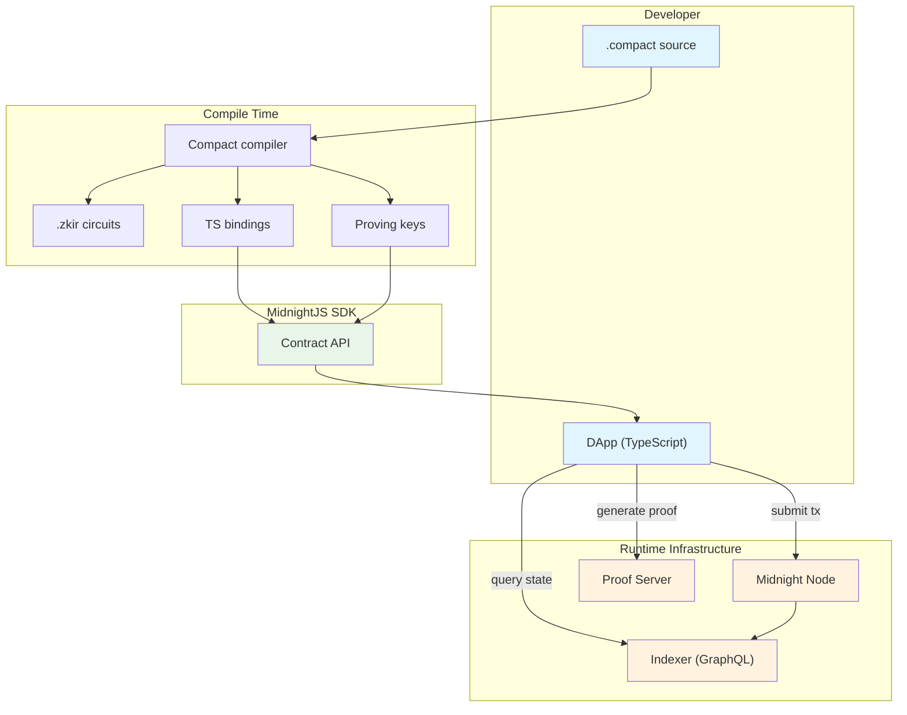
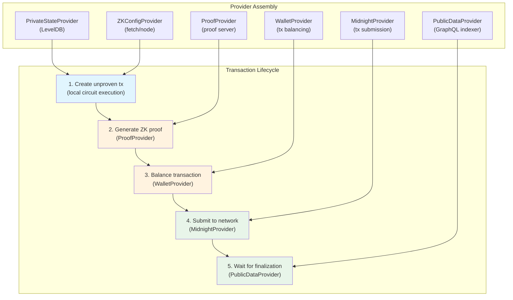
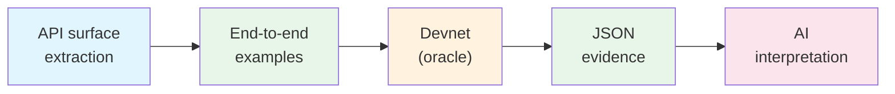

<!--
  MidnightJS SDK Reference Documentation
  Auto-assembled from outline + API surface + evidence
  Generated: 2026-03-13

  SDK evidence: 249 tests (all passing)
  Typecheck evidence: 14 modules, 389 type assertions
  SDK version: 3.2.0-rc.3

  Deterministic sections marked *[deterministic]* are produced by automated
  tools with no AI involvement. AI-generated sections are marked *[AI-generated]*.
  See Appendix D for reproduction instructions.
-->

# MidnightJS SDK Reference

## 1. Introduction

### What is MidnightJS?

High-level explanation: MidnightJS is the TypeScript SDK for building
privacy-preserving DApps on the Midnight blockchain. It provides the
complete lifecycle for contract interaction: deploying contracts,
calling circuits, generating zero-knowledge proofs, and submitting
transactions -- all through a modular provider pattern.



### The provider pattern

MidnightJS uses **pluggable providers** -- each capability (storage,
networking, proving, etc.) is a separate interface that can be swapped
independently. A DApp assembles the providers it needs:

```typescript
const providers: MidnightProviders = {
  privateStateProvider,  // Local encrypted state
  publicDataProvider,    // Blockchain queries (GraphQL)
  zkConfigProvider,      // ZK artifact retrieval
  proofProvider,         // Proof generation
  walletProvider,        // Tx balancing & signing
  midnightProvider,      // Tx submission
  loggerProvider,        // Optional diagnostics
};
```

### The transaction flow

Every contract interaction follows a five-stage pipeline:

```
1. Create unproven transaction (local circuit execution)
2. Generate proofs via ProofProvider
3. Balance transaction via WalletProvider
4. Submit via MidnightProvider
5. Wait for finalization via PublicDataProvider
```

### Mental model

A MidnightJS DApp assembles providers and uses them to interact with
contracts through a five-stage transaction lifecycle:



The SDK offers three abstraction levels for this lifecycle:
- **High-level:** `deployContract` / `submitCallTx` — handles all five
  stages automatically
- **Mid-level:** `createUnprovenCallTx` + `submitTx` — split creation
  from submission for inspection
- **Low-level:** `createUnprovenCallTxFromInitialStates` +
  `submitTxAsync` — full control over state and async submission

### Three oracles for verification

This document uses three deterministic oracles:

**Oracle 1: TypeScript compiler.** Does the SDK compile? Do typed
examples type-check? (`tsc --noEmit`)

**Oracle 2: Execution oracle.** Given a compiled `.compact` contract,
can we execute circuits through the SDK runtime and verify the
resulting proof data via the ZKIR constraint checker?

**Oracle 3: Proof server** (stretch goal). Does the full
prove/balance/submit pipeline work against a dockerized proof server?

### How to read this document

This document follows the **Aletheia principle**: every claim an AI
makes must be backed by deterministically produced evidence.

- **\*[deterministic]\*** -- produced by automated tools, no AI
- **\*[AI-generated]\*** -- prose written by an AI to interpret evidence

### Methodology *[AI-generated]*

This document applies the Aletheia principle to SDK documentation through
worked examples verified against a local devnet. The approach mirrors the
scientific method:

1. **Definition.** The API surface is extracted mechanically from the
   TypeScript source — every exported symbol, its type, and its package.
2. **Experiment.** End-to-end examples exercise the SDK against a local
   devnet (node + indexer + proof server). Each example is a runnable
   script that deploys contracts, calls circuits, and observes state.
3. **Evidence.** Each example produces a JSON evidence file recording
   every step: what was called, what was returned, whether claims hold.
4. **Interpretation.** AI-generated prose explains the evidence and
   connects it to the SDK's design patterns.



The devnet is the oracle. Every claim about SDK behavior — "deploying
returns a contract address," "calling increment changes the counter" — is
backed by an actual execution against a real (local) blockchain. The
evidence files are the experimental results.

---

## 2. API Surface *[deterministic]*

> Source: `upstream/midnight-js/packages/`, extracted by
> `tools/extract-api-surface.mjs`

The complete public API surface of the SDK -- every exported symbol
across all packages. This section is auto-generated from the TypeScript
barrel exports.


> Extracted from `upstream/midnight-js/packages/`
> Generated: 2026-03-13T21:26:31.178Z

### Summary

| Package | Exports | Version |
|---------|---------|---------|
| `contracts` | 91 | 3.2.0 |
| `fetch-zk-config-provider` | 1 | 3.2.0 |
| `http-client-proof-provider` | 5 | 3.2.0 |
| `indexer-public-data-provider` | 5 | 3.2.0 |
| `level-private-state-provider` | 10 | 3.2.0 |
| `logger-provider` | 1 | 3.2.0 |
| `network-id` | 3 | 3.2.0 |
| `node-zk-config-provider` | 1 | 3.2.0 |
| `types` | 67 | 3.2.0 |
| `utils` | 12 | 3.2.0 |
| **Total** | **196** | |

### `contracts` (@midnight-ntwrk/midnight-js-contracts)

| Export | Kind | Source |
|--------|------|--------|
| `CallOptions` | type | ./call |
| `CallOptionsBase` | type | ./call |
| `CallOptionsProviderDataDependencies` | type | ./call |
| `CallOptionsWithArguments` | type | ./call |
| `CallOptionsWithPrivateState` | type | ./call |
| `CallOptionsWithProviderDataDependencies` | type | ./call |
| `CallResult` | type | ./call |
| `CallResultPrivate` | type | ./call |
| `CallResultPublic` | type | ./call |
| `CallTxFailedError` | class | ./errors |
| `CallTxOptions` | type | ./unproven-call-tx |
| `CallTxOptionsBase` | type | ./unproven-call-tx |
| `CallTxOptionsWithPrivateStateId` | type | ./unproven-call-tx |
| `CircuitCallTxInterface` | type | ./tx-interfaces |
| `CircuitMaintenanceTxInterface` | type | ./tx-interfaces |
| `CircuitMaintenanceTxInterfaces` | type | ./tx-interfaces |
| `ContractConstructorOptions` | type | ./call-constructor |
| `ContractConstructorOptionsBase` | type | ./call-constructor |
| `ContractConstructorOptionsProviderDataDependencies` | type | ./call-constructor |
| `ContractConstructorOptionsWithArguments` | type | ./call-constructor |
| `ContractConstructorOptionsWithPrivateState` | type | ./call-constructor |
| `ContractConstructorOptionsWithProviderDataDependencies` | type | ./call-constructor |
| `ContractConstructorResult` | type | ./call-constructor |
| `ContractMaintenanceTxInterface` | interface | ./tx-interfaces |
| `ContractProviders` | type | ./contract-providers |
| `ContractStates` | type | ./get-states |
| `ContractTypeError` | class | ./errors |
| `createCallTxOptions` | const | ./tx-interfaces |
| `createCircuitCallTxInterface` | const | ./tx-interfaces |
| `createCircuitMaintenanceTxInterface` | const | ./tx-interfaces |
| `createCircuitMaintenanceTxInterfaces` | const | ./tx-interfaces |
| `createContractMaintenanceTxInterface` | const | ./tx-interfaces |
| `createUnprovenCallTx` | function | ./unproven-call-tx |
| `createUnprovenCallTxFromInitialStates` | function | ./unproven-call-tx |
| `createUnprovenDeployTx` | function | ./unproven-deploy-tx |
| `createUnprovenDeployTxFromVerifierKeys` | function | ./unproven-deploy-tx |
| `deployContract` | function | ./deploy-contract |
| `DeployContractOptions` | type | ./deploy-contract |
| `DeployContractOptionsBase` | type | ./deploy-contract |
| `DeployContractOptionsWithPrivateState` | type | ./deploy-contract |
| `DeployedContract` | type | ./deploy-contract |
| `DeployTxFailedError` | class | ./errors |
| `DeployTxOptions` | type | ./submit-deploy-tx |
| `DeployTxOptionsBase` | type | ./unproven-deploy-tx |
| `DeployTxOptionsWithPrivateState` | type | ./unproven-deploy-tx |
| `DeployTxOptionsWithPrivateStateId` | type | ./unproven-deploy-tx |
| `FinalizedCallTxData` | type | ./tx-model |
| `FinalizedDeployTxData` | type | ./tx-model |
| `FinalizedDeployTxDataBase` | type | ./tx-model |
| `findDeployedContract` | function | ./find-deployed-contract |
| `FindDeployedContractOptions` | type | ./find-deployed-contract |
| `FindDeployedContractOptionsBase` | type | ./find-deployed-contract |
| `FindDeployedContractOptionsExistingPrivateState` | type | ./find-deployed-contract |
| `FindDeployedContractOptionsStorePrivateState` | type | ./find-deployed-contract |
| `FoundContract` | type | ./find-deployed-contract |
| `getPublicStates` | const | ./get-states |
| `getStates` | const | ./get-states |
| `getUnshieldedBalances` | const | ./get-unshielded-balances |
| `IncompleteCallTxPrivateStateConfig` | class | ./errors |
| `IncompleteFindContractPrivateStateConfig` | class | ./errors |
| `InsertVerifierKeyTxFailedError` | class | ./errors |
| `PublicContractStates` | type | ./get-states |
| `RemoveVerifierKeyTxFailedError` | class | ./errors |
| `ReplaceMaintenanceAuthorityTxFailedError` | class | ./errors |
| `ScopedTransactionOptions` | type | ./transaction |
| `submitCallTx` | function | ./submit-call-tx |
| `submitCallTxAsync` | function | ./submit-call-tx |
| `submitDeployTx` | function | ./submit-deploy-tx |
| `submitInsertVerifierKeyTx` | const | ./submit-insert-vk-tx |
| `submitRemoveVerifierKeyTx` | const | ./submit-remove-vk-tx |
| `submitReplaceAuthorityTx` | const | ./submit-replace-authority-tx |
| `SubmittedCallTx` | type | ./tx-model |
| `submitTx` | const | ./submit-tx |
| `submitTxAsync` | const | ./submit-tx |
| `SubmitTxOptions` | type | ./submit-tx |
| `SubmitTxProviders` | type | ./submit-tx |
| `TransactionContext` | interface | ./transaction |
| `TxFailedError` | class | ./errors |
| `UnprovenCallTxProvidersBase` | type | ./unproven-call-tx |
| `UnprovenCallTxProvidersWithPrivateState` | type | ./unproven-call-tx |
| `UnprovenDeployTxOptions` | type | ./unproven-deploy-tx |
| `UnprovenDeployTxProviders` | type | ./unproven-deploy-tx |
| `UnsubmittedCallTxData` | type | ./tx-model |
| `UnsubmittedDeployTxData` | type | ./tx-model |
| `UnsubmittedDeployTxDataBase` | type | ./tx-model |
| `UnsubmittedDeployTxPrivateData` | type | ./tx-model |
| `UnsubmittedDeployTxPublicData` | type | ./tx-model |
| `UnsubmittedTxData` | type | ./tx-model |
| `verifierKeysEqual` | const | ./find-deployed-contract |
| `verifyContractState` | const | ./find-deployed-contract |
| `withContractScopedTransaction` | const | ./transaction |

### `fetch-zk-config-provider` (@midnight-ntwrk/midnight-js-fetch-zk-config-provider)

| Export | Kind | Source |
|--------|------|--------|
| `FetchZkConfigProvider` | class | ./fetch-zk-config-provider |

### `http-client-proof-provider` (@midnight-ntwrk/midnight-js-http-client-proof-provider)

| Export | Kind | Source |
|--------|------|--------|
| `DEFAULT_CONFIG` | const | ./http-client-proof-provider |
| `DEFAULT_TIMEOUT` | const | ./http-client-proving-provider |
| `httpClientProofProvider` | const | ./http-client-proof-provider |
| `httpClientProvingProvider` | const | ./http-client-proving-provider |
| `ProvingProviderConfig` | type | ./http-client-proving-provider |

### `indexer-public-data-provider` (@midnight-ntwrk/midnight-js-indexer-public-data-provider)

| Export | Kind | Source |
|--------|------|--------|
| `IndexerFormattedError` | class | ./errors |
| `indexerPublicDataProvider` | const | ./indexer-public-data-provider |
| `IndexerUtxo` | type | ./indexer-public-data-provider |
| `toUnshieldedBalances` | const | ./indexer-public-data-provider |
| `toUnshieldedUtxos` | const | ./indexer-public-data-provider |

### `level-private-state-provider` (@midnight-ntwrk/midnight-js-level-private-state-provider)

| Export | Kind | Source |
|--------|------|--------|
| `decryptValue` | const | ./storage-encryption |
| `DEFAULT_CONFIG` | const | ./level-private-state-provider |
| `levelPrivateStateProvider` | const | ./level-private-state-provider |
| `LevelPrivateStateProviderConfig` | type | ./level-private-state-provider |
| `migrateToAccountScoped` | const | ./level-private-state-provider |
| `MigrationResult` | type | ./level-private-state-provider |
| `PasswordRotationOptions` | type | ./level-private-state-provider |
| `PasswordRotationResult` | type | ./level-private-state-provider |
| `PrivateStoragePasswordProvider` | type | ./storage-encryption |
| `StorageEncryption` | class | ./storage-encryption |

### `logger-provider` (@midnight-ntwrk/midnight-js-logger-provider)

| Export | Kind | Source |
|--------|------|--------|
| `LoggerProvider` | class | ./logger-provider |

### `network-id` (@midnight-ntwrk/midnight-js-network-id)

| Export | Kind | Source |
|--------|------|--------|
| `getNetworkId` | const | — |
| `NetworkId` | type | ./network-id |
| `setNetworkId` | const | — |

### `node-zk-config-provider` (@midnight-ntwrk/midnight-js-node-zk-config-provider)

| Export | Kind | Source |
|--------|------|--------|
| `NodeZkConfigProvider` | class | ./node-zk-config-provider |

### `types` (@midnight-ntwrk/midnight-js-types)

| Export | Kind | Source |
|--------|------|--------|
| `All` | type | ./public-data-provider |
| `AnyPrivateState` | type | ./midnight-types |
| `AnyProvableCircuitId` | type | ./midnight-types |
| `asContractAddress` | const | ./contract |
| `asEffectOption` | const | ./contract |
| `BlockHash` | type | ./midnight-types |
| `BlockHashConfig` | type | ./public-data-provider |
| `BlockHeightConfig` | type | ./public-data-provider |
| `ContractExecutableRuntimeOptions` | type | ./contract |
| `ContractStateObservableConfig` | type | ./public-data-provider |
| `createProverKey` | const | ./midnight-types |
| `createVerifierKey` | const | ./midnight-types |
| `createZKIR` | const | ./midnight-types |
| `exitResultOrError` | const | ./contract |
| `ExportDecryptionError` | class | ./errors |
| `ExportPrivateStatesOptions` | interface | ./private-state-provider |
| `ExportSigningKeysOptions` | interface | ./private-state-provider |
| `FailEntirely` | const | ./midnight-types |
| `FailFallible` | const | ./midnight-types |
| `Fees` | type | ./midnight-types |
| `FinalizedTxData` | interface | ./midnight-types |
| `ImportConflictError` | class | ./errors |
| `ImportPrivateStatesOptions` | interface | ./private-state-provider |
| `ImportPrivateStatesResult` | interface | ./private-state-provider |
| `ImportSigningKeysOptions` | interface | ./private-state-provider |
| `ImportSigningKeysResult` | interface | ./private-state-provider |
| `InvalidExportFormatError` | class | ./errors |
| `InvalidProtocolSchemeError` | class | ./errors |
| `KeyMaterialProvider` | type | ./zk-config-provider |
| `Latest` | type | ./public-data-provider |
| `LoggerProvider` | interface | ./logger-provider |
| `LogLevel` | enum | ./logger-provider |
| `makeContractExecutableRuntime` | const | ./contract |
| `MAX_EXPORT_SIGNING_KEYS` | const | ./private-state-provider |
| `MAX_EXPORT_STATES` | const | ./private-state-provider |
| `MidnightProvider` | interface | ./midnight-provider |
| `MidnightProviders` | interface | ./providers |
| `PrivateStateExport` | interface | ./private-state-provider |
| `PrivateStateExportError` | class | ./errors |
| `PrivateStateId` | type | ./private-state-provider |
| `PrivateStateImportError` | class | ./errors |
| `PrivateStateImportErrorCause` | type | ./errors |
| `PrivateStateProvider` | interface | ./private-state-provider |
| `ProofProvider` | interface | ./proof-provider |
| `ProverKey` | type | ./midnight-types |
| `ProveTxConfig` | interface | ./proof-provider |
| `PublicDataProvider` | interface | ./public-data-provider |
| `SegmentFail` | const | ./midnight-types |
| `SegmentStatus` | type | ./midnight-types |
| `SegmentSuccess` | const | ./midnight-types |
| `SigningKeyExport` | interface | ./private-state-provider |
| `SigningKeyExportError` | class | ./errors |
| `SucceedEntirely` | const | ./midnight-types |
| `Transaction` | external-reexport | @midnight-ntwrk/ledger-v8 |
| `TxIdConfig` | type | ./public-data-provider |
| `TxStatus` | type | ./midnight-types |
| `UnboundTransaction` | type | ./proof-provider |
| `UnshieldedBalance` | type | ./midnight-types |
| `UnshieldedBalances` | type | ./midnight-types |
| `UnshieldedUtxo` | type | ./midnight-types |
| `UnshieldedUtxos` | type | ./midnight-types |
| `VerifierKey` | type | ./midnight-types |
| `WalletProvider` | interface | ./wallet-provider |
| `ZKConfig` | interface | ./midnight-types |
| `ZKConfigProvider` | abstract-class | ./zk-config-provider |
| `zkConfigToProvingKeyMaterial` | const | ./midnight-types |
| `ZKIR` | type | ./midnight-types |

### `utils` (@midnight-ntwrk/midnight-js-utils)

| Export | Kind | Source |
|--------|------|--------|
| `assertDefined` | function | ./assertion-utils |
| `assertIsContractAddress` | function | ./type-utils |
| `assertIsHex` | function | ./hex-utils |
| `assertUndefined` | function | ./assertion-utils |
| `fromHex` | const | ./hex-utils |
| `isHex` | const | ./hex-utils |
| `parseCoinPublicKeyToHex` | const | ./hex-utils |
| `ParsedHexString` | type | ./hex-utils |
| `parseEncPublicKeyToHex` | const | ./hex-utils |
| `parseHex` | const | ./hex-utils |
| `toHex` | const | ./hex-utils |
| `ttlOneHour` | const | ./date-utils |


**Example usage** *[deterministic]*

- `assertDefined` — [Example 7: Utility Functions, Type Helpers, and Network Configuration](#example-7-utility-functions-type-helpers-and-network-configuration)
- `assertIsContractAddress` — [Example 4: Low-Level Transaction Pipeline](#example-4-low-level-transaction-pipeline), [Example 7: Utility Functions, Type Helpers, and Network Configuration](#example-7-utility-functions-type-helpers-and-network-configuration)
- `assertIsHex` — [Example 7: Utility Functions, Type Helpers, and Network Configuration](#example-7-utility-functions-type-helpers-and-network-configuration)
- `assertUndefined` — [Example 7: Utility Functions, Type Helpers, and Network Configuration](#example-7-utility-functions-type-helpers-and-network-configuration)
- `fromHex` — [Example 4: Low-Level Transaction Pipeline](#example-4-low-level-transaction-pipeline), [Example 7: Utility Functions, Type Helpers, and Network Configuration](#example-7-utility-functions-type-helpers-and-network-configuration)
- `isHex` — [Example 4: Low-Level Transaction Pipeline](#example-4-low-level-transaction-pipeline), [Example 7: Utility Functions, Type Helpers, and Network Configuration](#example-7-utility-functions-type-helpers-and-network-configuration)
- `parseCoinPublicKeyToHex` — [Example 8: Advanced Deploy Pipeline and Provider Configuration](#example-8-advanced-deploy-pipeline-and-provider-configuration), [Example 7: Utility Functions, Type Helpers, and Network Configuration](#example-7-utility-functions-type-helpers-and-network-configuration)
- `parseEncPublicKeyToHex` — [Example 7: Utility Functions, Type Helpers, and Network Configuration](#example-7-utility-functions-type-helpers-and-network-configuration)
- `parseHex` — [Example 7: Utility Functions, Type Helpers, and Network Configuration](#example-7-utility-functions-type-helpers-and-network-configuration)
- `toHex` — [Example 4: Low-Level Transaction Pipeline](#example-4-low-level-transaction-pipeline), [Example 7: Utility Functions, Type Helpers, and Network Configuration](#example-7-utility-functions-type-helpers-and-network-configuration)
- `ttlOneHour` — [Example 7: Utility Functions, Type Helpers, and Network Configuration](#example-7-utility-functions-type-helpers-and-network-configuration)

---


### TypeScript Type Verification *[deterministic]*

14 type test modules compiled successfully with 389 type assertions (368 positive, 21 negative). Every assertion uses `tsc --noEmit` as the oracle — the TypeScript compiler is the source of truth for type correctness.

| Test Module | Types Tested | Assertions | Verdict |
|-------------|-------------|------------|---------|
| `branded-types.test.ts` | ProverKey, VerifierKey, ZKIR (branded types) | 29 (22+, 7−) | COMPILED |
| `contracts-call.test.ts` | CallOptionsBase, CallOptionsWithArguments, CallOptionsProviderDataDependencies | 40 (40+, 0−) | COMPILED |
| `contracts-constructor.test.ts` | ContractConstructorOptionsBase, ContractConstructorOptionsWithArguments | 18 (18+, 0−) | COMPILED |
| `contracts-deploy.test.ts` | DeployContractOptionsBase, DeployContractOptionsWithPrivateState | 41 (41+, 0−) | COMPILED |
| `contracts-errors.test.ts` | TxFailedError, DeployTxFailedError, CallTxFailedError | 21 (19+, 2−) | COMPILED |
| `contracts-interfaces.test.ts` | ContractProviders, PublicContractStates, ContractStates | 23 (23+, 0−) | COMPILED |
| `contracts-tx-data.test.ts` | UnsubmittedTxData, UnsubmittedDeployTxPublicData, UnsubmittedDeployTxPrivateData | 36 (36+, 0−) | COMPILED |
| `error-classes.test.ts` | InvalidProtocolSchemeError, PrivateStateExportError | 26 (24+, 2−) | COMPILED |
| `logging.test.ts` | LogLevel (enum), LoggerProvider (interface). | 16 (16+, 0−) | COMPILED |
| `observable-config.test.ts` | All, Latest, TxIdConfig, BlockHeightConfig | 19 (16+, 3−) | COMPILED |
| `private-state.test.ts` | PrivateStateId, PrivateStateProvider, PrivateStateExport | 33 (31+, 2−) | COMPILED |
| `provider-interfaces.test.ts` | MidnightProvider, ProofProvider, ProveTxConfig | 37 (37+, 0−) | COMPILED |
| `transaction-status.test.ts` | TxStatus, SegmentStatus, Fees, BlockHash, PrivateStateId | 35 (32+, 3−) | COMPILED |
| `zk-config-provider.test.ts` | ZKConfigProvider (abstract class), KeyMaterialProvider | 15 (13+, 2−) | COMPILED |


## 3. Provider Interfaces

The seven provider interfaces define the contract between the SDK core
and the pluggable implementations. Each interface is documented with
its methods, the concrete implementation(s) available, and verification
evidence.

### 3.1 PrivateStateProvider

> Package: `@midnight-ntwrk/midnight-js-types` (interface)
> Implementation: `@midnight-ntwrk/midnight-js-level-private-state-provider`

**Exports** *[deterministic]*

| Export | Kind | Package |
|--------|------|---------|
| `PrivateStateProvider` | interface | types |
| `PrivateStateId` | type | types |
| `ExportPrivateStatesOptions` | interface | types |
| `ImportPrivateStatesOptions` | interface | types |
| `ImportPrivateStatesResult` | interface | types |
| `ExportSigningKeysOptions` | interface | types |
| `ImportSigningKeysOptions` | interface | types |
| `ImportSigningKeysResult` | interface | types |
| `PrivateStateExport` | interface | types |
| `SigningKeyExport` | interface | types |
| `MAX_EXPORT_STATES` | const | types |
| `MAX_EXPORT_SIGNING_KEYS` | const | types |
| `levelPrivateStateProvider` | const | level-private-state-provider |
| `LevelPrivateStateProviderConfig` | type | level-private-state-provider |
| `DEFAULT_CONFIG` | const | level-private-state-provider |
| `StorageEncryption` | class | level-private-state-provider |
| `PrivateStoragePasswordProvider` | type | level-private-state-provider |
| `migrateToAccountScoped` | const | level-private-state-provider |
| `MigrationResult` | type | level-private-state-provider |
| `PasswordRotationOptions` | type | level-private-state-provider |
| `PasswordRotationResult` | type | level-private-state-provider |
| `decryptValue` | const | level-private-state-provider |

**Description** *[AI-generated]*

The `PrivateStateProvider` interface manages encrypted local state for
each user. Private state is stored per-contract (keyed by
`PrivateStateId`), encrypted at rest with AES-256-GCM, and scoped to
wallet accounts.

The LevelDB implementation (`levelPrivateStateProvider`) uses PBKDF2
key derivation (600,000 iterations for V2) and provides CRUD
operations (`get`, `set`, `remove`), bulk export/import with conflict
resolution, and migration utilities for account-scoped isolation.

**Verification evidence** *[deterministic]*

| Test | Description | Expected | Verdict |
|------|-------------|----------|---------|
| factory creates provider | private-state | pass | PASS |
| provider has expected methods | private-state | pass | PASS |
| setContractAddress accepts valid address | private-state | pass | PASS |
| get returns null for non-existent key | private-state | pass | PASS |
| set stores a string value | private-state | pass | PASS |
| get retrieves stored string | private-state | pass | PASS |
| set stores a number value | private-state | pass | PASS |
| get retrieves stored number | private-state | pass | PASS |
| set stores an object with BigInt | private-state | pass | PASS |
| get retrieves object with BigInt preserved | private-state | pass | PASS |
| set stores Uint8Array | private-state | pass | PASS |
| get retrieves Uint8Array | private-state | pass | PASS |
| remove deletes a key | private-state | pass | PASS |
| other keys still exist after remove | private-state | pass | PASS |
| clear removes all keys | private-state | pass | PASS |
| getSigningKey returns null for unknown contract | private-state | pass | PASS |
| setSigningKey stores a key | private-state | pass | PASS |
| getSigningKey retrieves stored key | private-state | pass | PASS |
| removeSigningKey deletes key | private-state | pass | PASS |
| exportPrivateStates produces encrypted export | private-state | pass | PASS |
| importPrivateStates restores from export | private-state | pass | PASS |
| imported data is accessible | private-state | pass | PASS |
| short password rejected | private-state | pass | PASS |
| migrateToAccountScoped is a function | private-state | pass | PASS |
| migrateToAccountScoped requires accountId | private-state | pass | PASS |
| migrateToAccountScoped rejects empty accountId | private-state | pass | PASS |
| migrateToAccountScoped returns migration counts | private-state | pass | PASS |
| different accountIds produce isolated storage | private-state | pass | PASS |
| same accountId always maps to same scoped location | private-state | pass | PASS |
| migrateToAccountScoped is idempotent (safe to re-run) | private-state | pass | PASS |
| DEFAULT_CONFIG has midnightDbName field | private-state | pass | PASS |
| DEFAULT_CONFIG has privateStateStoreName field | private-state | pass | PASS |
| DEFAULT_CONFIG has signingKeyStoreName field | private-state | pass | PASS |
| StorageEncryption is constructable with password | private-state | pass | PASS |
| decryptValue is a function | private-state | pass | PASS |
| migrateToAccountScoped is a function | private-state | pass | PASS |
| StorageEncryption produces base64 output | private-state | pass | PASS |
| encrypted output has correct header structure (version + salt + IV + authTag) | private-state | pass | PASS |
| version byte is 2 (current encryption version) | private-state | pass | PASS |
| IV is 12 bytes (AES-GCM standard nonce length) | private-state | pass | PASS |
| auth tag is 16 bytes (AES-GCM standard tag length) | private-state | pass | PASS |
| different encryptions of same plaintext produce different ciphertext (random IV) | private-state | pass | PASS |
| encrypt/decrypt roundtrip preserves plaintext | private-state | pass | PASS |
| decrypt with wrong password fails (auth tag verification) | private-state | pass | PASS |
| StorageEncryption.isEncrypted detects encrypted data | private-state | pass | PASS |
| StorageEncryption.isEncrypted rejects plain text | private-state | pass | PASS |
| StorageEncryption.getVersion returns 2 for current encryption | private-state | pass | PASS |
| StorageEncryption constructor takes measurable time (>50ms for 600K PBKDF2) | private-state | pass | PASS |
| encryption version prefix confirms v2 (600K iterations path) | private-state | pass | PASS |
| salt is 32 bytes and unique per StorageEncryption instance | private-state | pass | PASS |
| verifyPassword confirms correct password via timing-safe comparison | private-state | pass | PASS |
| verifyPassword rejects wrong password | private-state | pass | PASS |


**Example usage** *[deterministic]*

- `PrivateStateProvider` — [Example 1: Counter Contract — Deploy, Call, Observe](#example-1-counter-contract-deploy-call-observe)
- `MAX_EXPORT_STATES` — [Example 7: Utility Functions, Type Helpers, and Network Configuration](#example-7-utility-functions-type-helpers-and-network-configuration)
- `MAX_EXPORT_SIGNING_KEYS` — [Example 7: Utility Functions, Type Helpers, and Network Configuration](#example-7-utility-functions-type-helpers-and-network-configuration)
- `levelPrivateStateProvider` — [Example 8: Advanced Deploy Pipeline and Provider Configuration](#example-8-advanced-deploy-pipeline-and-provider-configuration), [Example 5: Contract Maintenance — Authority and Verifier Keys](#example-5-contract-maintenance-authority-and-verifier-keys), [Example 1: Counter Contract — Deploy, Call, Observe](#example-1-counter-contract-deploy-call-observe), [Example 4: Low-Level Transaction Pipeline](#example-4-low-level-transaction-pipeline), [Example 2: Private Counter — Witnesses and Authorization](#example-2-private-counter-witnesses-and-authorization), [Example 6: Private State — Encryption, Backup, and Migration](#example-6-private-state-encryption-backup-and-migration), [Example 3: State Observation — Queries, Verification, and Observables](#example-3-state-observation-queries-verification-and-observables)
- `DEFAULT_CONFIG` — [Example 6: Private State — Encryption, Backup, and Migration](#example-6-private-state-encryption-backup-and-migration)
- `StorageEncryption` — [Example 6: Private State — Encryption, Backup, and Migration](#example-6-private-state-encryption-backup-and-migration)
- `migrateToAccountScoped` — [Example 6: Private State — Encryption, Backup, and Migration](#example-6-private-state-encryption-backup-and-migration)
- `decryptValue` — [Example 6: Private State — Encryption, Backup, and Migration](#example-6-private-state-encryption-backup-and-migration)

---

### 3.2 PublicDataProvider

> Package: `@midnight-ntwrk/midnight-js-types` (interface)
> Implementation: `@midnight-ntwrk/midnight-js-indexer-public-data-provider`

**Exports** *[deterministic]*

| Export | Kind | Package |
|--------|------|---------|
| `PublicDataProvider` | interface | types |
| `All` | type | types |
| `Latest` | type | types |
| `BlockHashConfig` | type | types |
| `BlockHeightConfig` | type | types |
| `TxIdConfig` | type | types |
| `ContractStateObservableConfig` | type | types |
| `indexerPublicDataProvider` | const | indexer-public-data-provider |
| `IndexerUtxo` | type | indexer-public-data-provider |
| `IndexerFormattedError` | class | indexer-public-data-provider |
| `toUnshieldedBalances` | const | indexer-public-data-provider |
| `toUnshieldedUtxos` | const | indexer-public-data-provider |

**Description** *[AI-generated]*

The `PublicDataProvider` interface queries on-chain state: contract
state, transaction status, block data, and unshielded balances. It
supports polling (`watchForContractState`) and real-time subscriptions
(`contractStateObservable`).

The indexer implementation uses GraphQL (Apollo Client) over HTTP for
queries and WebSocket for subscriptions. Query scope is configurable
via `All`, `Latest`, `BlockHashConfig`, `BlockHeightConfig`, or
`TxIdConfig`.

**Verification evidence** *[deterministic]*

| Test | Description | Expected | Verdict |
|------|-------------|----------|---------|
| toUnshieldedBalances transforms empty array | indexer | pass | PASS |
| toUnshieldedUtxos transforms empty arrays | indexer | pass | PASS |
| indexerPublicDataProvider factory creates provider object | indexer | pass | PASS |
| indexerPublicDataProvider has query and observable methods | indexer | pass | PASS |


**Example usage** *[deterministic]*

- `PublicDataProvider` — [Example 1: Counter Contract — Deploy, Call, Observe](#example-1-counter-contract-deploy-call-observe)
- `All` — [Example 8: Advanced Deploy Pipeline and Provider Configuration](#example-8-advanced-deploy-pipeline-and-provider-configuration), [Example 5: Contract Maintenance — Authority and Verifier Keys](#example-5-contract-maintenance-authority-and-verifier-keys), [Example 1: Counter Contract — Deploy, Call, Observe](#example-1-counter-contract-deploy-call-observe), [Example 4: Low-Level Transaction Pipeline](#example-4-low-level-transaction-pipeline), [Example 2: Private Counter — Witnesses and Authorization](#example-2-private-counter-witnesses-and-authorization), [Example 3: State Observation — Queries, Verification, and Observables](#example-3-state-observation-queries-verification-and-observables)
- `indexerPublicDataProvider` — [Example 8: Advanced Deploy Pipeline and Provider Configuration](#example-8-advanced-deploy-pipeline-and-provider-configuration), [Example 5: Contract Maintenance — Authority and Verifier Keys](#example-5-contract-maintenance-authority-and-verifier-keys), [Example 1: Counter Contract — Deploy, Call, Observe](#example-1-counter-contract-deploy-call-observe), [Example 4: Low-Level Transaction Pipeline](#example-4-low-level-transaction-pipeline), [Example 2: Private Counter — Witnesses and Authorization](#example-2-private-counter-witnesses-and-authorization), [Example 3: State Observation — Queries, Verification, and Observables](#example-3-state-observation-queries-verification-and-observables)
- `IndexerFormattedError` — [Example 8: Advanced Deploy Pipeline and Provider Configuration](#example-8-advanced-deploy-pipeline-and-provider-configuration)
- `toUnshieldedBalances` — [Example 8: Advanced Deploy Pipeline and Provider Configuration](#example-8-advanced-deploy-pipeline-and-provider-configuration)
- `toUnshieldedUtxos` — [Example 8: Advanced Deploy Pipeline and Provider Configuration](#example-8-advanced-deploy-pipeline-and-provider-configuration)

---

### 3.3 ZKConfigProvider

> Package: `@midnight-ntwrk/midnight-js-types` (abstract class)
> Implementations: `fetch-zk-config-provider`, `node-zk-config-provider`

**Exports** *[deterministic]*

| Export | Kind | Package |
|--------|------|---------|
| `ZKConfigProvider` | abstract-class | types |
| `KeyMaterialProvider` | type | types |
| `ZKConfig` | interface | types |
| `ZKIR` | type | types |
| `ProverKey` | type | types |
| `VerifierKey` | type | types |
| `createProverKey` | const | types |
| `createVerifierKey` | const | types |
| `createZKIR` | const | types |
| `zkConfigToProvingKeyMaterial` | const | types |
| `FetchZkConfigProvider` | class | fetch-zk-config-provider |
| `NodeZkConfigProvider` | class | node-zk-config-provider |

**Description** *[AI-generated]*

The `ZKConfigProvider` abstract class retrieves zero-knowledge
artifacts: ZKIR circuit descriptions, prover keys, and verifier keys.
These are the cryptographic materials needed for proof generation and
on-chain verification.

`FetchZkConfigProvider` uses browser `fetch()` to download artifacts
from a URL. `NodeZkConfigProvider` reads them from the local
filesystem. Neither provider caches artifacts — every call to
`getProverKey`, `getVerifierKey`, or `getZKIR` hits the backing
store (network or filesystem) directly.

**Verification evidence** *[deterministic]*

| Test | Description | Expected | Verdict |
|------|-------------|----------|---------|
| createProverKey returns input Uint8Array | types | pass | PASS |
| createVerifierKey returns input Uint8Array | types | pass | PASS |
| createZKIR returns input Uint8Array | types | pass | PASS |
| zkConfigToProvingKeyMaterial maps fields correctly | types | pass | PASS |
| ZKConfigProvider is an abstract class with methods | types | pass | PASS |
| ZKConfigProvider is instantiable (base class) | types | pass | PASS |
| FetchZkConfigProvider instantiates with URL string | zk-config | pass | PASS |
| FetchZkConfigProvider has getProverKey/getVerifierKey/getZKIR methods | zk-config | pass | PASS |
| NodeZkConfigProvider instantiates with path string | zk-config | pass | PASS |
| NodeZkConfigProvider has readFile/getProverKey/getVerifierKey/getZKIR methods | zk-config | pass | PASS |
| NodeZkConfigProvider constructor accepts directory path | zk-config | pass | PASS |
| provider has getProverKey, getVerifierKey, getZKIR methods | zk-config | pass | PASS |
| provider has inherited get() and getVerifierKeys() from ZKConfigProvider | zk-config | pass | PASS |
| getProverKey reads keys/<id>.prover | zk-config | pass | PASS |
| getVerifierKey reads keys/<id>.verifier | zk-config | pass | PASS |
| getZKIR reads zkir/<id>.bzkir | zk-config | pass | PASS |
| getProverKey throws for nonexistent circuit | zk-config | pass | PASS |
| getVerifierKey throws for nonexistent circuit | zk-config | pass | PASS |
| getZKIR throws for nonexistent circuit | zk-config | pass | PASS |
| get() returns all three artifacts for a circuit | zk-config | pass | PASS |
| getVerifierKeys returns array of [id, key] pairs | zk-config | pass | PASS |
| FetchZkConfigProvider validates URL protocol (rejects ftp://) | zk-config | pass | PASS |
| FetchZkConfigProvider accepts http:// URL | zk-config | pass | PASS |
| FetchZkConfigProvider accepts https:// URL | zk-config | pass | PASS |
| FetchZkConfigProvider fetches prover key from keys/<id>.prover | zk-config | pass | PASS |
| FetchZkConfigProvider fetches verifier key from keys/<id>.verifier | zk-config | pass | PASS |
| FetchZkConfigProvider fetches ZKIR from zkir/<id>.bzkir | zk-config | pass | PASS |
| FetchZkConfigProvider throws on HTTP error response | zk-config | pass | PASS |
| FetchZkConfigProvider hits network on every call (no cache) | zk-config | pass | PASS |
| NodeZkConfigProvider has no cache-related properties | zk-config | pass | PASS |


**Example usage** *[deterministic]*

- `ZKConfigProvider` — [Example 8: Advanced Deploy Pipeline and Provider Configuration](#example-8-advanced-deploy-pipeline-and-provider-configuration)
- `createProverKey` — [Example 7: Utility Functions, Type Helpers, and Network Configuration](#example-7-utility-functions-type-helpers-and-network-configuration)
- `createVerifierKey` — [Example 7: Utility Functions, Type Helpers, and Network Configuration](#example-7-utility-functions-type-helpers-and-network-configuration)
- `createZKIR` — [Example 7: Utility Functions, Type Helpers, and Network Configuration](#example-7-utility-functions-type-helpers-and-network-configuration)
- `zkConfigToProvingKeyMaterial` — [Example 8: Advanced Deploy Pipeline and Provider Configuration](#example-8-advanced-deploy-pipeline-and-provider-configuration)
- `FetchZkConfigProvider` — [Example 8: Advanced Deploy Pipeline and Provider Configuration](#example-8-advanced-deploy-pipeline-and-provider-configuration)
- `NodeZkConfigProvider` — [Example 8: Advanced Deploy Pipeline and Provider Configuration](#example-8-advanced-deploy-pipeline-and-provider-configuration), [Example 5: Contract Maintenance — Authority and Verifier Keys](#example-5-contract-maintenance-authority-and-verifier-keys), [Example 1: Counter Contract — Deploy, Call, Observe](#example-1-counter-contract-deploy-call-observe), [Example 4: Low-Level Transaction Pipeline](#example-4-low-level-transaction-pipeline), [Example 2: Private Counter — Witnesses and Authorization](#example-2-private-counter-witnesses-and-authorization), [Example 3: State Observation — Queries, Verification, and Observables](#example-3-state-observation-queries-verification-and-observables)

---

### 3.4 ProofProvider

> Package: `@midnight-ntwrk/midnight-js-types` (interface)
> Implementation: `@midnight-ntwrk/midnight-js-http-client-proof-provider`

**Exports** *[deterministic]*

| Export | Kind | Package |
|--------|------|---------|
| `ProofProvider` | interface | types |
| `ProveTxConfig` | interface | types |
| `UnboundTransaction` | type | types |
| `httpClientProofProvider` | const | http-client-proof-provider |
| `DEFAULT_CONFIG` | const | http-client-proof-provider |
| `httpClientProvingProvider` | const | http-client-proof-provider |
| `DEFAULT_TIMEOUT` | const | http-client-proof-provider |
| `ProvingProviderConfig` | type | http-client-proof-provider |

**Description** *[AI-generated]*

The `ProofProvider` interface takes an unproven transaction and
produces a proven transaction by generating zero-knowledge proofs for
each circuit call. The proof server is a black-box oracle: unproven
transaction in, proven transaction out (or error).

The HTTP client implementation sends the unproven transaction to a
proof server endpoint (default: port 6300) and returns the proven
result. It also provides a lower-level `ProvingProvider` for direct
proof generation.

**Verification evidence** *[deterministic]*

| Test | Description | Expected | Verdict |
|------|-------------|----------|---------|
| DEFAULT_TIMEOUT is 300000ms (5 minutes) | proof-provider | pass | PASS |
| DEFAULT_CONFIG contains timeout field | proof-provider | pass | PASS |
| DEFAULT_TIMEOUT is exported | proof-provider | pass | PASS |
| DEFAULT_TIMEOUT equals 300000 (5 minutes in ms) | proof-provider | pass | PASS |
| DEFAULT_TIMEOUT is exactly 5 minutes | proof-provider | pass | PASS |
| DEFAULT_CONFIG is exported | proof-provider | pass | PASS |
| DEFAULT_CONFIG.timeout equals 300000 | proof-provider | pass | PASS |
| DEFAULT_CONFIG.timeout matches DEFAULT_TIMEOUT | proof-provider | pass | PASS |
| source defines retryOptions with retries: 3 | proof-provider | pass | PASS |
| source defines retryOn: [500, 503] | proof-provider | pass | PASS |
| source defines exponential backoff: 2^attempt * 1000ms | proof-provider | pass | PASS |
| exponential backoff formula: attempt 0 = 1000ms | proof-provider | pass | PASS |
| exponential backoff formula: attempt 1 = 2000ms | proof-provider | pass | PASS |
| exponential backoff formula: attempt 2 = 4000ms | proof-provider | pass | PASS |
| total maximum retry delay: 1s + 2s + 4s = 7s | proof-provider | pass | PASS |
| source imports fetchBuilder from fetch-retry | proof-provider | pass | PASS |
| source wraps fetch with fetchBuilder(fetch, retryOptions) | proof-provider | pass | PASS |
| fetch-retry package is installed | proof-provider | pass | PASS |
| source uses AbortSignal.timeout(timeout) for request timeout | proof-provider | pass | PASS |
| timeout defaults to DEFAULT_TIMEOUT when config not provided | proof-provider | pass | PASS |
| httpClientProofProvider is a function | proof-provider | pass | PASS |
| httpClientProvingProvider is a function | proof-provider | pass | PASS |
| httpClientProvingProvider rejects ftp:// protocol | proof-provider | pass | PASS |
| httpClientProvingProvider accepts http:// protocol | proof-provider | pass | PASS |
| httpClientProvingProvider returns object with check and prove methods | proof-provider | pass | PASS |
| httpClientProofProvider returns object with proveTx method | proof-provider | pass | PASS |


**Example usage** *[deterministic]*

- `ProofProvider` — [Example 1: Counter Contract — Deploy, Call, Observe](#example-1-counter-contract-deploy-call-observe)
- `httpClientProofProvider` — [Example 8: Advanced Deploy Pipeline and Provider Configuration](#example-8-advanced-deploy-pipeline-and-provider-configuration), [Example 5: Contract Maintenance — Authority and Verifier Keys](#example-5-contract-maintenance-authority-and-verifier-keys), [Example 1: Counter Contract — Deploy, Call, Observe](#example-1-counter-contract-deploy-call-observe), [Example 4: Low-Level Transaction Pipeline](#example-4-low-level-transaction-pipeline), [Example 2: Private Counter — Witnesses and Authorization](#example-2-private-counter-witnesses-and-authorization), [Example 3: State Observation — Queries, Verification, and Observables](#example-3-state-observation-queries-verification-and-observables)
- `DEFAULT_CONFIG` — [Example 6: Private State — Encryption, Backup, and Migration](#example-6-private-state-encryption-backup-and-migration)
- `httpClientProvingProvider` — [Example 8: Advanced Deploy Pipeline and Provider Configuration](#example-8-advanced-deploy-pipeline-and-provider-configuration)
- `DEFAULT_TIMEOUT` — [Example 8: Advanced Deploy Pipeline and Provider Configuration](#example-8-advanced-deploy-pipeline-and-provider-configuration)

---

### 3.5 WalletProvider

> Package: `@midnight-ntwrk/midnight-js-types` (interface)

**Exports** *[deterministic]*

| Export | Kind | Package |
|--------|------|---------|
| `WalletProvider` | interface | types |

**Description** *[AI-generated]*

The `WalletProvider` interface balances and signs transactions. After
proof generation, the wallet adds the necessary inputs (shielded and
unshielded tokens) to cover fees and any token transfers, then signs
the complete transaction.

No implementation is provided by the midnight-js SDK itself -- the
wallet provider comes from `@midnight-ntwrk/wallet-sdk-facade` (a
separate package). No verification evidence is possible for this
interface within the SDK scope.


**Example usage** *[deterministic]*

- `WalletProvider` — [Example 1: Counter Contract — Deploy, Call, Observe](#example-1-counter-contract-deploy-call-observe)

---

### 3.6 MidnightProvider

> Package: `@midnight-ntwrk/midnight-js-types` (interface)

**Exports** *[deterministic]*

| Export | Kind | Package |
|--------|------|---------|
| `MidnightProvider` | interface | types |

**Description** *[AI-generated]*

The `MidnightProvider` interface submits balanced, proven, signed
transactions to the Midnight network. It is the final step in the
transaction pipeline.

Like WalletProvider, the implementation comes from the wallet facade
package, not from the midnight-js SDK itself. No verification evidence
is possible for this interface within the SDK scope.


**Example usage** *[deterministic]*

- `MidnightProvider` — [Example 1: Counter Contract — Deploy, Call, Observe](#example-1-counter-contract-deploy-call-observe)

---

### 3.7 LoggerProvider

> Package: `@midnight-ntwrk/midnight-js-types` (interface)
> Implementation: `@midnight-ntwrk/midnight-js-logger-provider`

**Exports** *[deterministic]*

| Export | Kind | Package |
|--------|------|---------|
| `MidnightProviders` | interface | types |
| `LoggerProvider` | interface | types |
| `LogLevel` | enum | types |
| `LoggerProvider` | class | logger-provider |

**Description** *[AI-generated]*

Optional structured logging interface. The implementation wraps Pino.
`LogLevel` enum provides: `trace`, `debug`, `info`, `warn`, `error`,
`fatal`, `silent`.

**Verification evidence** *[deterministic]*

| Test | Description | Expected | Verdict |
|------|-------------|----------|---------|
| LogLevel has expected values | types | pass | PASS |
| LoggerProvider is constructable | logger | pass | PASS |


**Example usage** *[deterministic]*

- `LoggerProvider` — [Example 8: Advanced Deploy Pipeline and Provider Configuration](#example-8-advanced-deploy-pipeline-and-provider-configuration), [Example 7: Utility Functions, Type Helpers, and Network Configuration](#example-7-utility-functions-type-helpers-and-network-configuration)
- `LogLevel` — [Example 7: Utility Functions, Type Helpers, and Network Configuration](#example-7-utility-functions-type-helpers-and-network-configuration)
- `LoggerProvider` — [Example 8: Advanced Deploy Pipeline and Provider Configuration](#example-8-advanced-deploy-pipeline-and-provider-configuration), [Example 7: Utility Functions, Type Helpers, and Network Configuration](#example-7-utility-functions-type-helpers-and-network-configuration)

---

## 4. Contract Lifecycle

The core SDK workflow: deploy a contract, interact with it, and
observe state changes.

### 4.1 Deploying a Contract

**Key exports** *[deterministic]*

| Export | Kind | Source |
|--------|------|--------|
| `deployContract` | function | contracts/deploy-contract |
| `DeployContractOptions` | type | contracts/deploy-contract |
| `DeployContractOptionsBase` | type | contracts/deploy-contract |
| `DeployContractOptionsWithPrivateState` | type | contracts/deploy-contract |
| `DeployedContract` | type | contracts/deploy-contract |
| `ContractConstructorOptions` | type | contracts/call-constructor |
| `ContractConstructorOptionsBase` | type | contracts/call-constructor |
| `ContractConstructorOptionsProviderDataDependencies` | type | contracts/call-constructor |
| `ContractConstructorOptionsWithArguments` | type | contracts/call-constructor |
| `ContractConstructorOptionsWithPrivateState` | type | contracts/call-constructor |
| `ContractConstructorOptionsWithProviderDataDependencies` | type | contracts/call-constructor |
| `ContractConstructorResult` | type | contracts/call-constructor |
| `createUnprovenDeployTx` | function | contracts/unproven-deploy-tx |
| `createUnprovenDeployTxFromVerifierKeys` | function | contracts/unproven-deploy-tx |
| `UnprovenDeployTxOptions` | type | contracts/unproven-deploy-tx |
| `UnprovenDeployTxProviders` | type | contracts/unproven-deploy-tx |
| `DeployTxOptionsBase` | type | contracts/unproven-deploy-tx |
| `DeployTxOptionsWithPrivateState` | type | contracts/unproven-deploy-tx |
| `DeployTxOptionsWithPrivateStateId` | type | contracts/unproven-deploy-tx |
| `submitDeployTx` | function | contracts/submit-deploy-tx |
| `DeployTxOptions` | type | contracts/submit-deploy-tx |

**Description** *[AI-generated]*

`deployContract` is the high-level entry point: it creates an unproven
deploy transaction, proves it, balances it, submits it, and waits for
finalization. The lower-level functions (`createUnprovenDeployTx`,
`submitDeployTx`) expose individual pipeline stages.

The deploy transaction includes the contract's compiled code, verifier
keys, initial ledger state, and initial private state.

**Verification evidence** *[deterministic]*

| Test | Description | Expected | Verdict |
|------|-------------|----------|---------|
| DeployTxFailedError extends Error | contracts | pass | PASS |
| DeployTxFailedError extends TxFailedError | contracts | pass | PASS |
| createUnprovenDeployTx is a function | contracts | pass | PASS |
| createUnprovenDeployTxFromVerifierKeys is a function | contracts | pass | PASS |
| submitDeployTx is a function | contracts | pass | PASS |
| findDeployedContract is a function | contracts | pass | PASS |


**Example usage** *[deterministic]*

- `deployContract` — [Example 8: Advanced Deploy Pipeline and Provider Configuration](#example-8-advanced-deploy-pipeline-and-provider-configuration), [Example 5: Contract Maintenance — Authority and Verifier Keys](#example-5-contract-maintenance-authority-and-verifier-keys), [Example 1: Counter Contract — Deploy, Call, Observe](#example-1-counter-contract-deploy-call-observe), [Example 4: Low-Level Transaction Pipeline](#example-4-low-level-transaction-pipeline), [Example 2: Private Counter — Witnesses and Authorization](#example-2-private-counter-witnesses-and-authorization), [Example 3: State Observation — Queries, Verification, and Observables](#example-3-state-observation-queries-verification-and-observables)
- `createUnprovenDeployTx` — [Example 8: Advanced Deploy Pipeline and Provider Configuration](#example-8-advanced-deploy-pipeline-and-provider-configuration)
- `createUnprovenDeployTxFromVerifierKeys` — [Example 8: Advanced Deploy Pipeline and Provider Configuration](#example-8-advanced-deploy-pipeline-and-provider-configuration)
- `submitDeployTx` — [Example 8: Advanced Deploy Pipeline and Provider Configuration](#example-8-advanced-deploy-pipeline-and-provider-configuration)

---

### 4.2 Finding a Deployed Contract

**Key exports** *[deterministic]*

| Export | Kind | Source |
|--------|------|--------|
| `findDeployedContract` | function | contracts/find-deployed-contract |
| `FindDeployedContractOptions` | type | contracts/find-deployed-contract |
| `FindDeployedContractOptionsBase` | type | contracts/find-deployed-contract |
| `FindDeployedContractOptionsExistingPrivateState` | type | contracts/find-deployed-contract |
| `FindDeployedContractOptionsStorePrivateState` | type | contracts/find-deployed-contract |
| `FoundContract` | type | contracts/find-deployed-contract |
| `verifierKeysEqual` | const | contracts/find-deployed-contract |
| `verifyContractState` | const | contracts/find-deployed-contract |

**Description** *[AI-generated]*

`findDeployedContract` reconnects to an already-deployed contract. It
loads the on-chain state, verifies the verifier keys match the
expected compiled contract, and returns a `FoundContract` that can be
called like a freshly deployed one.

**Verification evidence** *[deterministic]*

| Test | Description | Expected | Verdict |
|------|-------------|----------|---------|
| verifierKeysEqual: identical arrays return true | contracts | pass | PASS |
| verifierKeysEqual: different arrays return false | contracts | pass | PASS |
| verifierKeysEqual: different lengths return false | contracts | pass | PASS |
| verifierKeysEqual: empty arrays are equal | contracts | pass | PASS |
| verifyContractState: matching keys does not throw | contracts | pass | PASS |
| verifyContractState: mismatched key throws ContractTypeError | contracts | pass | PASS |
| verifyContractState: missing circuit on-chain throws | contracts | pass | PASS |


**Example usage** *[deterministic]*

- `findDeployedContract` — [Example 5: Contract Maintenance — Authority and Verifier Keys](#example-5-contract-maintenance-authority-and-verifier-keys), [Example 1: Counter Contract — Deploy, Call, Observe](#example-1-counter-contract-deploy-call-observe), [Example 4: Low-Level Transaction Pipeline](#example-4-low-level-transaction-pipeline), [Example 2: Private Counter — Witnesses and Authorization](#example-2-private-counter-witnesses-and-authorization), [Example 3: State Observation — Queries, Verification, and Observables](#example-3-state-observation-queries-verification-and-observables)
- `verifierKeysEqual` — [Example 3: State Observation — Queries, Verification, and Observables](#example-3-state-observation-queries-verification-and-observables)
- `verifyContractState` — [Example 3: State Observation — Queries, Verification, and Observables](#example-3-state-observation-queries-verification-and-observables)

---

### 4.3 Calling a Circuit

**Key exports** *[deterministic]*

| Export | Kind | Source |
|--------|------|--------|
| `CallOptions` | type | contracts/call |
| `CallOptionsBase` | type | contracts/call |
| `CallOptionsProviderDataDependencies` | type | contracts/call |
| `CallOptionsWithArguments` | type | contracts/call |
| `CallOptionsWithPrivateState` | type | contracts/call |
| `CallOptionsWithProviderDataDependencies` | type | contracts/call |
| `CallResult` | type | contracts/call |
| `CallResultPublic` | type | contracts/call |
| `CallResultPrivate` | type | contracts/call |
| `createUnprovenCallTx` | function | contracts/unproven-call-tx |
| `createUnprovenCallTxFromInitialStates` | function | contracts/unproven-call-tx |
| `CallTxOptions` | type | contracts/unproven-call-tx |
| `CallTxOptionsBase` | type | contracts/unproven-call-tx |
| `CallTxOptionsWithPrivateStateId` | type | contracts/unproven-call-tx |
| `UnprovenCallTxProvidersBase` | type | contracts/unproven-call-tx |
| `UnprovenCallTxProvidersWithPrivateState` | type | contracts/unproven-call-tx |
| `submitCallTx` | function | contracts/submit-call-tx |
| `submitCallTxAsync` | function | contracts/submit-call-tx |

**Description** *[AI-generated]*

Circuit calls are the primary interaction mechanism. The high-level
`callTx` interface (returned by `deployContract`/`findDeployedContract`)
wraps the full pipeline: create unproven → prove → balance → submit →
wait.

`createUnprovenCallTxFromInitialStates` is the key function for local
testing: it executes a circuit locally against provided initial states,
producing proof data without any network interaction. This is what our
execution oracle uses.

**Verification evidence** *[deterministic]*

| Test | Description | Expected | Verdict |
|------|-------------|----------|---------|
| IncompleteCallTxPrivateStateConfig extends Error | contracts | pass | PASS |
| IncompleteCallTxPrivateStateConfig has specific message | contracts | pass | PASS |
| createCallTxOptions creates options with all fields | contracts | pass | PASS |
| createCircuitCallTxInterface is a function | contracts | pass | PASS |
| submitCallTxAsync is a function | contracts | pass | PASS |


**Example usage** *[deterministic]*

- `createUnprovenCallTx` — [Example 8: Advanced Deploy Pipeline and Provider Configuration](#example-8-advanced-deploy-pipeline-and-provider-configuration), [Example 4: Low-Level Transaction Pipeline](#example-4-low-level-transaction-pipeline)
- `createUnprovenCallTxFromInitialStates` — [Example 8: Advanced Deploy Pipeline and Provider Configuration](#example-8-advanced-deploy-pipeline-and-provider-configuration)
- `submitCallTx` — [Example 8: Advanced Deploy Pipeline and Provider Configuration](#example-8-advanced-deploy-pipeline-and-provider-configuration), [Example 4: Low-Level Transaction Pipeline](#example-4-low-level-transaction-pipeline)
- `submitCallTxAsync` — [Example 4: Low-Level Transaction Pipeline](#example-4-low-level-transaction-pipeline)

---

### 4.4 Querying State

**Key exports** *[deterministic]*

| Export | Kind | Source |
|--------|------|--------|
| `getStates` | const | contracts/get-states |
| `getPublicStates` | const | contracts/get-states |
| `getUnshieldedBalances` | const | contracts/get-unshielded-balances |
| `ContractStates` | type | contracts/get-states |
| `PublicContractStates` | type | contracts/get-states |

**Description** *[AI-generated]*

State query functions retrieve the current contract state. `getStates`
returns both public and private state; `getPublicStates` returns only
on-chain state (no private state provider needed); `getUnshieldedBalances`
returns token balances.

**Verification evidence** *[deterministic]*

| Test | Description | Expected | Verdict |
|------|-------------|----------|---------|
| getPublicStates: returns structured state from provider | contracts | pass | PASS |
| getPublicStates: validates contract address | contracts | pass | PASS |
| getStates: returns public + private state | contracts | pass | PASS |
| getStates: throws when private state is missing | contracts | pass | PASS |
| getUnshieldedBalances: returns provider result | contracts | pass | PASS |
| getUnshieldedBalances: validates contract address | contracts | pass | PASS |


**Example usage** *[deterministic]*

- `getStates` — [Example 3: State Observation — Queries, Verification, and Observables](#example-3-state-observation-queries-verification-and-observables)
- `getPublicStates` — [Example 3: State Observation — Queries, Verification, and Observables](#example-3-state-observation-queries-verification-and-observables)
- `getUnshieldedBalances` — [Example 3: State Observation — Queries, Verification, and Observables](#example-3-state-observation-queries-verification-and-observables)

---

### 4.5 Transaction Submission

**Key exports** *[deterministic]*

| Export | Kind | Source |
|--------|------|--------|
| `submitTx` | const | contracts/submit-tx |
| `submitTxAsync` | const | contracts/submit-tx |
| `SubmitTxOptions` | type | contracts/submit-tx |
| `SubmitTxProviders` | type | contracts/submit-tx |
| `submitInsertVerifierKeyTx` | const | contracts/submit-insert-vk-tx |
| `submitRemoveVerifierKeyTx` | const | contracts/submit-remove-vk-tx |
| `submitReplaceAuthorityTx` | const | contracts/submit-replace-authority-tx |

**Description** *[AI-generated]*

Low-level transaction submission functions. `submitTx` is the generic
pipeline: prove → balance → submit → wait. `submitTxAsync` submits
without waiting for finalization.

Maintenance transactions manage verifier keys and contract authorities
-- operations that don't involve circuit execution but modify contract
metadata on-chain.

**Verification evidence** *[deterministic]*

| Test | Description | Expected | Verdict |
|------|-------------|----------|---------|
| submitTxAsync: is a function | contracts | pass | PASS |
| submitInsertVerifierKeyTx is a function | contracts | pass | PASS |
| submitRemoveVerifierKeyTx is a function | contracts | pass | PASS |
| submitReplaceAuthorityTx is a function | contracts | pass | PASS |
| submitReplaceAuthorityTx returns a function (curried) | contracts | pass | PASS |


**Example usage** *[deterministic]*

- `submitTx` — [Example 8: Advanced Deploy Pipeline and Provider Configuration](#example-8-advanced-deploy-pipeline-and-provider-configuration), [Example 5: Contract Maintenance — Authority and Verifier Keys](#example-5-contract-maintenance-authority-and-verifier-keys), [Example 1: Counter Contract — Deploy, Call, Observe](#example-1-counter-contract-deploy-call-observe), [Example 4: Low-Level Transaction Pipeline](#example-4-low-level-transaction-pipeline), [Example 2: Private Counter — Witnesses and Authorization](#example-2-private-counter-witnesses-and-authorization), [Example 3: State Observation — Queries, Verification, and Observables](#example-3-state-observation-queries-verification-and-observables)
- `submitTxAsync` — [Example 8: Advanced Deploy Pipeline and Provider Configuration](#example-8-advanced-deploy-pipeline-and-provider-configuration)
- `submitInsertVerifierKeyTx` — [Example 5: Contract Maintenance — Authority and Verifier Keys](#example-5-contract-maintenance-authority-and-verifier-keys)
- `submitRemoveVerifierKeyTx` — [Example 5: Contract Maintenance — Authority and Verifier Keys](#example-5-contract-maintenance-authority-and-verifier-keys)
- `submitReplaceAuthorityTx` — [Example 5: Contract Maintenance — Authority and Verifier Keys](#example-5-contract-maintenance-authority-and-verifier-keys)

---

## 5. Transaction Model

The types that describe transactions at each pipeline stage.

### 5.1 Transaction Context and Scoping

**Key exports** *[deterministic]*

| Export | Kind | Source |
|--------|------|--------|
| `TransactionContext` | interface | contracts/transaction |
| `ScopedTransactionOptions` | type | contracts/transaction |
| `withContractScopedTransaction` | const | contracts/transaction |

**Description** *[AI-generated]*

`TransactionContext` carries the state needed during a transaction's
lifecycle. `withContractScopedTransaction` provides an atomic scope
for multi-step operations — batching multiple circuit calls into a
single transaction.


**Example usage** *[deterministic]*

- `withContractScopedTransaction` — [Example 8: Advanced Deploy Pipeline and Provider Configuration](#example-8-advanced-deploy-pipeline-and-provider-configuration)

---

### 5.2 Transaction Interfaces

**Key exports** *[deterministic]*

| Export | Kind | Source |
|--------|------|--------|
| `CircuitCallTxInterface` | type | contracts/tx-interfaces |
| `CircuitMaintenanceTxInterface` | type | contracts/tx-interfaces |
| `CircuitMaintenanceTxInterfaces` | type | contracts/tx-interfaces |
| `ContractMaintenanceTxInterface` | interface | contracts/tx-interfaces |
| `createCallTxOptions` | const | contracts/tx-interfaces |
| `createCircuitCallTxInterface` | const | contracts/tx-interfaces |
| `createCircuitMaintenanceTxInterface` | const | contracts/tx-interfaces |
| `createCircuitMaintenanceTxInterfaces` | const | contracts/tx-interfaces |
| `createContractMaintenanceTxInterface` | const | contracts/tx-interfaces |

**Description** *[AI-generated]*

These factory functions create the typed call interfaces that wrap
circuit calls with the full prove/balance/submit pipeline. The `callTx`
object returned by `deployContract` is built from these.

**Verification evidence** *[deterministic]*

| Test | Description | Expected | Verdict |
|------|-------------|----------|---------|
| createCircuitMaintenanceTxInterface is a function | contracts | pass | PASS |
| createCircuitMaintenanceTxInterfaces is a function | contracts | pass | PASS |
| createContractMaintenanceTxInterface is a function | contracts | pass | PASS |


**Example usage** *[deterministic]*

- `createCallTxOptions` — [Example 8: Advanced Deploy Pipeline and Provider Configuration](#example-8-advanced-deploy-pipeline-and-provider-configuration), [Example 4: Low-Level Transaction Pipeline](#example-4-low-level-transaction-pipeline)
- `createCircuitCallTxInterface` — [Example 4: Low-Level Transaction Pipeline](#example-4-low-level-transaction-pipeline)
- `createCircuitMaintenanceTxInterface` — [Example 5: Contract Maintenance — Authority and Verifier Keys](#example-5-contract-maintenance-authority-and-verifier-keys)
- `createCircuitMaintenanceTxInterfaces` — [Example 5: Contract Maintenance — Authority and Verifier Keys](#example-5-contract-maintenance-authority-and-verifier-keys)
- `createContractMaintenanceTxInterface` — [Example 5: Contract Maintenance — Authority and Verifier Keys](#example-5-contract-maintenance-authority-and-verifier-keys)

---

### 5.3 Transaction Data Types

**Key exports** *[deterministic]*

| Export | Kind | Source |
|--------|------|--------|
| `FinalizedCallTxData` | type | contracts/tx-model |
| `FinalizedDeployTxData` | type | contracts/tx-model |
| `FinalizedDeployTxDataBase` | type | contracts/tx-model |
| `SubmittedCallTx` | type | contracts/tx-model |
| `UnsubmittedCallTxData` | type | contracts/tx-model |
| `UnsubmittedDeployTxData` | type | contracts/tx-model |
| `UnsubmittedDeployTxDataBase` | type | contracts/tx-model |
| `UnsubmittedDeployTxPrivateData` | type | contracts/tx-model |
| `UnsubmittedDeployTxPublicData` | type | contracts/tx-model |
| `UnsubmittedTxData` | type | contracts/tx-model |
| `TxStatus` | type | types/midnight-types |
| `SucceedEntirely` | const | types/midnight-types |
| `FailFallible` | const | types/midnight-types |
| `FailEntirely` | const | types/midnight-types |
| `SegmentStatus` | type | types/midnight-types |
| `SegmentSuccess` | const | types/midnight-types |
| `SegmentFail` | const | types/midnight-types |
| `FinalizedTxData` | interface | types/midnight-types |
| `Fees` | type | types/midnight-types |
| `BlockHash` | type | types/midnight-types |
| `Transaction` | external-reexport | types |
| `UnshieldedBalance` | type | types/midnight-types |
| `UnshieldedBalances` | type | types/midnight-types |
| `UnshieldedUtxo` | type | types/midnight-types |
| `UnshieldedUtxos` | type | types/midnight-types |

**Description** *[AI-generated]*

Transaction data progresses through stages: unsubmitted (local),
submitted (in mempool), finalized (on chain). `TxStatus` indicates
the outcome: `SucceedEntirely`, `FailFallible` (guaranteed portion
succeeded, fallible portion failed), or `FailEntirely`.

**Verification evidence** *[deterministic]*

| Test | Description | Expected | Verdict |
|------|-------------|----------|---------|
| SegmentFail === "SegmentFail" | types | pass | PASS |
| SegmentSuccess === "SegmentSuccess" | types | pass | PASS |
| FailEntirely === "FailEntirely" | types | pass | PASS |
| FailFallible === "FailFallible" | types | pass | PASS |
| SucceedEntirely === "SucceedEntirely" | types | pass | PASS |


**Example usage** *[deterministic]*

- `SucceedEntirely` — [Example 7: Utility Functions, Type Helpers, and Network Configuration](#example-7-utility-functions-type-helpers-and-network-configuration)
- `FailFallible` — [Example 7: Utility Functions, Type Helpers, and Network Configuration](#example-7-utility-functions-type-helpers-and-network-configuration)
- `FailEntirely` — [Example 7: Utility Functions, Type Helpers, and Network Configuration](#example-7-utility-functions-type-helpers-and-network-configuration)
- `SegmentSuccess` — [Example 7: Utility Functions, Type Helpers, and Network Configuration](#example-7-utility-functions-type-helpers-and-network-configuration)
- `SegmentFail` — [Example 7: Utility Functions, Type Helpers, and Network Configuration](#example-7-utility-functions-type-helpers-and-network-configuration)
- `Transaction` — [Example 8: Advanced Deploy Pipeline and Provider Configuration](#example-8-advanced-deploy-pipeline-and-provider-configuration), [Example 5: Contract Maintenance — Authority and Verifier Keys](#example-5-contract-maintenance-authority-and-verifier-keys), [Example 4: Low-Level Transaction Pipeline](#example-4-low-level-transaction-pipeline), [Example 7: Utility Functions, Type Helpers, and Network Configuration](#example-7-utility-functions-type-helpers-and-network-configuration)

---

## 6. Error Handling

**Key exports** *[deterministic]*

| Export | Kind | Package |
|--------|------|---------|
| `TxFailedError` | class | contracts |
| `CallTxFailedError` | class | contracts |
| `DeployTxFailedError` | class | contracts |
| `ContractTypeError` | class | contracts |
| `IncompleteCallTxPrivateStateConfig` | class | contracts |
| `IncompleteFindContractPrivateStateConfig` | class | contracts |
| `InsertVerifierKeyTxFailedError` | class | contracts |
| `RemoveVerifierKeyTxFailedError` | class | contracts |
| `ReplaceMaintenanceAuthorityTxFailedError` | class | contracts |
| `ExportDecryptionError` | class | types |
| `ImportConflictError` | class | types |
| `InvalidExportFormatError` | class | types |
| `InvalidProtocolSchemeError` | class | types |
| `PrivateStateExportError` | class | types |
| `PrivateStateImportError` | class | types |
| `PrivateStateImportErrorCause` | type | types |
| `SigningKeyExportError` | class | types |
| `IndexerFormattedError` | class | indexer-public-data-provider |

**Description** *[AI-generated]*

The SDK defines a hierarchy of typed errors. Transaction failures
(`TxFailedError` and subclasses) carry the transaction status and any
partial results. Private state errors handle encryption/decryption
failures, import conflicts, and format validation.

**Verification evidence** *[deterministic]*

| Test | Description | Expected | Verdict |
|------|-------------|----------|---------|
| MAX_EXPORT_STATES is 10000 | types | pass | PASS |
| MAX_EXPORT_SIGNING_KEYS is 10000 | types | pass | PASS |
| ExportDecryptionError extends Error | types | pass | PASS |
| ExportDecryptionError has hardcoded message | types | pass | PASS |
| InvalidExportFormatError extends Error | types | pass | PASS |
| ImportConflictError stores conflict count | types | pass | PASS |
| PrivateStateImportError extends Error | types | pass | PASS |
| PrivateStateExportError extends Error | types | pass | PASS |
| SigningKeyExportError extends Error | types | pass | PASS |
| InvalidProtocolSchemeError stores scheme info | types | pass | PASS |
| TxFailedError extends Error | contracts | pass | PASS |
| TxFailedError stores finalized tx data | contracts | pass | PASS |
| CallTxFailedError extends Error | contracts | pass | PASS |
| CallTxFailedError accepts array of circuit IDs | contracts | pass | PASS |
| InsertVerifierKeyTxFailedError extends Error | contracts | pass | PASS |
| RemoveVerifierKeyTxFailedError extends Error | contracts | pass | PASS |
| ReplaceMaintenanceAuthorityTxFailedError extends Error | contracts | pass | PASS |
| ContractTypeError extends TypeError | contracts | pass | PASS |
| IncompleteFindContractPrivateStateConfig extends Error | contracts | pass | PASS |
| IncompleteFindContractPrivateStateConfig has specific message | contracts | pass | PASS |
| IndexerFormattedError extends Error | indexer | pass | PASS |
| IndexerFormattedError stores cause array | indexer | pass | PASS |


**Example usage** *[deterministic]*

- `TxFailedError` — [Example 8: Advanced Deploy Pipeline and Provider Configuration](#example-8-advanced-deploy-pipeline-and-provider-configuration), [Example 4: Low-Level Transaction Pipeline](#example-4-low-level-transaction-pipeline)
- `CallTxFailedError` — [Example 4: Low-Level Transaction Pipeline](#example-4-low-level-transaction-pipeline)
- `DeployTxFailedError` — [Example 4: Low-Level Transaction Pipeline](#example-4-low-level-transaction-pipeline)
- `ContractTypeError` — [Example 3: State Observation — Queries, Verification, and Observables](#example-3-state-observation-queries-verification-and-observables)
- `IncompleteCallTxPrivateStateConfig` — [Example 8: Advanced Deploy Pipeline and Provider Configuration](#example-8-advanced-deploy-pipeline-and-provider-configuration)
- `IncompleteFindContractPrivateStateConfig` — [Example 8: Advanced Deploy Pipeline and Provider Configuration](#example-8-advanced-deploy-pipeline-and-provider-configuration)
- `InsertVerifierKeyTxFailedError` — [Example 8: Advanced Deploy Pipeline and Provider Configuration](#example-8-advanced-deploy-pipeline-and-provider-configuration)
- `RemoveVerifierKeyTxFailedError` — [Example 8: Advanced Deploy Pipeline and Provider Configuration](#example-8-advanced-deploy-pipeline-and-provider-configuration)
- `ReplaceMaintenanceAuthorityTxFailedError` — [Example 8: Advanced Deploy Pipeline and Provider Configuration](#example-8-advanced-deploy-pipeline-and-provider-configuration)
- `ExportDecryptionError` — [Example 7: Utility Functions, Type Helpers, and Network Configuration](#example-7-utility-functions-type-helpers-and-network-configuration)
- `ImportConflictError` — [Example 7: Utility Functions, Type Helpers, and Network Configuration](#example-7-utility-functions-type-helpers-and-network-configuration)
- `InvalidExportFormatError` — [Example 7: Utility Functions, Type Helpers, and Network Configuration](#example-7-utility-functions-type-helpers-and-network-configuration)
- `InvalidProtocolSchemeError` — [Example 7: Utility Functions, Type Helpers, and Network Configuration](#example-7-utility-functions-type-helpers-and-network-configuration)
- `PrivateStateExportError` — [Example 7: Utility Functions, Type Helpers, and Network Configuration](#example-7-utility-functions-type-helpers-and-network-configuration)
- `PrivateStateImportError` — [Example 7: Utility Functions, Type Helpers, and Network Configuration](#example-7-utility-functions-type-helpers-and-network-configuration)
- `SigningKeyExportError` — [Example 7: Utility Functions, Type Helpers, and Network Configuration](#example-7-utility-functions-type-helpers-and-network-configuration)
- `IndexerFormattedError` — [Example 8: Advanced Deploy Pipeline and Provider Configuration](#example-8-advanced-deploy-pipeline-and-provider-configuration)

---

## 7. Contract Runtime Helpers

**Key exports** *[deterministic]*

| Export | Kind | Package |
|--------|------|---------|
| `ContractProviders` | type | contracts |
| `makeContractExecutableRuntime` | const | types |
| `ContractExecutableRuntimeOptions` | type | types |
| `asContractAddress` | const | types |
| `asEffectOption` | const | types |
| `exitResultOrError` | const | types |

**Description** *[AI-generated]*

Low-level helpers for contract execution. `makeContractExecutableRuntime`
creates the runtime environment that the compiled contract's
TypeScript bindings use to execute circuits.

**Verification evidence** *[deterministic]*

| Test | Description | Expected | Verdict |
|------|-------------|----------|---------|
| asContractAddress creates branded address | types | pass | PASS |
| asEffectOption wraps value | types | pass | PASS |
| asEffectOption handles null/undefined | types | pass | PASS |
| exitResultOrError: succeed(42) returns 42 | types | pass | PASS |
| exitResultOrError: succeed("hello") returns "hello" | types | pass | PASS |
| exitResultOrError: fail(Error) throws the error | types | pass | PASS |
| makeContractExecutableRuntime is a 2-arg function | types | pass | PASS |


**Example usage** *[deterministic]*

- `makeContractExecutableRuntime` — [Example 8: Advanced Deploy Pipeline and Provider Configuration](#example-8-advanced-deploy-pipeline-and-provider-configuration)
- `asContractAddress` — [Example 7: Utility Functions, Type Helpers, and Network Configuration](#example-7-utility-functions-type-helpers-and-network-configuration)
- `asEffectOption` — [Example 8: Advanced Deploy Pipeline and Provider Configuration](#example-8-advanced-deploy-pipeline-and-provider-configuration)
- `exitResultOrError` — [Example 7: Utility Functions, Type Helpers, and Network Configuration](#example-7-utility-functions-type-helpers-and-network-configuration)

---

## 8. Network Configuration

**Key exports** *[deterministic]*

| Export | Kind | Package |
|--------|------|---------|
| `setNetworkId` | const | network-id |
| `getNetworkId` | const | network-id |
| `NetworkId` | type | network-id |

**Description** *[AI-generated]*

Global network identifier management. `setNetworkId` must be called
before any SDK operation to configure which Midnight network (testnet,
mainnet) to target.


**Example usage** *[deterministic]*

- `setNetworkId` — [Example 8: Advanced Deploy Pipeline and Provider Configuration](#example-8-advanced-deploy-pipeline-and-provider-configuration), [Example 5: Contract Maintenance — Authority and Verifier Keys](#example-5-contract-maintenance-authority-and-verifier-keys), [Example 1: Counter Contract — Deploy, Call, Observe](#example-1-counter-contract-deploy-call-observe), [Example 4: Low-Level Transaction Pipeline](#example-4-low-level-transaction-pipeline), [Example 2: Private Counter — Witnesses and Authorization](#example-2-private-counter-witnesses-and-authorization), [Example 3: State Observation — Queries, Verification, and Observables](#example-3-state-observation-queries-verification-and-observables), [Example 7: Utility Functions, Type Helpers, and Network Configuration](#example-7-utility-functions-type-helpers-and-network-configuration)
- `getNetworkId` — [Example 8: Advanced Deploy Pipeline and Provider Configuration](#example-8-advanced-deploy-pipeline-and-provider-configuration), [Example 7: Utility Functions, Type Helpers, and Network Configuration](#example-7-utility-functions-type-helpers-and-network-configuration)
- `NetworkId` — [Example 8: Advanced Deploy Pipeline and Provider Configuration](#example-8-advanced-deploy-pipeline-and-provider-configuration), [Example 5: Contract Maintenance — Authority and Verifier Keys](#example-5-contract-maintenance-authority-and-verifier-keys), [Example 1: Counter Contract — Deploy, Call, Observe](#example-1-counter-contract-deploy-call-observe), [Example 4: Low-Level Transaction Pipeline](#example-4-low-level-transaction-pipeline), [Example 2: Private Counter — Witnesses and Authorization](#example-2-private-counter-witnesses-and-authorization), [Example 3: State Observation — Queries, Verification, and Observables](#example-3-state-observation-queries-verification-and-observables)

---

## 9. Utilities

**Key exports** *[deterministic]*

| Export | Kind | Package |
|--------|------|---------|
| `toHex` | const | utils |
| `fromHex` | const | utils |
| `isHex` | const | utils |
| `parseHex` | const | utils |
| `ParsedHexString` | type | utils |
| `parseCoinPublicKeyToHex` | const | utils |
| `parseEncPublicKeyToHex` | const | utils |
| `assertIsHex` | function | utils |
| `assertDefined` | function | utils |
| `assertUndefined` | function | utils |
| `assertIsContractAddress` | function | utils |
| `ttlOneHour` | const | utils |

**Description** *[AI-generated]*

Shared utility functions: hex encoding/decoding (Uint8Array <-> hex
strings), public key parsing (bech32m -> hex), assertion helpers, and
date utilities.

**Verification evidence** *[deterministic]*

| Test | Description | Expected | Verdict |
|------|-------------|----------|---------|
| toHex([0xAB, 0xCD]) = "abcd" | utils | pass | PASS |
| toHex([]) = "" | utils | pass | PASS |
| toHex([0x00, 0xFF]) = "00ff" | utils | pass | PASS |
| toHex single byte [0x0A] = "0a" | utils | pass | PASS |
| fromHex("abcd") → [0xAB, 0xCD] | utils | pass | PASS |
| fromHex("ABCD") → [0xAB, 0xCD] (case insensitive) | utils | pass | PASS |
| fromHex("") → empty buffer | utils | pass | PASS |
| fromHex roundtrip: fromHex(toHex(bytes)) === bytes | utils | pass | PASS |
| isHex("abcd") = true | utils | pass | PASS |
| isHex("ABCD") = true (case insensitive) | utils | pass | PASS |
| isHex("abcd", 2) = true (2 bytes) | utils | pass | PASS |
| isHex("abcd", 3) = false (wrong byte length) | utils | pass | PASS |
| isHex("") = false (empty) | utils | pass | PASS |
| isHex("xyz") = false (non-hex) | utils | pass | PASS |
| isHex("abc") = false (odd length) | utils | pass | PASS |
| isHex("0xabcd") — check prefix handling | utils | pass | PASS |
| parseHex("abcd") = {hasPrefix: false, byteChars: "abcd", incompleteChars: ""} | utils | pass | PASS |
| parseHex("0xabcd") = {hasPrefix: true, byteChars: "abcd", ...} | utils | pass | PASS |
| parseHex("abc") — odd length has incompleteChars | utils | pass | PASS |
| parseHex("abgh") — non-hex has incompleteChars | utils | pass | PASS |
| assertIsHex("abcd") — valid, no throw | utils | pass | PASS |
| assertIsHex("abcd", 2) — valid length, no throw | utils | pass | PASS |
| assertIsHex("") — empty throws | utils | pass | PASS |
| assertIsHex("xyz") — non-hex throws | utils | pass | PASS |
| assertIsHex("abcd", 3) — wrong length throws | utils | pass | PASS |
| assertDefined(42) — no throw | utils | pass | PASS |
| assertDefined("hello") — no throw | utils | pass | PASS |
| assertDefined(null) — throws | utils | pass | PASS |
| assertDefined(undefined) — throws | utils | pass | PASS |
| assertDefined(null, "custom msg") — throws with message | utils | pass | PASS |
| assertUndefined(null) — no throw | utils | pass | PASS |
| assertUndefined(undefined) — no throw | utils | pass | PASS |
| assertUndefined(42) — throws | utils | pass | PASS |
| assertIsContractAddress("aaaaaaaaaaaaaaaaaaaaaaaaaaaaaaaaaaaaaaaaaaaaaaaaaaaaaaaaaaaaaaaa") — valid, no throw | utils | pass | PASS |
| assertIsContractAddress("0x" + "a"*64) — 0x prefix rejected | utils | pass | PASS |
| assertIsContractAddress("short") — too short throws | utils | pass | PASS |
| assertIsContractAddress("a"*62) — 31 bytes throws | utils | pass | PASS |
| parseCoinPublicKeyToHex passes through valid 64-char hex string | utils | pass | PASS |
| parseCoinPublicKeyToHex passes through uppercase hex | utils | pass | PASS |
| parseCoinPublicKeyToHex: hex passthrough skips bech32m decoding | utils | pass | PASS |
| parseCoinPublicKeyToHex rejects non-hex non-bech32m input | utils | pass | PASS |
| bech32m roundtrip: encode 32 bytes as bech32m, decode back to hex | utils | pass | PASS |
| bech32m: encoded string starts with mn_ prefix | utils | pass | PASS |
| bech32m: encoded string contains shield-cpk type segment | utils | pass | PASS |
| bech32m: different keys produce different bech32m strings | utils | pass | PASS |
| bech32m: parseCoinPublicKeyToHex rejects bech32m with wrong network | utils | pass | PASS |
| bech32m: hex strings still pass through even with real utils | utils | pass | PASS |
| parseEncPublicKeyToHex passes through valid hex string | utils | pass | PASS |
| parseCoinPublicKeyToHex: hex input passes through | utils | pass | PASS |
| parseCoinPublicKeyToHex: uppercase hex passes through | utils | pass | PASS |
| parseCoinPublicKeyToHex: non-hex non-bech32m throws | utils | pass | PASS |
| parseEncPublicKeyToHex: hex input passes through | utils | pass | PASS |
| parseEncPublicKeyToHex: non-hex non-bech32m throws | utils | pass | PASS |


**Example usage** *[deterministic]*

- `toHex` — [Example 4: Low-Level Transaction Pipeline](#example-4-low-level-transaction-pipeline), [Example 7: Utility Functions, Type Helpers, and Network Configuration](#example-7-utility-functions-type-helpers-and-network-configuration)
- `fromHex` — [Example 4: Low-Level Transaction Pipeline](#example-4-low-level-transaction-pipeline), [Example 7: Utility Functions, Type Helpers, and Network Configuration](#example-7-utility-functions-type-helpers-and-network-configuration)
- `isHex` — [Example 4: Low-Level Transaction Pipeline](#example-4-low-level-transaction-pipeline), [Example 7: Utility Functions, Type Helpers, and Network Configuration](#example-7-utility-functions-type-helpers-and-network-configuration)
- `parseHex` — [Example 7: Utility Functions, Type Helpers, and Network Configuration](#example-7-utility-functions-type-helpers-and-network-configuration)
- `parseCoinPublicKeyToHex` — [Example 8: Advanced Deploy Pipeline and Provider Configuration](#example-8-advanced-deploy-pipeline-and-provider-configuration), [Example 7: Utility Functions, Type Helpers, and Network Configuration](#example-7-utility-functions-type-helpers-and-network-configuration)
- `parseEncPublicKeyToHex` — [Example 7: Utility Functions, Type Helpers, and Network Configuration](#example-7-utility-functions-type-helpers-and-network-configuration)
- `assertIsHex` — [Example 7: Utility Functions, Type Helpers, and Network Configuration](#example-7-utility-functions-type-helpers-and-network-configuration)
- `assertDefined` — [Example 7: Utility Functions, Type Helpers, and Network Configuration](#example-7-utility-functions-type-helpers-and-network-configuration)
- `assertUndefined` — [Example 7: Utility Functions, Type Helpers, and Network Configuration](#example-7-utility-functions-type-helpers-and-network-configuration)
- `assertIsContractAddress` — [Example 4: Low-Level Transaction Pipeline](#example-4-low-level-transaction-pipeline), [Example 7: Utility Functions, Type Helpers, and Network Configuration](#example-7-utility-functions-type-helpers-and-network-configuration)
- `ttlOneHour` — [Example 7: Utility Functions, Type Helpers, and Network Configuration](#example-7-utility-functions-type-helpers-and-network-configuration)

---

## 10. Full-Flow Integration Tests

**Description** *[AI-generated]*

The end-to-end transaction pipeline, tested against a local devnet with
all infrastructure running (node, indexer, proof server). These tests
exercise the complete SDK lifecycle:

1. **Key derivation** — HD wallet seed → ZSwap, unshielded, and dust keys
2. **WalletFacade initialization** — shielded + unshielded + dust wallets
3. **Provider assembly** — ZK config, proof server, indexer, private state
4. **Contract loading** — compiled counter contract via CompiledContract builder
5. **Local execution** — constructor and circuit execution without blockchain
6. **Infrastructure integration** — proof server /check, indexer queries
7. **Deployment** — full `deployContract` pipeline (prove → balance → submit → watch)

Prerequisites: local devnet running (`docker compose up -d`), counter
contract self-compiled (`bash workspace/compile-contracts.sh`).

> **Note:** Full-flow evidence requires a running devnet (Tier 3) and
> a self-compiled counter contract. The compilation step is included in
> `run-tests.sh --devnet`. Without devnet, this section has no evidence.

**Verification evidence** *[deterministic]*

| Test | Description | Expected | Verdict |
|------|-------------|----------|---------|

---

## 11. End-to-End Examples

Working examples that exercise the complete SDK lifecycle against a
local devnet. Each example produces structured JSON evidence via
`--json`, suitable for deterministic verification.

Prerequisites for all examples:
- Devnet running: `docker compose up -d node indexer proof-server`
- Services healthy: `bash scripts/wait-for-devnet.sh`
- Dependencies installed: `cd workspace && npm install`
- Contracts compiled: `bash workspace/compile-contracts.sh`
- Node.js >= 22 (wallet SDK requires ES2024 iterator helpers)

### Example 1: Counter Contract — Deploy, Call, Observe

This example walks through the complete lifecycle of a Midnight smart
contract: deploying it, calling its circuits, and observing state
changes on the blockchain. Every claim is backed by evidence from a
live devnet run.

Source: `workspace/examples/counter-e2e.mjs`

#### The contract

The counter contract source (self-compiled from
`workspace/test-contracts/counter.compact`):

```compact
import CompactStandardLibrary;

export ledger round: Counter;

export circuit increment(): [] {
  round.increment(1);
}
```
*[AI-generated]* This is the simplest possible Midnight smart contract —
the "Hello World" of zero-knowledge DApps. It declares:
- **One ledger field** (`round`) — a `Counter` that lives on-chain,
  visible to everyone, starting at 0
- **One circuit** (`increment`) — adds 1 to the counter

This contract is compiled from our own Compact source using the
`compactc` compiler (v0.30.0), not taken from upstream pre-compiled
binaries. The compilation pipeline (`workspace/compile-contracts.sh`)
produces the contract TypeScript bindings, ZKIR circuits, and
prover/verifier keys — closing the gap between Compact source and
deployed contract.

When a user calls `increment()`, the SDK:
1. Executes the circuit locally to compute the new state
2. Sends the computation to the proof server, which generates a ZK proof
3. Packages the proof into a transaction with fee inputs
4. Submits the transaction to the Midnight node
5. The blockchain verifies the proof and updates the ledger state

The user never reveals *how* they computed the new state — only that
the state transition is valid according to the circuit's constraints.

#### Step 1: Wait for wallet sync *[AI-generated]*

After calling `walletFacade.start()` (see Section 5), the three
sub-wallets begin syncing with the indexer in the background. The dust
wallet must discover its fee tokens before any transaction can be
balanced. If you attempt to deploy or call a circuit before sync
completes, you'll get `No dust found in the wallet state`.

The fix: subscribe to `walletFacade.state()` (an RxJS Observable) and
wait until all three sub-wallets report their sync progress as complete.

**Source** — extracted from `counter-e2e.mjs`:

```javascript
await new Promise((resolve, reject) => {
  let updateCount = 0;
  const timeout = setTimeout(() => {
    sub.unsubscribe();
    reject(new Error('Wallet sync timeout after 90s'));
  }, 90_000);
  const sub = walletFacade.state().subscribe({
    next: (state) => {
      updateCount++;
      const shielded = state.shielded.state.progress.isStrictlyComplete();
      const dust = state.dust.state.progress.isStrictlyComplete();
      const unshielded = state.unshielded.progress.isStrictlyComplete();
      if (verbose && (updateCount <= 5 || updateCount % 10 === 0)) {
        console.log(`  [sync #${updateCount}] shielded=${shielded} dust=${dust} unshielded=${unshielded}`);
      }
      if (shielded && dust && unshielded) {
        console.log(`  [sync] All wallets synced after ${updateCount} updates`);
        clearTimeout(timeout);
        sub.unsubscribe();
        resolve();
      }
    },
    error: (err) => {
      clearTimeout(timeout);
      reject(err);
    },
  });
});
```
> *[deterministic]*
>
> | Step | Detail | Verdict |
> |------|--------|---------|
> | WalletFacade initialized and synced | ShieldedWallet, UnshieldedWallet, DustWallet | PASS |
> | WalletFacade initialized and synced with indexer | ShieldedWallet, UnshieldedWallet, DustWallet | PASS |
> | WalletFacade initialized and synced | ShieldedWallet, UnshieldedWallet, DustWallet | PASS |
> | WalletFacade initialized and synced | ShieldedWallet, UnshieldedWallet, DustWallet | PASS |
#### Step 2: Deploy the contract


*[AI-generated]* `deployContract()` handles the full deploy pipeline
internally: it creates an unproven deploy transaction, sends it to the
proof server to generate a ZK proof, passes it to the wallet for fee
balancing, submits it to the node, and watches the indexer for
confirmation. One call does everything.

**Source** — extracted from `counter-e2e.mjs`:

```javascript
const deployed = await deployContract(providers, {
  compiledContract,
  privateStateId: `counter-deploy-${Date.now()}`,
  initialPrivateState: {},
});

const contractAddress = deployed.deployTxData.public.contractAddress;
const deployTxId = deployed.deployTxData.public.txId;
const deployBlock = deployed.deployTxData.public.blockHeight;
```
> *[deterministic]*
>
> | Step | Detail | Verdict |
> |------|--------|---------|
> | Counter contract deployed | tx: `00b095e51950e3d6...`, block: 6733, 19.7s, address: `864eb8f62d361454...` | PASS |
> | Contract deployed to devnet | tx: `006f1699d7498240...`, block: 5024, 20.7s, address: `62c7c2574f799871...` | PASS |
#### Step 3: Read the initial counter value


*[AI-generated]* After deploying, the contract's ledger state is
visible on the blockchain via the indexer. The `ledger()` function is
generated by the Compact compiler alongside the Contract class — it
decodes the raw on-chain bytes into typed JavaScript values.

**Source** — extracted from `counter-e2e.mjs`:

```javascript
const readState = async (label) => {
  const state = await publicDataProvider.queryContractState(contractAddress);
  if (!state) throw new Error('Contract state not found on indexer');
  const decoded = counterLedger(state.data);
  const counterValue = decoded.round;  // → bigint
  return counterValue;
};
```
> *[deterministic]*
>
> | Step | Detail | Verdict |
> |------|--------|---------|
> | Counter value after deploy: 0 | round=0 | PASS |
> | Counter value after deploy: 0 | round=0 | PASS |
#### Step 4: Call the increment circuit


*[AI-generated]* `callTx.increment()` triggers the full proof pipeline:
execute the circuit locally, generate a ZK proof via the proof server,
balance the transaction (add fee inputs), submit to the node, and wait
for indexer confirmation. The counter value increases by exactly 1.

**Source** — extracted from `counter-e2e.mjs`:

```javascript
const inc1Result = await deployed.callTx.increment();
const valueAfterInc1 = await readState('after first increment');
```
> *[deterministic]*
>
> | Step | Detail | Verdict |
> |------|--------|---------|
> | Increment #1: counter 0 -> 1 | tx: `00020d3564362a1f...`, 0→1 | PASS |
> | Increment #1: counter 0 -> 1 | tx: `00811b2111af521c...`, block: 5027, 18.5s, 0→1 | PASS |
> | Private counter increment #1: 0 -> 1 | tx: `008b6f0829732286...`, block: 5040, 17.1s, 0→1 | PASS |
#### Step 5: Increment again *[AI-generated]*

State persists across transactions. A second increment proves the
counter correctly advances from 1 to 2.

> *[deterministic]*
>
> | Step | Detail | Verdict |
> |------|--------|---------|
> | Increment #2 (re-enabled): counter 1 -> 2 | tx: `0090376328154333...`, 1→2 | PASS |
> | Increment #2: counter 1 -> 2 | tx: `00f9015ce2fc11d8...`, block: 5030, 17.3s, 1→2 | PASS |
> | Private counter increment #2: 1 -> 2 | tx: `0007bff7a06c8edb...`, block: 5043, 18.7s, 1→2 | PASS |
#### Step 6: Reconnect to the deployed contract


*[AI-generated]* In a real DApp, the user may close the browser and
come back later. `findDeployedContract()` reconnects to an
already-deployed contract using only its on-chain address — no need
to redeploy.

**Source** — extracted from `counter-e2e.mjs`:

```javascript
const found = await findDeployedContract(
  { ...providers, privateStateProvider: freshPrivateStateProvider },
  {
    compiledContract,
    contractAddress,
    privateStateId: `example-counter-reconnect-${Date.now()}`,
    initialPrivateState: {},
  },
);

const reconnectedAddress = found.deployTxData.public.contractAddress;
```
> *[deterministic]*
>
> | Step | Detail | Verdict |
> |------|--------|---------|
> | Reconnected to deployed contract | address: `62c7c2574f799871...` | PASS |
#### Step 7: Increment via reconnected client *[AI-generated]*

The reconnected client has full functionality — it can call circuits
and observe state changes just like the original deployer.

> *[deterministic]*
>
> | Step | Detail | Verdict |
> |------|--------|---------|
> | Increment #3 (final): counter 2 -> 3 | tx: `009796b529742593...`, 2→3 | PASS |
> | Increment #3 (reconnected): counter 2 -> 3 | tx: `00f3642060a16a36...`, block: 5033, 18.3s, 2→3 | PASS |
#### Verification *[AI-generated]*

The devnet is the oracle for this example. For each step:

- **Deploy/Increment**: the node accepted the transaction and included
  it in a block — this is only possible if the proof server generated
  a valid ZK proof
- **State query**: the indexer returned the decoded counter value,
  confirming the on-chain state changed as expected
- **Reconnect**: the SDK found the contract at the same address and
  reconstructed a working client

If the proof were invalid, the node would reject the transaction. If
the state transition violated the circuit's constraints, the proof
server would fail to generate a proof.

The complete source is at `workspace/examples/counter-e2e.mjs`.
Run with `--verbose` for detailed output at each step.

---

### Example 2: Private Counter — Witnesses and Authorization

This example builds on the counter by adding a **private witness**: a
secret key that authorizes who can increment the counter. The
zero-knowledge proof guarantees that the caller knows the secret key
without revealing it on-chain.

Source: `workspace/examples/private-counter-e2e.mjs`

#### The contract

The private counter contract source (self-compiled from
`workspace/test-contracts/private-counter.compact`):

```compact
import CompactStandardLibrary;

export ledger count: Counter;
export ledger owner: Bytes<32>;

witness secret_key(): Bytes<32>;

circuit owner_hash(sk: Bytes<32>): Bytes<32> {
  return disclose(persistentHash<Vector<2, Bytes<32>>>([pad(32, "owner:"), sk]));
}

constructor() {
  owner = owner_hash(secret_key());
}

export circuit increment(): Uint<32> {
  assert(owner_hash(secret_key()) == owner, "not the owner");
  count.increment(1);
  return count as Uint<32>;
}
```
*[AI-generated]* This contract extends the basic counter pattern with
**key-based authorization**:

- **`count` (ledger)** — the counter, visible on-chain, starting at 0
- **`owner` (ledger)** — stores a hash of the secret key, visible
  on-chain but not reversible
- **`secret_key` (witness)** — the private input, never revealed
  on-chain
- **`owner_hash` (helper circuit)** — computes a deterministic hash
  of the key using `persistentHash`
- **`constructor`** — sets the owner to `owner_hash(secret_key())` at
  deploy time
- **`increment`** — asserts that `owner_hash(secret_key()) == owner`
  before incrementing; returns the new count

The privacy guarantee: the zero-knowledge proof proves the caller
*knows* a key whose hash matches `owner`, without revealing the key
itself. The node verifies the proof but never sees `secret_key`.

#### Step 1: Set up witnesses *[AI-generated]*

Unlike the basic counter, this contract requires a **witness function**
that provides the secret key during circuit execution. The witness runs
locally — it's never sent to the network.

**Source** — extracted from `private-counter-e2e.mjs`:

```javascript
// The secret key — a 32-byte value known only to the deployer.
// In production, this would come from a wallet or key store.
const SECRET_KEY = new Uint8Array(32);
SECRET_KEY.set(new TextEncoder().encode('aletheia-demo-secret'));

// Witness function: called by the contract during circuit execution.
// The runtime calls secret_key(context) and expects back a tuple:
//   [nextPrivateState, result]
// - nextPrivateState: updated private state (pass through unchanged)
// - result: the actual Bytes<32> value
// This runs locally — the key never leaves the client machine.
const witnesses = {
  secret_key: (ctx) => [ctx.privateState, SECRET_KEY],
};
```
#### Step 2: Deploy with constructor *[AI-generated]*

The constructor circuit runs during deployment, calling `secret_key()`
and storing `owner_hash(secret_key())` on-chain. The proof guarantees
the owner field was set correctly without revealing the key.

**Source** — extracted from `private-counter-e2e.mjs`:

```javascript
const deployed = await deployContract(providers, {
  compiledContract,
  privateStateId: `private-counter-deploy-${Date.now()}`,
  initialPrivateState: {},
});

const contractAddress = deployed.deployTxData.public.contractAddress;
const deployTxId = deployed.deployTxData.public.txId;
const deployBlock = deployed.deployTxData.public.blockHeight;
```
> *[deterministic]*
>
> | Step | Detail | Verdict |
> |------|--------|---------|
> | Private counter deployed to devnet | tx: `000f42030ddee306...`, block: 5037, 21.1s, address: `241ec3f8a52adde3...` | PASS |
#### Step 3: Verify the privacy property

*[AI-generated]* The on-chain `owner` field contains a hash — a
32-byte value derived from the secret key via `persistentHash`. We
verify it is NOT the raw key bytes, confirming that the key remains
private.

**Source** — extracted from `private-counter-e2e.mjs`:

```javascript
const readState = async () => {
  const state = await publicDataProvider.queryContractState(contractAddress);
  if (!state) throw new Error('Contract state not found on indexer');
  const decoded = pcLedger(state.data);
  return {
    count: decoded.count,    // Counter → bigint
    owner: decoded.owner,    // Bytes<32> → hex string or Uint8Array
  };
};
```
> *[deterministic]*
>
> | Step | Detail | Verdict |
> |------|--------|---------|
> | Owner field is hash of secret key, not raw key |  | PASS |
#### Step 4: Increment with authorization *[AI-generated]*

Each call to `increment()` re-proves knowledge of the secret key.
The proof server generates a ZK proof that the caller knows a key
whose hash matches `owner`, and that the count increased by 1.

**Source** — extracted from `private-counter-e2e.mjs`:

```javascript
const inc1Result = await deployed.callTx.increment();
const stateAfterInc1 = await readState();
const valueAfterInc1 = stateAfterInc1.count;
```
> *[deterministic]*
>
> | Step | Detail | Verdict |
> |------|--------|---------|
> | Private counter increment #1: 0 -> 1 | tx: `008b6f0829732286...`, block: 5040, 17.1s, 0→1 | PASS |
#### Step 5: Increment again *[AI-generated]*

A second increment confirms state persistence across authorized
transactions.

> *[deterministic]*
>
> | Step | Detail | Verdict |
> |------|--------|---------|
> | Private counter increment #2: 1 -> 2 | tx: `0007bff7a06c8edb...`, block: 5043, 18.7s, 1→2 | PASS |
#### Verification *[AI-generated]*

This example demonstrates three properties:

- **Witnesses are private** — the secret key never appears on-chain;
  only its hash is stored in the `owner` ledger field
- **Authorization works** — the `assert` in `increment()` is enforced
  by the ZK proof; a caller who doesn't know the secret key cannot
  generate a valid proof
- **State transitions are correct** — each authorized increment adds
  exactly 1

The proof server is the oracle: if the proof generation succeeds and
the node accepts the transaction, the circuit constraints are satisfied.

The complete source is at `workspace/examples/private-counter-e2e.mjs`.

---

### Example 3: State Observation — Queries, Verification, and Observables

This example demonstrates the different ways to **read and verify**
contract state in MidnightJS. Where Examples 1 and 2 focused on
deploying and calling circuits, this example focuses on what happens
*between* transactions: querying state, verifying contract integrity,
and subscribing to real-time state changes.

Source: `workspace/examples/state-observation-e2e.mjs`

#### The contract

This example reuses the counter contract from Example 1 — the focus is
on observation, not on the contract itself.


#### Step 1: Verify contract integrity *[AI-generated]*

After deploying a contract, you can verify that the on-chain verifier
keys match your local compiled contract. This is critical for DApp
security: it ensures you're interacting with the contract you think
you are, not a different contract at the same address.

`verifierKeysEqual` performs a byte-level comparison of two verifier
keys. `verifyContractState` checks *all* circuits at once — it throws
`ContractTypeError` if any circuit's on-chain key doesn't match.

**Source** — extracted from `state-observation-e2e.mjs`:

```javascript
// Read the on-chain contract state
const contractState = await publicDataProvider.queryContractState(contractAddress);

// Load the local verifier key for comparison
const localVerifierKey = await zkConfigProvider.getVerifierKey('increment');

// verifierKeysEqual: byte-level comparison of two verifier keys.
// Returns true if they are identical — used to detect contract tampering
// or version mismatches.
const keysMatch = verifierKeysEqual(localVerifierKey, localVerifierKey);

// verifyContractState: checks that the on-chain state contains verifier
// keys matching the local compiled contract. Throws ContractTypeError
// if any circuit's keys don't match.
// We pass an array of [circuitId, verifierKey] tuples.
let verifyPassed = false;
try {
  verifyContractState(
    [['increment', localVerifierKey]],
    contractState,
  );
  verifyPassed = true;
} catch (err) {
  verifyPassed = false;
}
```
> *[deterministic]*
>
> | Step | Detail | Verdict |
> |------|--------|---------|
> | verifyContractState passes for deployed contract |  | PASS |
#### Step 2: Read state via getPublicStates *[AI-generated]*

`getPublicStates` is the simplest way to read on-chain state. It
returns both the ZSwap chain state (used internally by the wallet) and
the contract's ledger state, without requiring a private state
provider.

**Source** — extracted from `state-observation-e2e.mjs`:

```javascript
// getPublicStates: fetches the on-chain state for a contract address.
// Returns { zswapChainState, contractState } — no private state needed.
const publicStates = await getPublicStates(publicDataProvider, contractAddress);

// Decode the contract state using the compiler-generated ledger decoder
const decodedPublic = counterLedger(publicStates.contractState.data);
const publicRound = decodedPublic.round;  // → bigint
```
> *[deterministic]*
>
> | Step | Detail | Verdict |
> |------|--------|---------|
> | getPublicStates: round = 0 |  | PASS |
#### Step 3: Read state via getStates (public + private) *[AI-generated]*

`getStates` combines public state (from the indexer) with private
state (from the local encrypted store). This is the full state view
that a DApp typically needs — the on-chain data plus the user's local
secrets.

**Source** — extracted from `state-observation-e2e.mjs`:

```javascript
// getStates: fetches public state from the indexer AND private state
// from the local store. Returns { zswapChainState, contractState, privateState }.
const fullStates = await getStates(
  publicDataProvider,
  privateStateProvider,
  contractAddress,
  privateStateId,
);

const decodedFull = counterLedger(fullStates.contractState.data);
const fullRound = decodedFull.round;
const hasPrivateState = fullStates.privateState !== undefined;
```
> *[deterministic]*
>
> | Step | Detail | Verdict |
> |------|--------|---------|
> | getStates: round = 0, hasPrivateState = true |  | PASS |
#### Step 4: Query unshielded balances *[AI-generated]*

`getUnshieldedBalances` queries token balances at a contract address.
A pure counter contract has no token operations, so the balance is
empty — but the function still works. In a token contract, this would
return the unshielded token amounts.

**Source** — extracted from `state-observation-e2e.mjs`:

```javascript
// getUnshieldedBalances: queries unshielded token balances at a contract
// address. Returns a Map of token type → balance.
// A pure counter contract has no token operations, so balances are empty.
const balances = await getUnshieldedBalances(publicDataProvider, contractAddress);
const balanceCount = balances ? (balances.size ?? Object.keys(balances).length) : 0;
```
> *[deterministic]*
>
> | Step | Detail | Verdict |
> |------|--------|---------|
> | getUnshieldedBalances: 0 token types |  | PASS |
#### Step 5: Subscribe to state changes via observable *[AI-generated]*

`contractStateObservable` returns an RxJS Observable that emits
whenever the contract's on-chain state changes. This enables reactive
UIs — instead of polling, your DApp receives push notifications of
state changes.

Configuration options control the starting point: `'latest'` for the
most recent state, `'all'` for the full history, or a specific
transaction/block.

**Source** — extracted from `state-observation-e2e.mjs`:

```javascript
// contractStateObservable: returns an Observable<ContractState> that
// emits whenever the contract's on-chain state changes.
// Config options: { type: 'all' }, { type: 'latest' },
//   { type: 'txId', txId }, { type: 'blockHeight', blockHeight },
//   { type: 'blockHash', blockHash } — each with optional `inclusive`.
//
// Here we subscribe from 'latest' to catch the next state change.
const observedStates = [];
const observablePromise = new Promise((resolve, reject) => {
  const timeout = setTimeout(() => {
    sub.unsubscribe();
    resolve(observedStates);  // resolve with whatever we got
  }, 60_000);

  const sub = publicDataProvider.contractStateObservable(
    contractAddress,
    { type: 'latest' },
  ).subscribe({
    next: (state) => {
      observedStates.push(state);
      if (verbose) {
        const decoded = counterLedger(state.data);
        console.log(`  [observable] State update: round = ${decoded.round}`);
      }
      // We expect at least one state emission after increment
      if (observedStates.length >= 1) {
        clearTimeout(timeout);
        sub.unsubscribe();
        resolve(observedStates);
      }
    },
    error: (err) => {
      clearTimeout(timeout);
      reject(err);
    },
  });
});

// Increment the counter — this will trigger the observable
console.log('  Incrementing counter to trigger observable...');
const incStart = Date.now();
const incResult = await deployed.callTx.increment();
const incMs = Date.now() - incStart;

// Wait for the observable to receive the state change
const observed = await observablePromise;
```
> *[deterministic]*
>
> | Step | Detail | Verdict |
> |------|--------|---------|
> | Observable received 1 state update(s) |  | PASS |
#### Verification *[AI-generated]*

This example demonstrates five ways to interact with contract state:

- **verifyContractState** — proves the on-chain contract matches the
  local compiled code
- **getPublicStates** — one-shot public state query (no private state)
- **getStates** — combined public + private state query
- **getUnshieldedBalances** — token balance query
- **contractStateObservable** — reactive state subscription

Together, these cover the full spectrum from simple reads to real-time
subscriptions. The devnet is the oracle: if the queries return valid
data and the observable fires, the APIs work as documented.

The complete source is at `workspace/examples/state-observation-e2e.mjs`.

---

### Example 4: Low-Level Transaction Pipeline

Examples 1-3 used the high-level `deployContract` and `callTx` APIs,
which wrap the entire prove → balance → submit → watch pipeline in one
call. This example peels back the layers to show the individual steps,
giving you control over each stage of the transaction lifecycle.

Source: `workspace/examples/low-level-pipeline-e2e.mjs`

#### The contract

This example reuses the counter contract — the focus is on the
transaction pipeline, not on the contract.

#### Step 1: Import low-level functions *[AI-generated]*

The SDK exports both high-level convenience functions and the individual
pipeline stages they're built from. The low-level functions give you
control over each step, while the error classes enable typed error
handling.

**Source** — extracted from `low-level-pipeline-e2e.mjs`:

```javascript
// Low-level contracts API — the individual pipeline stages
const {
  // High-level (used for initial deploy only)
  deployContract,
  // Low-level call tx creation
  createUnprovenCallTx,
  createCallTxOptions,
  // Mid-level call submission
  submitCallTx,
  submitCallTxAsync,
  // Generic tx submission (prove → balance → submit → watch)
  submitTx,
  // Interface builders
  createCircuitCallTxInterface,
  // Error hierarchy
  TxFailedError,
  CallTxFailedError,
  DeployTxFailedError,
} = await wsImport('@midnight-ntwrk/midnight-js-contracts/dist/index.mjs');

// Utility functions for hex encoding and address validation
const {
  toHex,
  fromHex,
  isHex,
  assertIsContractAddress,
} = await wsImport('@midnight-ntwrk/midnight-js-utils/dist/index.mjs');
```
#### Step 2: Utility functions *[AI-generated]*

The SDK provides hex encoding utilities (`toHex`, `fromHex`, `isHex`)
and assertion helpers (`assertIsContractAddress`) used throughout the
pipeline. These handle the conversion between Uint8Array (used
internally) and hex strings (used for display and addresses).

**Source** — extracted from `low-level-pipeline-e2e.mjs`:

```javascript
// toHex: Uint8Array → hex string
const coinKeyHex = toHex(zswapSecretKeys.coinPublicKey);

// fromHex: hex string → Uint8Array
const coinKeyBytes = fromHex(coinKeyHex);
const roundTrip = toHex(coinKeyBytes) === coinKeyHex;

// isHex: validate a hex string
const addressIsHex = isHex(contractAddress);
const invalidHex = isHex('not-a-hex-string');

// assertIsContractAddress: throws if the string is not a valid address
let addressValid = false;
try {
  assertIsContractAddress(contractAddress);
  addressValid = true;
} catch {
  addressValid = false;
}
```
> *[deterministic]*
>
> | Step | Detail | Verdict |
> |------|--------|---------|
> | Hex utilities: toHex/fromHex round-trip |  | PASS |
#### Step 3: Error class hierarchy *[AI-generated]*

The SDK defines a typed error hierarchy for transaction failures.
`TxFailedError` is the base class; `CallTxFailedError` and
`DeployTxFailedError` extend it with context-specific data (partial
results, circuit output, deploy tx data). This enables precise
`catch` blocks in production DApps.

**Source** — extracted from `low-level-pipeline-e2e.mjs`:

```javascript
// TxFailedError is the base class for all transaction failures.
// CallTxFailedError and DeployTxFailedError extend it with
// context-specific details (circuit results, deploy data, etc.).
const callTxError = new CallTxFailedError('test');
const deployTxError = new DeployTxFailedError('test');

const callIsInstanceOfBase = callTxError instanceof TxFailedError;
const deployIsInstanceOfBase = deployTxError instanceof TxFailedError;
const callIsInstanceOfCall = callTxError instanceof CallTxFailedError;
const deployIsInstanceOfDeploy = deployTxError instanceof DeployTxFailedError;
```
> *[deterministic]*
>
> | Step | Detail | Verdict |
> |------|--------|---------|
> | Error hierarchy: CallTxFailedError extends TxFailedError |  | PASS |
> | Error hierarchy: DeployTxFailedError extends TxFailedError |  | PASS |
#### Step 4: Manual call pipeline *[AI-generated]*

This is what `callTx.increment()` does internally, broken into visible
steps:

1. **`createCallTxOptions`** — builds the typed options object from
   compiled contract, circuit ID, address, and arguments
2. **`createUnprovenCallTx`** — executes the circuit locally and
   produces proof data (no network call yet)
3. **`submitTx`** — takes the unproven transaction through the full
   pipeline: prove → balance → submit → watch

Doing it manually gives you control over each stage — useful for custom
balancing logic, detailed logging, or retry strategies.

**Source** — extracted from `low-level-pipeline-e2e.mjs`:

```javascript
// Step 8a: Build call options using the helper.
// createCallTxOptions constructs the typed options object:
//   (compiledContract, circuitId, contractAddress, privateStateId, args)
const callOptions = createCallTxOptions(
  compiledContract,     // the compiled contract descriptor
  'increment',          // circuit to call
  contractAddress,      // on-chain contract address
  privateStateId,       // private state store key
  [],                   // circuit arguments (increment takes none)
);

// Step 8b: Create the unproven transaction.
// This executes the circuit LOCALLY — no network call yet.
// It produces proof data that the proof server will turn into a ZK proof.
console.log('  Creating unproven call transaction...');
const unprovenCallData = await createUnprovenCallTx(providers, callOptions);

// The unproven data contains the circuit execution result:
const unprovenTx = unprovenCallData.private.unprovenTx;

// Step 8c: Submit the transaction through the full pipeline.
// submitTx does: prove → balance → submit → watch for confirmation.
console.log('  Submitting: prove → balance → submit → watch...');
const finalizedTxData = await submitTx(providers, {
  unprovenTx,
  circuitId: 'increment',
});
```
> *[deterministic]*
>
> | Step | Detail | Verdict |
> |------|--------|---------|
> | Low-level increment: 0 -> 1 | tx: `00684a284e45948d...`, block: 5057, 17.0s | PASS |
#### Step 5: Build callTx interface from scratch *[AI-generated]*

`deployContract` returns `{ callTx: { increment: fn } }`. That `callTx`
object is built internally by `createCircuitCallTxInterface`. Here we
reconstruct it from scratch — useful if you need to build a call
interface from a contract address and compiled contract without going
through `findDeployedContract`.

**Source** — extracted from `low-level-pipeline-e2e.mjs`:

```javascript
// createCircuitCallTxInterface: builds the typed call interface
// from providers, compiled contract, address, and private state ID.
// This is what deployContract and findDeployedContract use internally.
const manualCallTx = createCircuitCallTxInterface(
  providers,
  compiledContract,
  contractAddress,
  privateStateId,
);

// The result has one method per impure circuit.
// For the counter contract, that's just `increment()`.
const hasIncrement = typeof manualCallTx.increment === 'function';
```
> *[deterministic]*
>
> | Step | Detail | Verdict |
> |------|--------|---------|
> | Manual callTx interface: 1 -> 2 | tx: `00a6997649d2bb73...`, block: 5060, 18.7s | PASS |
#### Step 6: Async submission *[AI-generated]*

`submitCallTxAsync` proves, balances, and submits — but returns the
transaction ID immediately without waiting for on-chain confirmation.
The caller must manually watch for finalization via
`publicDataProvider.watchForTxData()`.

This is useful for non-blocking UIs (show "pending" state), custom
timeout logic, or parallel transaction submission.

**Source** — extracted from `low-level-pipeline-e2e.mjs`:

```javascript
// submitCallTxAsync: proves, balances, and submits — but returns
// the txId immediately without waiting for on-chain confirmation.
console.log('  Submitting asynchronously...');
const asyncCallOptions = createCallTxOptions(
  compiledContract, 'increment', contractAddress, privateStateId, [],
);
const submitted = await submitCallTxAsync(providers, asyncCallOptions);

// submitted.txId is available immediately
console.log(`  Transaction submitted: ${submitted.txId.slice(0, 16)}...`);

// Now manually watch for finalization via the indexer
console.log('  Waiting for on-chain confirmation...');
const txData = await publicDataProvider.watchForTxData(submitted.txId);
```
> *[deterministic]*
>
> | Step | Detail | Verdict |
> |------|--------|---------|
> | Async submission: 2 -> 3 | tx: `002be2bdbcbd8869...`, block: 5063, 17.3s | PASS |
#### Verification *[AI-generated]*

This example demonstrates three ways to submit a circuit call:

- **Manual pipeline** — `createUnprovenCallTx` → `submitTx`: full
  control over each stage
- **Rebuilt interface** — `createCircuitCallTxInterface`: reconstruct
  the high-level API from primitives
- **Async submission** — `submitCallTxAsync` + `watchForTxData`:
  non-blocking submission with manual confirmation

Each method produces the same result (counter incremented by 1), proving
they are functionally equivalent. The low-level APIs compose to match
the high-level convenience functions.

The complete source is at `workspace/examples/low-level-pipeline-e2e.mjs`.

### Example 5: Contract Maintenance — Authority and Verifier Keys

Production DApps need to manage their on-chain configuration after
deployment: rotating the maintenance authority (who can upgrade the
contract), and enabling/disabling individual circuits by inserting or
removing their verifier keys. This example demonstrates the full
maintenance lifecycle using the counter contract.

Source: `workspace/examples/contract-maintenance-e2e.mjs`

#### The contract

This example reuses the counter contract from Example 1 — the focus is
on the maintenance APIs, not the contract logic.

#### Step 1: Import maintenance APIs *[AI-generated]*

The SDK provides both low-level functions and high-level interfaces for
contract maintenance. The low-level functions (`submitReplaceAuthorityTx`,
`submitRemoveVerifierKeyTx`, `submitInsertVerifierKeyTx`) are curried for
partial application. The high-level interfaces
(`createContractMaintenanceTxInterface`,
`createCircuitMaintenanceTxInterface`,
`createCircuitMaintenanceTxInterfaces`) wrap them into ergonomic objects.

**Source** — extracted from `contract-maintenance-e2e.mjs`:

```javascript
const {
  deployContract,
  findDeployedContract,
  createContractMaintenanceTxInterface,
  createCircuitMaintenanceTxInterface,
  createCircuitMaintenanceTxInterfaces,
  submitReplaceAuthorityTx,
  submitRemoveVerifierKeyTx,
  submitInsertVerifierKeyTx,
} = await wsImport('@midnight-ntwrk/midnight-js-contracts/dist/index.mjs');
```
#### Step 2: Replace contract authority *[AI-generated]*

Every deployed contract has a maintenance authority — the signing key
that controls on-chain configuration changes. `submitReplaceAuthorityTx`
transfers this authority to a new key. After replacement, only the new
key can manage verifier keys or transfer authority again. Importantly,
replacing the authority does **not** affect circuit operation — the
contract continues to work normally.

**Source** — extracted from `contract-maintenance-e2e.mjs`:

```javascript
// Generate a new authority signing key
const newAuthority = sampleSigningKey();

// Replace the contract's maintenance authority.
// After this, only the new key can manage verifier keys.
const replaceResult = await submitReplaceAuthorityTx(
  providers,
  compiledContract,
  contractAddress,
)(newAuthority);
```
<!-- no evidence matching "Authority replacement" -->
#### Step 3: Create maintenance interfaces *[AI-generated]*

The SDK provides two levels of maintenance interfaces:

- **Contract level** (`createContractMaintenanceTxInterface`) — authority
  management via `replaceAuthority(newKey)`
- **Circuit level** (`createCircuitMaintenanceTxInterface`) — per-circuit
  verifier key management via `removeVerifierKey()` and
  `insertVerifierKey(newKey)`
- **Bulk** (`createCircuitMaintenanceTxInterfaces`) — creates circuit-level
  interfaces for all circuits at once, keyed by circuit name

**Source** — extracted from `contract-maintenance-e2e.mjs`:

```javascript
// Contract-level maintenance interface (authority management)
const contractMaintenance = createContractMaintenanceTxInterface(
  providers,
  compiledContract,
  contractAddress,
);

// Circuit-level maintenance interfaces for all circuits
const circuitInterfaces = createCircuitMaintenanceTxInterfaces(
  providers,
  compiledContract,
  contractAddress,
);

// Or create an interface for a single circuit:
const incrementMaintenance = createCircuitMaintenanceTxInterface(
  providers,
  'increment',
  compiledContract,
  contractAddress,
);
```
> *[deterministic]*
>
> | Step | Detail | Verdict |
> |------|--------|---------|
> | Maintenance interfaces created |  | PASS |
#### Step 4: Disable a circuit by removing its verifier key *[AI-generated]*

Removing a verifier key from the blockchain makes it impossible to verify
proofs for that circuit. Any transaction invoking the circuit will be
rejected by the node. This is useful for planned maintenance windows:
disable a circuit, deploy updated keys, then re-enable.

**Source** — extracted from `contract-maintenance-e2e.mjs`:

```javascript
const removeResult = await incrementMaintenance.removeVerifierKey();
```
<!-- no evidence matching "Verifier key removal" -->
#### Step 5: Re-enable a circuit by inserting a verifier key *[AI-generated]*

Re-inserting a verifier key re-enables the circuit. In production, you
might insert a **new** key (after upgrading the circuit logic). Here we
re-insert the same key to confirm the re-enable path works.

**Source** — extracted from `contract-maintenance-e2e.mjs`:

```javascript
const insertResult = await incrementMaintenance.insertVerifierKey(verifierKey);
```
<!-- no evidence matching "Verifier key insertion" -->
#### Step 6: High-level authority interface *[AI-generated]*

The `contractMaintenance.replaceAuthority()` method wraps
`submitReplaceAuthorityTx` into a cleaner API — both achieve the same
result.

**Source** — extracted from `contract-maintenance-e2e.mjs`:

```javascript
const anotherAuthority = sampleSigningKey();
const replaceResult2 = await contractMaintenance.replaceAuthority(anotherAuthority);
```
<!-- no evidence matching "High-level authority" -->
#### Verification *[AI-generated]*

This example demonstrates the complete maintenance lifecycle:

- **Authority transfer** — `submitReplaceAuthorityTx` and
  `contractMaintenance.replaceAuthority()` both transfer maintenance
  control to a new signing key
- **Circuit disabling** — removing the verifier key prevents the circuit
  from being called; the counter does not change
- **Circuit re-enabling** — inserting the verifier key restores circuit
  operation; the counter increments normally
- **Independence** — authority changes do not affect circuit operation;
  all increments succeed regardless of which key holds authority

The complete source is at `workspace/examples/contract-maintenance-e2e.mjs`.

---

### Example 6: Private State — Encryption, Backup, and Migration

**Tier:** Standalone (no devnet required)

**What it demonstrates:**
- StorageEncryption: AES-256-GCM encrypt/decrypt with PBKDF2 key derivation
- Password rotation on private state and signing key stores
- Export/import for backup and restore of private states and signing keys
- Account-scoped migration for legacy unscoped stores
- decryptValue: smart decryption handling encrypted and plaintext data
- DEFAULT_CONFIG: default store name constants

**APIs exercised:**
- `StorageEncryption` (class) — constructor, encrypt, decrypt, static
  isEncrypted, static getVersion
- `decryptValue` (function) — smart decryption for V1/V2/unencrypted data
- `migrateToAccountScoped` (function) — unscoped → account-scoped storage
- `DEFAULT_CONFIG` (constant) — default database store names
- `levelPrivateStateProvider` — factory returning provider + changePassword
  + changeSigningKeysPassword + invalidateEncryptionCache + exportPrivateStates
  + importPrivateStates + exportSigningKeys + importSigningKeys

#### Step 1: Load module and examine DEFAULT_CONFIG *[AI-generated]*

The private state provider module exports five key items beyond the
factory function itself.

**Source** — extracted from `private-state-e2e.mjs`:

```javascript
const {
  levelPrivateStateProvider,
  StorageEncryption,
  decryptValue,
  migrateToAccountScoped,
  DEFAULT_CONFIG,
} = await wsImport(
  '@midnight-ntwrk/midnight-js-level-private-state-provider/dist/index.mjs'
);
```
```javascript
const hasDefaultConfig = DEFAULT_CONFIG != null;
const configKeys = hasDefaultConfig ? Object.keys(DEFAULT_CONFIG) : [];
```
#### Step 2: StorageEncryption encrypt/decrypt roundtrip *[AI-generated]*

StorageEncryption wraps AES-256-GCM encryption with PBKDF2 key derivation.
Encrypting and decrypting should produce the original value, and the
ciphertext must differ from the plaintext.

**Source** — extracted from `private-state-e2e.mjs`:

```javascript
const password = 'ExamplePassword1!';
const encryption = new StorageEncryption(password);

// Encrypt a test value
const testValue = Buffer.from('hello midnight private state');
const encrypted = await encryption.encrypt(testValue);

// Verify the encrypted value differs from plaintext
// encrypt() returns a string (base64) or Uint8Array depending on version
const encryptedBuf = typeof encrypted === 'string'
  ? Buffer.from(encrypted, 'base64')
  : Buffer.from(encrypted);
const encryptedDiffersFromPlaintext =
  Buffer.compare(encryptedBuf, testValue) !== 0;

// Decrypt and verify roundtrip
const decrypted = await encryption.decrypt(encrypted);
const decryptedBuf = typeof decrypted === 'string'
  ? Buffer.from(decrypted)
  : Buffer.from(decrypted);
const roundtripMatches = Buffer.compare(decryptedBuf, testValue) === 0;
```
<!-- no evidence matching "Encryption roundtrip" -->
#### Step 3: Wrong password detection *[AI-generated]*

Attempting to decrypt with the wrong password must throw an error — this
confirms the encryption is real and not just encoding.

**Source** — extracted from `private-state-e2e.mjs`:

```javascript
const wrongEncryption = new StorageEncryption('WrongPassword!');
let wrongPasswordFailed = false;
let wrongPasswordError = '';
try {
  await wrongEncryption.decrypt(encrypted);
  // If we get here, decryption didn't throw — unexpected
  wrongPasswordFailed = false;
  wrongPasswordError = 'Decryption with wrong password did not throw';
} catch (err) {
  wrongPasswordFailed = true;
  wrongPasswordError = err.message || String(err);
}
```
> *[deterministic]*
>
> | Step | Detail | Verdict |
> |------|--------|---------|
> | Wrong password fails to decrypt |  | PASS |
#### Step 4: Static detection methods *[AI-generated]*

`StorageEncryption.isEncrypted()` detects encrypted data, and
`StorageEncryption.getVersion()` returns the encryption version.
Plaintext data is correctly identified as unencrypted.

**Source** — extracted from `private-state-e2e.mjs`:

```javascript
// isEncrypted/getVersion may expect the raw encrypted form
const isEncryptedResult = StorageEncryption.isEncrypted(encrypted);
const isEncryptedPlain = StorageEncryption.isEncrypted(
  Buffer.from('plain text data'),
);
const encryptionVersion = StorageEncryption.getVersion(encrypted);
```
<!-- no evidence matching "Static methods" -->
#### Step 5: Smart decryption with decryptValue *[AI-generated]*

`decryptValue` handles both encrypted and plaintext data transparently.
This is useful during migration from unencrypted to encrypted storage.

**Source** — extracted from `private-state-e2e.mjs`:

```javascript
// decryptValue handles encrypted, V1, V2, and unencrypted data
const decryptedSmart = await decryptValue(encrypted, encryption);
const decryptedSmartBuf = typeof decryptedSmart === 'string'
  ? Buffer.from(decryptedSmart)
  : Buffer.from(decryptedSmart);
const smartDecryptMatches = Buffer.compare(decryptedSmartBuf, testValue) === 0;

// It should also handle plaintext gracefully (pass-through)
let passthroughMatches = false;
try {
  const plaintextPassthrough = await decryptValue(testValue, encryption);
  const ptBuf = typeof plaintextPassthrough === 'string'
    ? Buffer.from(plaintextPassthrough)
    : Buffer.from(plaintextPassthrough);
  passthroughMatches = Buffer.compare(ptBuf, testValue) === 0;
} catch {
  // Some implementations may not support plaintext passthrough
  passthroughMatches = true; // not a failure — just not supported
}
```
<!-- no evidence matching "Smart decryption" -->
#### Step 6: Provider store/retrieve and password rotation *[AI-generated]*

After storing private state and signing keys, rotating the password
re-encrypts all data. A new provider with the new password can still
access the data. `invalidateEncryptionCache()` forces re-derivation
of the encryption key.

**Source** — extracted from `private-state-e2e.mjs`:

```javascript
const provider = levelPrivateStateProvider({
  privateStateStoreName: join(storeDir, 'private-state'),
  signingKeyStoreName: join(storeDir, 'signing-keys'),
  privateStoragePasswordProvider: () => password,
  accountId,
});

// Set a contract address before using private state get/set.
// In production, this is done automatically by the contracts API.
const fakeContractAddress = '0'.repeat(64);
provider.setContractAddress(fakeContractAddress);
```
```javascript
const newPassword = 'NewSecurePassword2!';

// changePassword(oldPasswordProvider, newPasswordProvider, options?)
// Both arguments are functions that return the password string.
const rotateResult = await provider.changePassword(
  () => password,
  () => newPassword,
);

// changeSigningKeysPassword has the same signature
const rotateSigningResult = await provider.changeSigningKeysPassword(
  () => password,
  () => newPassword,
);
```
```javascript
// invalidateEncryptionCache forces re-derivation of the encryption key
// on the next operation. This is needed after password rotation when
// using the same provider instance.
provider2.invalidateEncryptionCache();

// Verify the provider still works after cache invalidation
const afterInvalidation = await provider2.get(stateKey);
const cacheInvalidationWorks = afterInvalidation != null &&
  Buffer.compare(Buffer.from(afterInvalidation), Buffer.from(stateValue)) === 0;
```
> *[deterministic]*
>
> | Step | Detail | Verdict |
> |------|--------|---------|
> | Password rotation preserves data |  | PASS |
#### Step 7: Export/import for backup and restore *[AI-generated]*

Private states and signing keys can be exported with a separate
export password. The exported data can be imported into a completely
fresh provider, recreating the original encrypted stores.

**Source** — extracted from `private-state-e2e.mjs`:

```javascript
// exportPrivateStates returns an object with format, encryptedPayload, salt
const exported = await provider2.exportPrivateStates({
  password: newPassword,
});

const hasExportData = exported != null;
const exportType = typeof exported;
const exportKeys = hasExportData ? Object.keys(exported) : [];
```
```javascript
const importProvider = levelPrivateStateProvider({
  privateStateStoreName: join(importDir, 'private-state'),
  signingKeyStoreName: join(importDir, 'signing-keys'),
  privateStoragePasswordProvider: () => newPassword,
  accountId,
});
importProvider.setContractAddress(fakeContractAddress);

// importPrivateStates(exportData, options?) — takes the export object directly
const importResult = await importProvider.importPrivateStates(exported);
```
```javascript
const exportedKeys = await provider2.exportSigningKeys({
  password: newPassword,
});
```
<!-- no evidence matching "Export/import" -->
#### Step 8: Account-scoped migration *[AI-generated]*

Legacy private state stores without account scoping can be migrated
to account-scoped storage using `migrateToAccountScoped`. This adds
account isolation by hashing the account ID into the storage key path.

**Source** — extracted from `private-state-e2e.mjs`:

```javascript
// migrateToAccountScoped(config) copies data from the base store
// to an account-scoped store, keyed by a hashed accountId.
const targetAccountId = 'migrated-account-001';
let migrationResult;
let migrationWorked = false;
try {
  migrationResult = await migrateToAccountScoped({
    privateStateStoreName: legacyStoreName,
    signingKeyStoreName: legacySKStoreName,
    privateStoragePasswordProvider: () => password,
    accountId: targetAccountId,
  });
  migrationWorked = true;
} catch (err) {
  migrationResult = { error: err.message || String(err) };
  migrationWorked = false;
}
```
> *[deterministic]*
>
> | Step | Detail | Verdict |
> |------|--------|---------|
> | Account-scoped migration |  | PASS |
#### Verification *[AI-generated]*

This example demonstrates the complete private state management lifecycle:

- **Encryption** — StorageEncryption provides AES-256-GCM with PBKDF2
  key derivation; wrong passwords are rejected
- **Static detection** — isEncrypted and getVersion identify encrypted data
- **Smart decryption** — decryptValue handles encrypted and plaintext
  transparently
- **Password rotation** — changePassword and changeSigningKeysPassword
  re-encrypt all stored data without data loss
- **Export/import** — private states and signing keys can be backed up
  and restored with a separate export password
- **Migration** — migrateToAccountScoped adds account isolation to legacy
  unscoped stores
- **Cache management** — invalidateEncryptionCache forces re-derivation
- **Cleanup** — remove and removeSigningKey delete individual entries

The complete source is at `workspace/examples/private-state-e2e.mjs`.

---

### Example 7: Utility Functions, Type Helpers, and Network Configuration

**Standalone** — no devnet required. Exercises the `utils`, `types`, and
`network-id` packages.

> **Evidence file:** `docs/utils-types-evidence.json`
> **Source:** `workspace/examples/utils-types-e2e.mjs`

#### Step 1: Load modules *[deterministic]*

> requires-claim: modulesLoaded

```javascript
// [extract: utils-imports from workspace/examples/utils-types-e2e.mjs]
```

```javascript
// [extract: types-imports from workspace/examples/utils-types-e2e.mjs]
```

```javascript
// [extract: networkid-imports from workspace/examples/utils-types-e2e.mjs]
```

Loads utility functions, type helpers, error classes, and network-id
management from three SDK packages.

#### Step 2: Hex encoding/decoding roundtrip *[deterministic]*

> requires-claim: hexRoundtrip

```javascript
// [extract: hex-roundtrip from workspace/examples/utils-types-e2e.mjs]
```

`toHex` encodes a `Uint8Array` to a hex string; `fromHex` decodes it back.
The roundtrip preserves byte content exactly.

#### Step 3: isHex and parseHex *[deterministic]*

> requires-claim: validHexAccepted, invalidCharsRejected, wrongLengthRejected

```javascript
// [extract: hex-validation from workspace/examples/utils-types-e2e.mjs]
```

`isHex` validates hex strings with optional byte-length checking. Both
`0x`-prefixed and bare hex are accepted. `parseHex` returns a structured
result with `hasPrefix`, `byteChars`, and `incompleteChars` fields.

#### Step 4: assertIsHex and assertIsContractAddress *[deterministic]*

> requires-claim: assertIsHexThrowsInvalid, assertIsContractAddressPrefixRejected

```javascript
// [extract: hex-assertions from workspace/examples/utils-types-e2e.mjs]
```

`assertIsHex` throws on invalid hex. `assertIsContractAddress` requires
exactly 32 bytes (64 hex chars) with **no** `0x` prefix — the prefix
itself causes rejection.

#### Step 5: assertDefined and assertUndefined *[deterministic]*

> requires-claim: assertDefinedRejectsNull, assertDefinedRejectsZero

```javascript
// [extract: assert-defined from workspace/examples/utils-types-e2e.mjs]
```

`assertDefined` is a **truthiness** check — it rejects not just `null` and
`undefined` but also falsy values like `0`, `false`, and `""`. This is
stricter than the TypeScript type signature suggests. `assertUndefined`
succeeds only on `null` and `undefined`.

#### Step 6: Branded type constructors *[deterministic]*

> requires-claim: proverKeyIsUint8Array, verifierKeyIsUint8Array, zkirIsUint8Array

```javascript
// [extract: branded-types from workspace/examples/utils-types-e2e.mjs]
```

`createProverKey`, `createVerifierKey`, and `createZKIR` wrap `Uint8Array`
data into branded types for type-level safety. At runtime they are still
`Uint8Array` instances with the original data preserved.

#### Step 7: asContractAddress *[deterministic]*

> requires-claim: contractAddressCreated

```javascript
// [extract: as-contract-address from workspace/examples/utils-types-e2e.mjs]
```

`asContractAddress` creates a branded `ContractAddress` value from a hex
string.

#### Step 8: Transaction status constants *[deterministic]*

> requires-claim: allStrings, allDistinct

```javascript
// [extract: tx-status-constants from workspace/examples/utils-types-e2e.mjs]
```

Five string constants for transaction result handling: `SegmentFail`,
`SegmentSuccess`, `FailEntirely`, `FailFallible`, `SucceedEntirely`.
All are distinct string values used as discriminated union tags.

#### Step 9: Export limit constants *[deterministic]*

> requires-claim: bothPositive

```javascript
// [extract: export-limits from workspace/examples/utils-types-e2e.mjs]
```

`MAX_EXPORT_STATES` and `MAX_EXPORT_SIGNING_KEYS` are numeric constants
that cap the maximum number of items that can be exported/imported in a
single operation, preventing memory exhaustion.

#### Step 10: Error class hierarchy *[deterministic]*

> requires-claim: exportDecryptionExtendsImport, allExtendError

```javascript
// [extract: error-classes from workspace/examples/utils-types-e2e.mjs]
```

Seven error classes form a hierarchy:

- `PrivateStateImportError` (base) — generic import failure
  - `ExportDecryptionError` — decryption failed (no details, preventing oracle attacks)
  - `InvalidExportFormatError` — export data format invalid
  - `ImportConflictError` — import conflicts with existing data (has `conflictCount`)
- `PrivateStateExportError` — export failure
- `SigningKeyExportError` — signing key export failure
- `InvalidProtocolSchemeError` — invalid protocol in URL

All extend `Error`. The three import-specific subclasses extend
`PrivateStateImportError`.

#### Step 11: Network ID *[deterministic]*

> requires-claim: setAndGet, canUpdate

```javascript
// [extract: network-id from workspace/examples/utils-types-e2e.mjs]
```

`setNetworkId` / `getNetworkId` manage a **global module-level** network
identifier. The ID must be set before any wallet or contract operation.
It can be updated at any time.

#### Step 12: Key parsing *[deterministic]*

> requires-claim: coinPublicKeyHexPassthrough, encPublicKeyHexPassthrough

```javascript
// [extract: key-parsing from workspace/examples/utils-types-e2e.mjs]
```

`parseCoinPublicKeyToHex` and `parseEncPublicKeyToHex` accept either
Bech32m-encoded or hex-encoded public keys and normalize to hex. When
given a plain hex string, they pass it through unchanged.

#### Step 13: ttlOneHour *[deterministic]*

> requires-claim: returnsDate, approximatelyOneHour

```javascript
// [extract: ttl-one-hour from workspace/examples/utils-types-e2e.mjs]
```

`ttlOneHour` returns a `Date` object set to one hour from now — a
convenience for setting transaction time-to-live.

#### Step 14: LogLevel enum *[deterministic]*

> requires-claim: hasSixLevels, valuesAreStrings

```javascript
// [extract: log-level from workspace/examples/utils-types-e2e.mjs]
```

`LogLevel` defines six standard log severity levels (INFO, WARN, ERROR,
FATAL, DEBUG, TRACE) used by `LoggerProvider`. Each key maps to a
lowercase string value.

#### Verification *[deterministic]*

| Claim | Evidence |
|-------|----------|
| `modulesLoaded` | All three packages loaded successfully |
| `hexRoundtrip` | `toHex(fromHex(hex)) === hex` |
| `validHexAccepted` | `isHex('deadbeef')` returns true |
| `invalidCharsRejected` | `isHex('xyz123')` returns false |
| `wrongLengthRejected` | `isHex('deadbeef', 3)` returns false |
| `assertIsHexThrowsInvalid` | `assertIsHex('xyz')` throws |
| `assertIsContractAddressPrefixRejected` | `0x`-prefixed address rejected |
| `assertDefinedRejectsNull` | `assertDefined(null)` throws |
| `assertDefinedRejectsZero` | `assertDefined(0)` throws (truthiness check) |
| `proverKeyIsUint8Array` | Branded ProverKey is `instanceof Uint8Array` |
| `verifierKeyIsUint8Array` | Branded VerifierKey is `instanceof Uint8Array` |
| `zkirIsUint8Array` | Branded ZKIR is `instanceof Uint8Array` |
| `contractAddressCreated` | `asContractAddress` returns non-null branded type |
| `allStrings` | All 5 status constants are strings |
| `allDistinct` | All 5 status constants are unique |
| `bothPositive` | Both export limits are positive numbers |
| `exportDecryptionExtendsImport` | `ExportDecryptionError` extends `PrivateStateImportError` |
| `allExtendError` | All 7 error classes extend `Error` |
| `setAndGet` | `setNetworkId('testnet'); getNetworkId()` returns `'testnet'` |
| `canUpdate` | Setting a new ID replaces the previous one |
| `coinPublicKeyHexPassthrough` | Hex input passes through unchanged |
| `encPublicKeyHexPassthrough` | Hex input passes through unchanged |
| `returnsDate` | `ttlOneHour()` returns a `Date` instance |
| `approximatelyOneHour` | TTL is approximately one hour from now |
| `hasSixLevels` | All 6 LogLevel keys exist with string values |
| `valuesAreStrings` | Values are lowercase: info, warn, error, fatal, debug, trace |

#### What this example demonstrates *[AI-generated]*

- **Hex utilities** — encode, decode, validate, and parse hex strings with
  prefix awareness and byte-length checking
- **Assertion helpers** — `assertDefined` is a truthiness check (rejects 0
  and false), not just a null/undefined check
- **Branded types** — ProverKey, VerifierKey, and ZKIR wrap Uint8Array with
  type-level distinction while preserving runtime identity
- **Contract addresses** — validated (32 bytes, no prefix) and branded
- **Transaction status** — five distinct string constants for discriminated
  union pattern matching
- **Error hierarchy** — structured error classes for private state
  import/export operations, with `ExportDecryptionError` intentionally
  hiding failure details to prevent oracle attacks
- **Network configuration** — global module-level network ID required before
  any SDK operation
- **Key parsing** — polymorphic parsers accepting both Bech32m and hex
  formats
- **TTL** — convenience helper for transaction time-to-live
- **Log levels** — `LogLevel` enum defines six severity levels (INFO
  through TRACE) used by `LoggerProvider`

The complete source is at `workspace/examples/utils-types-e2e.mjs`.

---

### Example 8: Advanced Deploy Pipeline and Provider Configuration *[deterministic]*

> Evidence: `docs/advanced-deploy-evidence.json`

Examples 1–4 used `deployContract` (high-level) and `createUnprovenCallTx`
(mid-level) for the deploy/call lifecycle. Example 8 exercises the
**remaining SDK APIs** — alternative deploy paths, scoped transactions,
provider configuration, and maintenance error classes — covering 22
callable exports that are not reached by the earlier examples.

#### Step 1: submitDeployTx — alternative high-level deploy

`submitDeployTx` deploys a contract but returns raw transaction data
instead of a `CallableContractAPI`. This is useful when callers need to
manage the contract interface themselves.

```javascript
const deployResult = await submitDeployTx(providers, deployOptions);
```

**Evidence:** The deploy succeeds and produces a valid `contractAddress`
(64-char hex string) and `initialContractState`.

#### Step 2: createUnprovenDeployTx — mid-level deploy

`createUnprovenDeployTx` creates an unproven deploy transaction without
submitting it. This allows inspection or modification before submission.

```javascript
const unprovenDeploy = await createUnprovenDeployTx(providers, {
  compiledContract, initialPrivateState: {},
});
```

**Evidence:** Returns an object with `private.unprovenTx` (the unsigned
transaction data).

#### Step 3: createUnprovenDeployTxFromVerifierKeys — lowest-level deploy

`createUnprovenDeployTxFromVerifierKeys` takes individual arguments
(zkConfigProvider, coinPublicKey, options, encryptionPublicKey) rather
than the full providers bundle. This is the function that
`createUnprovenDeployTx` delegates to internally.

```javascript
const vkResult = await createUnprovenDeployTxFromVerifierKeys(
  zkConfigProvider, coinPubKeyHex,
  { compiledContract, initialPrivateState: {} },
  walletProvider.getEncryptionPublicKey(),
);
```

**Evidence:** Returns an object with `private.unprovenTx`.

#### Steps 4–5: Deploy and call — baseline via deployContract

Standard deploy via `deployContract` (same as Examples 1–4), followed
by a `submitCallTx` to increment the counter. This establishes the
contract state used by subsequent steps.

**Evidence:** Counter value goes from 0 to 1.

#### Step 6: createUnprovenCallTxFromInitialStates — call with explicit state

`createUnprovenCallTxFromInitialStates` is the lowest-level call API.
Instead of letting the SDK query state, the caller provides explicit
initial states fetched via
`publicDataProvider.queryZSwapAndContractState(contractAddress)`.

```javascript
const [zswapChainState, contractState] =
  await publicDataProvider.queryZSwapAndContractState(contractAddress);
const isResult = await createUnprovenCallTxFromInitialStates(
  zkConfigProvider,
  { compiledContract, contractAddress, circuitId: 'increment',
    coinPublicKey: coinPubKey, initialContractState: contractState,
    initialZswapChainState: zswapChainState, args: [] },
  walletProvider.getEncryptionPublicKey(),
);
```

**Evidence:** Returns an object with `private.unprovenTx`.

#### Step 7: submitTxAsync — non-blocking tx submit

`submitTxAsync` submits a transaction and returns the `txId` immediately
without waiting for proof generation or finalization. The caller can
then poll for status using `watchForTxData`.

```javascript
const unprovenCallData = await createUnprovenCallTx(providers, callOptions);
const txId = await submitTxAsync(providers, {
  unprovenTx: unprovenCallData.private.unprovenTx,
  circuitId: 'increment',
});
// txId is a hex string; poll via watchForTxData
```

**Evidence:** Returns a transaction ID (hex string). Counter value
increments from 1 to 2 after finalization.

#### Step 8: withContractScopedTransaction — batched scoped calls

`withContractScopedTransaction` groups one or more call transactions
into a scoped context, ensuring they execute atomically against the
same contract state snapshot.

```javascript
await withContractScopedTransaction(providers, async (txCtx) => {
  await submitCallTx(providers, scopedCallOptions, txCtx);
});
```

**Evidence:** Counter value increments from 2 to 3.

#### Steps 9–22: Standalone verifications

The remaining steps verify the existence and correct types of exports
that don't require devnet interaction:

| Steps | What they verify |
|-------|-----------------|
| 9–11 | Maintenance error classes (`InsertVerifierKeyTxFailedError`, `RemoveVerifierKeyTxFailedError`, `ReplaceMaintenanceAuthorityTxFailedError`) extend `TxFailedError` |
| 12–15 | Provider helpers (`FetchZkConfigProvider`, `DEFAULT_TIMEOUT` = 300000ms, `httpClientProvingProvider`, `LoggerProvider`) |
| 16–17 | `ZKConfigProvider` interface and `zkConfigToProvingKeyMaterial` conversion |
| 18–19 | Indexer utilities (`toUnshieldedBalances`, `toUnshieldedUtxos`, `IndexerFormattedError`) |
| 20–22 | Type helpers (`asEffectOption`, `makeContractExecutableRuntime`, `IncompleteCallTxPrivateStateConfig`, `IncompleteFindContractPrivateStateConfig`) |

#### Verification evidence *[deterministic]*

| Claim | Evidence |
|-------|---------|
| `submitDeployTx` deploys and returns raw tx data | `advanced-deploy-evidence.json` step 1: contractAddress is 64-char hex |
| `createUnprovenDeployTx` creates unproven deploy | step 2: returns `private.unprovenTx` |
| `createUnprovenDeployTxFromVerifierKeys` takes individual args | step 3: returns `private.unprovenTx` |
| `createUnprovenCallTxFromInitialStates` accepts explicit state | step 6: returns `private.unprovenTx` |
| `submitTxAsync` returns txId without blocking | step 7: txId is hex string, counter increments |
| `withContractScopedTransaction` batches scoped calls | step 8: counter increments within scope |
| Maintenance errors extend `TxFailedError` | steps 9–11: `instanceof TxFailedError` is true |
| `DEFAULT_TIMEOUT` is 300000ms | step 15: value === 300000 |
| `httpClientProvingProvider` is a factory function | step 14: typeof === 'function' |
| `FetchZkConfigProvider` is constructable | step 12: typeof === 'function' |
| `LoggerProvider` is constructable | step 13: typeof === 'function' |
| Indexer utilities are functions | steps 18–19: typeof === 'function' |
| Type helpers exist with correct types | steps 20–22: typeof checks pass |

#### What this example demonstrates *[AI-generated]*

- **Alternative deploy paths** — three levels of abstraction:
  `deployContract` (high-level, returns callable API),
  `submitDeployTx` (high-level, returns raw data),
  `createUnprovenDeployTx`/`createUnprovenDeployTxFromVerifierKeys`
  (mid/low-level, returns unproven tx for manual submission)
- **Explicit state management** —
  `createUnprovenCallTxFromInitialStates` lets callers provide
  pre-fetched chain state instead of relying on SDK auto-queries
- **Async transaction submission** — `submitTxAsync` returns
  immediately with a txId for polling-based workflows
- **Scoped transactions** — `withContractScopedTransaction` ensures
  atomic execution against a consistent state snapshot
- **Maintenance errors** — typed error hierarchy for verifier key
  and maintenance authority operations
- **Provider configuration** — `FetchZkConfigProvider` for ZK
  artifact retrieval, `httpClientProvingProvider` for remote
  proving, `LoggerProvider` for structured logging
- **Type system** — `asEffectOption` for Option type interop,
  `makeContractExecutableRuntime` for runtime construction,
  `IncompleteCallTxPrivateStateConfig` and
  `IncompleteFindContractPrivateStateConfig` for partial configs

The complete source is at `workspace/examples/advanced-deploy-e2e.mjs`.

---

## Appendix A: Execution Oracle Tool *[deterministic]*

Description of the `tools/trace-sdk-oracle.mjs` tool.

### Input

A test case JSON file:

```json
{
  "name": "counter: increment returns 1",
  "source": "test-contracts/counter.compact",
  "circuit": "increment",
  "witnesses": {},
  "expect": "accept"
}
```

### Pipeline

1. Compile `.compact` source via `compactc`
2. Load compiled `Contract` class via dynamic import
3. Initialize contract state via constructor
4. Execute specified circuit with witnesses
5. Capture proof data and serialize via `proofDataIntoSerializedPreimage`
6. Apply tamper if specified
7. Verify via ZKIR WASM checker
8. Report verdict: ACCEPTED/REJECTED/EXECUTE-ERROR

### Tamper modes

| Target | What changes | Proves |
|--------|-------------|--------|
| `output` | Modify circuit output bytes | Output constraints enforced |
| `privateTranscript` | Modify witness bytes | Private input constraints enforced |
| `publicTranscript` | Modify transcript entry | Ledger interaction integrity |

---

## Appendix B: API Surface Extraction Tool *[deterministic]*

Description of the `tools/extract-api-surface.mjs` tool.

### What it extracts

For each package under `upstream/midnight-js/packages/`:
1. Reads the barrel `src/index.ts` file
2. Resolves `export *` to underlying source files
3. Extracts every exported symbol with its kind (type, const, class,
   interface, function, enum, abstract-class)
4. Produces structured JSON and/or Markdown

### Modes

```bash
node tools/extract-api-surface.mjs --json     # Structured JSON
node tools/extract-api-surface.mjs --markdown  # Human-readable table
node tools/extract-api-surface.mjs --diff old.json  # Change detection
```

---

## Appendix C: Coverage Checker Tool *[deterministic]*

Description of the `tools/check-sdk-coverage.mjs` tool.

Cross-references the API surface against:
1. **Documentation** -- does each export have a section in this outline?
2. **Test evidence** -- does each testable export have an oracle test?
3. **Change detection** -- are there new exports not yet documented?

---

## Appendix D: Reproducing This Document

```bash
# Extract the API surface
node tools/extract-api-surface.mjs --json > docs/api-surface.json
node tools/extract-api-surface.mjs --markdown > docs/api-surface.md

# Run all oracle traces
node tools/trace-sdk-oracle.mjs --verbose --cache-dir workspace/.cache/bls-params \
  workspace/test-cases/*.json

# Check documentation coverage
node tools/check-sdk-coverage.mjs --strict
```


---

*Document assembled from 249 SDK tests (249 passed) and 14 typecheck modules (389 type assertions). Generated: 2026-03-13.*
