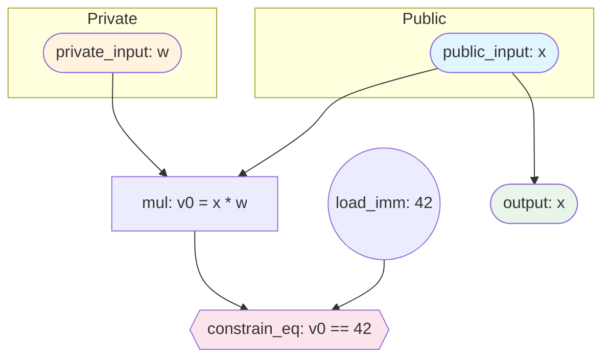
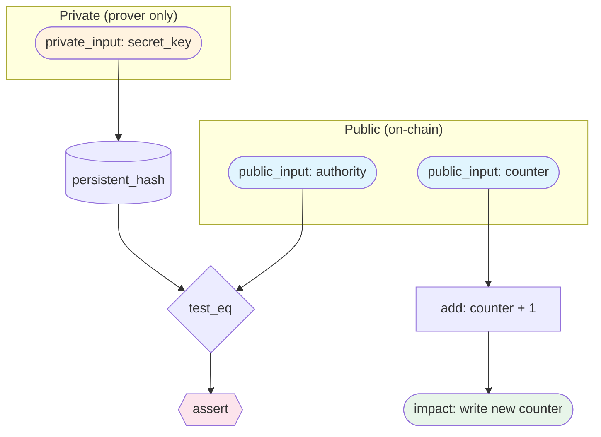
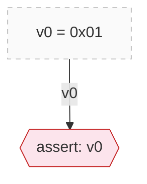

<!--
  ZKIR Reference Documentation
  Auto-assembled from outline + grammar + evidence
  Generated: 2026-03-06

  Deterministic sections marked *[deterministic]* are produced by automated
  tools with no AI involvement. AI-generated sections are marked *[AI-generated]*.
  See Appendix C for reproduction instructions.
-->

# ZKIR Reference Documentation — Outline

## 1. Introduction

### What is ZKIR?

High-level explanation: ZKIR (Zero-Knowledge Intermediate Representation) is
the instruction set for Midnight's zero-knowledge circuits.

A ZKIR circuit is a **directed acyclic graph** (DAG) of instructions. Each
instruction consumes inputs (field elements or references to earlier
instruction outputs) and produces outputs (new variable bindings). The
circuit defines a **relation** — a predicate that is either satisfied or not.

### The simple model: circuits as relations

At its simplest, a circuit defines a relation between public values (visible
to everyone) and private values (known only to the prover):

```
R(public, private) holds  ⟺  all constraints in the circuit are satisfied
```

A zero-knowledge proof says: "I know private values such that R holds" —
without revealing what those private values are.



This diagram shows a tiny circuit that checks "does the prover know a secret
w such that x * w = 42?" The public input x and the output are visible to
everyone; the private input w is known only to the prover. The
`constrain_eq` instruction enforces the relationship — if it fails, the
circuit rejects.

Key mental model:
- **Inputs** flow in (public = visible to verifier, private = prover's secret)
- **Computation** produces intermediate values (add, mul, etc.)
- **Constraints** restrict which values are valid (assert, constrain_eq, etc.)
- **Outputs** flow out (visible to verifier)
- The circuit **accepts** if and only if all constraints are satisfied

### The underlying field *[deterministic]*

All values in a ZKIR circuit are **field elements** — members of a finite
field. Specifically, ZKIR uses the scalar field of the BLS12-381 elliptic
curve, which has order:

```
r = 0x73eda753299d7d483339d80809a1d80553bda402fffe5bfeffffffff00000001
```

This is a prime number approximately 2^253. Every value in the circuit —
inputs, outputs, intermediate variables, immediates — is an element of this
field. Arithmetic wraps around modulo `r`:

- Adding 1 to the largest element `(r-1)` produces 0, not `r`
- `neg(x)` produces the *additive inverse*: `neg(1) = r-1`, because
  `1 + (r-1) = 0` in the field
- There are no negative numbers — what looks like `-1` is actually `r-1`
- Multiplication similarly wraps: `2 * ((r+1)/2) = 1` (modular inverse)

This has practical consequences:
- The `constrain_bits` instruction exists precisely because field elements
  are not integers — without explicit range constraints, any field element
  can masquerade as a "small number"
- The `encode`/`decode` instructions convert between Compact's typed values
  (integers, bytes, booleans) and their field-element representations

**Evidence:** The field wrap-around behavior is demonstrated by hand-crafted
test circuits in Section 6 (Examples), with oracle traces confirming:
`(r-1) + 1 = 0` (accepted), `(r-1) + 2 = 1` (accepted), `(r-1) + 1 = 1`
(rejected). See `circuits/field-wrap-*.zkir`.

### The full model: proving state transitions

ZKIR circuits don't exist in a vacuum — they run on the Midnight
blockchain, where they prove that **ledger state transitions** are valid.
This is why the proof data has four components, not two:

| Component | Visibility | What it contains |
|-----------|-----------|------------------|
| `input` | public | Circuit arguments (function parameters) |
| `output` | public | Circuit return values |
| `publicTranscript` | public | Ledger interactions — what was read from and written to on-chain state |
| `privateTranscriptOutputs` | private | Witness values — the prover's secrets |

The mathematical relation is still **R(public, private)**, but:
- **public** = `input` + `output` + `publicTranscript`
- **private** = `privateTranscriptOutputs`

The `publicTranscript` is what makes ZKIR circuits blockchain-aware. A
circuit doesn't just prove "I computed something correctly" — it proves
"this ledger state transition is valid, given what I know." The transcript
records a sequence of ledger operations (reads, writes, comparisons), and
the circuit's constraints ensure those operations are consistent with the
prover's private witness.

Example: a guarded counter contract proves "I know a secret key whose hash
matches the on-chain authority, therefore I'm allowed to increment the
counter." The public transcript records the authority read and the counter
update; the private transcript contains the secret key; the circuit
constrains that the key's hash matches the authority.



The verifier (the blockchain) sees only the public side: the authority, the
counter values, and the state update. It never sees the secret key — but the
ZKIR proof guarantees the key was valid.

### How to read this document

This document follows the **Aletheia principle**: every claim an AI makes
must be backed by deterministically produced evidence. A mechanical process
— no AI involved — retrieves the evidence and presents it alongside the
claim. You never need to trust the AI. You only need to check the evidence.

#### The three-layer trust model

**Layer 1 — Deterministic evidence production.** Sections marked
*[deterministic]* are produced entirely by automated tools. The grammar is
extracted by a parser. The oracle traces are raw checker output. The
diagrams are generated from `.zkir` JSON. No AI is involved — these
sections are reproducible by anyone who runs the same tools on the same
inputs.

**Layer 2 — Transparent presentation.** Every AI-generated description in
Section 5 is presented alongside the deterministic evidence it interprets.
You can read the description, then look at the oracle traces directly below
it and judge for yourself: does the evidence support the claim?

**Layer 3 — AI synthesis.** Sections marked *[AI-generated]* are prose
summaries written by an AI that interprets the deterministic evidence. These
are a convenience — they save you from reading raw traces and grammar
definitions. But they are not the source of truth. If an AI description
contradicts the evidence, the evidence wins.

#### The markers

- **\*[deterministic]\*** — produced by automated tools, no AI. Fully
  reproducible. See Appendix C for exact reproduction commands.
- **\*[AI-generated]\*** — prose written by an AI to interpret deterministic
  evidence. The evidence it references is always shown nearby.

#### Reproducing the deterministic sections

Every *[deterministic]* section in this document can be regenerated from
source. See **Appendix C** for the exact commands. If you run the tools and
get different output, the documentation is out of date — file a bug.

---

## 1.5. ZKIR Versions *[deterministic]*

> Source: `upstream/compact/compiler/zkir-passes.ss` (v2 serializer),
> `upstream/compact/compiler/zkir-v3-passes.ss` (v3 serializer), field
> names extracted by comparing serializer output

ZKIR circuits exist in two JSON format versions. Both describe the same
computation, but they differ in how variables, immediates, and outputs
are represented.

### v2 — The current production format

The v2 format (version `{major: 2, minor: 0}`) is what the Compact
compiler emits today and what the production proof system consumes. Its
key characteristics:

- **Implicit variable numbering.** Variables are integers (0, 1, 2, ...)
  allocated sequentially. Each instruction that produces output gets the
  next available index. References to previous outputs use these integers.
- **`load_imm` for literals.** Immediate values are loaded by a dedicated
  `load_imm` instruction and then referenced by index, like any other
  variable.
- **Transcript meta-instructions.** The public transcript protocol is
  encoded through `declare_pub_input` and `pi_skip` instructions that
  exist only in v2.
- **Bare hex immediates.** Hex strings without `0x` prefix (e.g., `"01"`,
  `"FF"`, `"0302"`).

### v3 — The next-generation format

The v3 format (version `{major: 3, minor: 0}`) uses named variables and
eliminates meta-instructions:

- **Named variables.** Variables are strings like `%v.0`, `%v.1`, or
  `%pt.3`. The name carries semantic information beyond a simple index.
- **Inline immediates.** No `load_imm` — literal values appear directly
  in instruction operands as `0x`-prefixed hex (e.g., `"0x01"`, `"0xFF"`).
- **Explicit outputs.** Each instruction that produces output declares it
  with an `output` or `outputs` field.
- **No meta-instructions.** `load_imm`, `declare_pub_input`, and `pi_skip`
  do not exist in v3.
- **New opcodes.** `encode` and `decode` are v3-only — they handle
  type-level conversions not available in v2.

### Field name differences *[deterministic]*

Several opcodes use different JSON field names between v2 and v3. The
pattern is systematic: v2 uses `var` where v3 uses `val`, and v3 adds
explicit `output`/`outputs` fields.

| Opcode | v2 field | v3 field | Change |
|--------|----------|----------|--------|
| `constrain_bits` | `var` | `val` | renamed |
| `constrain_to_boolean` | `var` | `val` | renamed |
| `copy` | `var` | `val` + `output` | renamed + explicit output |
| `output` | `var` | `val` | renamed |
| `div_mod_power_of_two` | `var` | `val` + `outputs` | renamed + explicit outputs |
| `ec_mul` | `a_x`, `a_y` | `a` + `output` | merged point + explicit output |
| `ec_mul_generator` | `scalar` | `scalar` + `output` | explicit output added |
| `persistent_hash` | `inputs` | `inputs` + `outputs` | explicit outputs added |
| `private_input` | `guard` | `type` + `output` + `guard` | added type + output |
| `public_input` | `guard` | `type` + `output` + `guard` | added type + output |
| all arithmetic/comparison | `a`, `b` | `a`, `b` + `output` | explicit output added |

### Version-specific opcodes

| Opcode | v2 | v3 | Notes |
|--------|----|----|-------|
| `load_imm` | yes | no | Literals are inlined in v3 |
| `declare_pub_input` | yes | no | Transcript encoding changed in v3 |
| `pi_skip` | yes | no | Transcript encoding changed in v3 |
| `not` | checker only | no | v2 bonus opcode, not in grammar |
| `ec_add` | checker only | no | v2 bonus opcode, not in grammar |
| `encode` | no | yes | Type encoding, v3-only |
| `decode` | no | yes | Type decoding, v3-only |

### Cross-verification

Every opcode documented in this reference (except version-specific ones)
is tested against **both** the v2 and v3 WASM checkers. The v2 hand-
crafted circuits are mechanically converted to v3 format by
`tools/v2-to-v3.mjs` — a deterministic transformation that replaces
integer indices with named variables, inlines `load_imm` values, and
applies the field name mapping above. The same proof data works for both
versions (the proof data format is version-independent).

---

## 2. Formal Grammar *[deterministic]*

> Source: `upstream/compact/compiler/langs.ss`, extracted by
> `tools/extract-grammar.mjs`

The complete formal grammar of the Lzkir language, as defined in the
compiler source. This section is auto-generated — every instruction name,
operand, and type comes directly from the grammar definition.

## Terminal Types

These are the atomic value types used in ZKIR instructions.

| Type | Grammar Symbols | Description |
|------|----------------|-------------|
| `field` | `arg-count`, `imm`, `nat` | Finite field element (used for immediates, counts, natural numbers) |
| `zkir-field-rep` | `fr` | Field representation literal (hex-encoded constant, e.g. `0x0a00`) |
| `source-object` | `src` | Source location metadata (for compiler diagnostics) |
| `id` | `var-name` | Identifier / variable name |
| `symbol` | `name` | Symbolic name (circuit names, labels) |
| `string` | `zkir-type` | String value (ZKIR type annotations like `Uint`, `Bytes`, etc.) |
| `Lflattened-Alignment` | `alignment` | Alignment descriptor from the flattened IR (field, bytes, ADT, etc.) |

## Operand Types

**Input** (`inp`): `fr` | `var-name`

An input operand is either a *field-representation literal* (a hex-encoded constant like `0x0a00`) or a *variable name* (referencing a previous instruction's output).

**Output** (`outp`): `var-name`

An output operand is always a *variable name* — a binding that subsequent instructions can reference.

## Program Structure

A ZKIR **Program** contains one or more circuit definitions:

```
program src cdefn* ...  →  program #f cdefn* ...
```

A **Circuit Definition** declares the circuit's name, typed local
variables, and instruction sequence:

```
circuit src (name* ...) (var-name*,zkir-type* ...) instr* ...
```

Each circuit has a name list (identifying the contract function), a set of typed variable declarations `(var-name : zkir-type)`, and a sequence of instructions.

## Instructions

The Lzkir instruction set contains **24 instructions** (26 forms including overloaded variants).

### Overview

| Category | Instructions | Count |
|----------|-------------|-------|
| Arithmetic | `add`, `mul`, `neg` | 3 |
| Constraints | `assert`, `constrain_bits`, `constrain_eq`, `constrain_to_boolean` | 4 |
| Control Flow | `cond_select`, `copy` | 2 |
| Type Encoding | `decode`, `encode`, `reconstitute_field` | 3 |
| Division | `div_mod_power_of_two` | 1 |
| Cryptographic | `ec_mul`, `ec_mul_generator`, `hash_to_curve`, `persistent_hash`, `transient_hash` | 5 |
| I/O | `impact`, `output`, `private_input`, `public_input` | 4 |
| Comparison | `less_than`, `test_eq` | 2 |

### Arithmetic

#### `add outp inp0 inp1`

| Operand | Role | Type |
|---------|------|------|
| `outp` | output | `—` |
| `inp0` | input | `—` |
| `inp1` | input | `—` |

#### `mul outp inp0 inp1`

| Operand | Role | Type |
|---------|------|------|
| `outp` | output | `—` |
| `inp0` | input | `—` |
| `inp1` | input | `—` |

#### `neg outp inp`

| Operand | Role | Type |
|---------|------|------|
| `outp` | output | `—` |
| `inp` | input | `—` |

### Constraints

#### `assert inp`

| Operand | Role | Type |
|---------|------|------|
| `inp` | input | `—` |

#### `constrain_bits inp imm`

| Operand | Role | Type |
|---------|------|------|
| `inp` | input | `—` |
| `imm` | parameter | `field` |

#### `constrain_eq inp0 inp1`

| Operand | Role | Type |
|---------|------|------|
| `inp0` | input | `—` |
| `inp1` | input | `—` |

#### `constrain_to_boolean inp`

| Operand | Role | Type |
|---------|------|------|
| `inp` | input | `—` |

### Control Flow

#### `cond_select outp inp0 inp1 inp2`

| Operand | Role | Type |
|---------|------|------|
| `outp` | output | `—` |
| `inp0` | input | `—` |
| `inp1` | input | `—` |
| `inp2` | input | `—` |

#### `copy outp inp`

| Operand | Role | Type |
|---------|------|------|
| `outp` | output | `—` |
| `inp` | input | `—` |

### Type Encoding

#### `decode zkir-type outp inp* ...`

| Operand | Role | Type |
|---------|------|------|
| `zkir-type` | parameter | `string` |
| `outp` | output | `—` |
| `inp* (variadic)` | input | `—` |
| `...` | — | `—` |

#### `encode outp0 outp1 inp`

| Operand | Role | Type |
|---------|------|------|
| `outp0` | output | `—` |
| `outp1` | output | `—` |
| `inp` | input | `—` |

#### `reconstitute_field outp inp0 inp1 imm`

| Operand | Role | Type |
|---------|------|------|
| `outp` | output | `—` |
| `inp0` | input | `—` |
| `inp1` | input | `—` |
| `imm` | parameter | `field` |

### Division

#### `div_mod_power_of_two outp0 outp1 inp imm`

*outps=(quotient remainder)*

| Operand | Role | Type |
|---------|------|------|
| `outp0` | output | `—` |
| `outp1` | output | `—` |
| `inp` | input | `—` |
| `imm` | parameter | `field` |

### Cryptographic

#### `ec_mul outp inp0 inp1`

| Operand | Role | Type |
|---------|------|------|
| `outp` | output | `—` |
| `inp0` | input | `—` |
| `inp1` | input | `—` |

#### `ec_mul_generator outp0 inp`

| Operand | Role | Type |
|---------|------|------|
| `outp0` | output | `—` |
| `inp` | input | `—` |

#### `hash_to_curve outp inp* ...`

| Operand | Role | Type |
|---------|------|------|
| `outp` | output | `—` |
| `inp* (variadic)` | input | `—` |
| `...` | — | `—` |

#### `persistent_hash outp0 outp1 (alignment* ...) inp* ...`

| Operand | Role | Type |
|---------|------|------|
| `outp0` | output | `—` |
| `outp1` | output | `—` |
| `alignment* ... (variadic)` | — | `—` |
| `inp* (variadic)` | input | `—` |
| `...` | — | `—` |

#### `transient_hash outp inp* ...`

| Operand | Role | Type |
|---------|------|------|
| `outp` | output | `—` |
| `inp* (variadic)` | input | `—` |
| `...` | — | `—` |

### I/O

#### `impact inp inp* ...`

| Operand | Role | Type |
|---------|------|------|
| `inp` | input | `—` |
| `inp* (variadic)` | input | `—` |
| `...` | — | `—` |

#### `output inp`

| Operand | Role | Type |
|---------|------|------|
| `inp` | input | `—` |

#### `private_input zkir-type outp`

| Operand | Role | Type |
|---------|------|------|
| `zkir-type` | parameter | `string` |
| `outp` | output | `—` |

#### `private_input zkir-type outp inp`

| Operand | Role | Type |
|---------|------|------|
| `zkir-type` | parameter | `string` |
| `outp` | output | `—` |
| `inp` | input | `—` |

#### `public_input zkir-type outp`

| Operand | Role | Type |
|---------|------|------|
| `zkir-type` | parameter | `string` |
| `outp` | output | `—` |

#### `public_input zkir-type outp inp`

| Operand | Role | Type |
|---------|------|------|
| `zkir-type` | parameter | `string` |
| `outp` | output | `—` |
| `inp` | input | `—` |

### Comparison

#### `less_than outp inp0 inp1 imm`

| Operand | Role | Type |
|---------|------|------|
| `outp` | output | `—` |
| `inp0` | input | `—` |
| `inp1` | input | `—` |
| `imm` | parameter | `field` |

#### `test_eq outp inp0 inp1`

| Operand | Role | Type |
|---------|------|------|
| `outp` | output | `—` |
| `inp0` | input | `—` |
| `inp1` | input | `—` |

---

## Source Traceability

This document was generated by parsing the `define-language/pretty Lzkir` form in `upstream/compact/compiler/langs.ss`. Every instruction signature, operand name, and type annotation above comes directly from the formal grammar — no manual transcription, no AI interpretation.

Related source files for deeper understanding:

| File | Purpose |
|------|---------|
| `compiler/langs.ss` | Formal grammar (this document's source) |
| `compiler/zkir-passes.ss` | ZKIR v2 serializer (how instructions become JSON) |
| `compiler/zkir-v3-passes.ss` | ZKIR v3 backend |
| `compiler/circuit-passes.ss` | Circuit lowering (what Compact constructs emit which instructions) |


---

## 3. Serialized ZKIR — The JSON Format *[deterministic]*

> Source: compiled `.zkir` files + `compiler/zkir-passes.ss` serializer

Explain the JSON format that circuits are actually stored in. This is the
concrete representation that tools consume.

### Top-level structure

```json
{
  "version": { "major": 2, "minor": 0 },
  "do_communications_commitment": true,
  "num_inputs": 0,
  "instructions": [ ... ]
}
```

### Instruction encoding

Each instruction is a JSON object with an `op` field. Operands are encoded
as:
- **Variables**: integer indices (0, 1, 2, ...) — each instruction that
  produces a value gets the next available index
- **Immediates**: hex strings without `0x` prefix (e.g., `"01"`, `"A1"`)
- **Guards**: integer variable index or `null` (for conditional execution)

### Variable numbering

Variables are allocated sequentially. Each instruction that produces an
output occupies the next integer. References to previous outputs use these
integers.

### Mapping from grammar to JSON *[deterministic]*

> Source: `upstream/compact/compiler/zkir-passes.ss` (v2 serializer),
> `upstream/compact/compiler/zkir-v3-passes.ss` (v3 serializer)

Each Lzkir grammar instruction maps directly to a JSON `op` name and a set
of field names. The mapping was derived by analyzing the serializer source
code — see **Section 1.5 (ZKIR Versions)** for the complete field name
cross-reference between v2 and v3 formats.

The v2 JSON encoding follows a consistent pattern:

| Grammar operand | JSON encoding |
|----------------|---------------|
| `outp` (output) | Implicit — the next sequential integer index |
| `inp` (input) | Integer index (variable reference) or hex string (immediate) |
| `imm` (parameter) | Inline integer (e.g., `"bits": 8`) |
| `zkir-type` | String (e.g., `"field"`) |
| `alignment*` | Array of alignment segment objects |
| `inp* ...` (variadic) | `"inputs": [...]` array |

Instruction names are preserved verbatim from the grammar (e.g.,
`constrain_bits` → `{"op": "constrain_bits", ...}`). The v2 serializer
uses `var` for single-input operands and `a`/`b` for binary operands.
The v3 serializer renames these — the complete mapping is in the
**Field name differences** table in Section 1.5.

---

## 4. The Verification Oracle *[deterministic]*

> Source: `@midnight-ntwrk/zkir-v2` WASM library

Explain the black-box checker:

```
check(circuit, inputs) → accept | reject(reason)
```

### What the checker takes

The checker takes a circuit and the four proof data components introduced in
Section 1:

| Component                  | Part of     | What it contains              |
|---------------------------|-------------|-------------------------------|
| `circuit`                  | —           | The `.zkir` JSON (or binary)  |
| `input`                    | **public**  | Circuit arguments             |
| `output`                   | **public**  | Circuit return values         |
| `publicTranscript`         | **public**  | Ledger state reads/writes     |
| `privateTranscriptOutputs` | **private** | Witness values                |

It replays the circuit's instructions using these values and checks whether
all constraints are satisfied — that is, whether R(public, private) holds.

### What the checker returns

- **Accept**: R(public, private) holds — all constraints satisfied
- **Reject**: a specific error message identifying *which* constraint failed
  and *why*

### Error message catalog

Table of known error messages and what they mean, derived from our test
runs. Each entry cites the specific test that produced it.

| Error message                                         | Meaning                    | Evidence         |
|------------------------------------------------------|----------------------------|------------------|
| `Failed direct assertion`                             | `assert` input is boolean 0 | assert-false-reject |
| `Expected boolean, found: XX`                         | Input is not boolean (0 or 1) | assert-two-reject, ctb-two-reject |
| `Failed equality constraint: XX != YY`                | `constrain_eq` inputs differ | ceq-unequal-reject |
| `Bit bound failed: XX is not N-bit`                   | `constrain_bits` value exceeds range | cb-8bit-256-reject, cb-1bit-two-reject |
| `Ran out of private transcript outputs`               | Missing witness data       | priv-input-missing-reject |
| `Transcripts not fully consumed`                      | Extra unused witness data  | checker-extra-private-... |
| `Public transcript input mismatch for input N; ...`   | Tampered public value      | checker-tampered-public-... |

### Transcript mismatch behavior *[deterministic]*

> Source: derived test cases produced by `tests/derive-checker-tests.mjs`

Before documenting individual opcodes, it is important to understand what
happens when the proof data itself is structurally wrong — independent of
any constraint logic. The checker enforces **transcript integrity**: the
public and private transcripts must be exactly consumed during circuit
execution. No more, no less.

These tests are derived deterministically from valid proof data by making
targeted modifications:

**Extra private transcript outputs.** Appending an unused entry to
`privateTranscriptOutputs` causes the checker to reject after circuit
execution completes — it detects that not all witness data was consumed.
This is a protocol-level check, not a constraint check.

**Missing private transcript outputs.** Removing the private transcript
from a circuit that expects witness data causes the checker to reject when
the circuit's `private_input` instruction tries to read a value that isn't
there.

**Tampered public transcript values.** Changing a byte in the public
transcript causes a mismatch between what the circuit computes and what the
transcript claims. The error message identifies the exact input index and
shows the expected vs. computed values in hex.

**Truncated public transcript.** Removing entries from the public transcript
disrupts the circuit's ledger interaction sequence.

Each of these behaviors is demonstrated by oracle traces in the evidence
report. The tests are produced by `derive-checker-tests.mjs`, which takes
valid test cases and generates modified variants — no manual construction,
no AI involvement.

### How we use it

Every opcode documentation section below includes hand-crafted circuits that
are fed to this checker. The accept/reject results and error messages are
the **evidence** for the documented behavior.

---

## 4.5. The Public Transcript Protocol *[deterministic]*

> Source: compiled circuit analysis + `@midnight-ntwrk/onchain-runtime-v3`
> type definitions + `upstream/compact/compiler/zkir-passes.ss` serializer

ZKIR circuits on the Midnight blockchain don't just prove computation — they
prove that **ledger state transitions** are valid. The `publicTranscript` is
the mechanism for this: it records a sequence of VM operations that interact
with on-chain state.

### The transcript VM

The `publicTranscript` is an array of `Op<AlignedValue>` — operations for a
stack-based virtual machine that reads and writes ledger state. These
operations are defined in the `onchain-runtime` packages:

| Operation | Fields | What it does |
|-----------|--------|-------------|
| `dup` | `{n: number}` | Duplicate the n-th stack element |
| `idx` | `{cached, pushPath, path: Key[]}` | Index into state (array/map lookup) |
| `popeq` | `{cached, result: AlignedValue}` | Pop and verify equality; carries the read value |
| `addi` | `{immediate: number}` | Add integer to top of stack |
| `subi` | `{immediate: number}` | Subtract integer from top of stack |
| `ins` | `{cached, n: number}` | Insert value into state |
| `push` | `{storage, value: EncodedStateValue}` | Push a value onto the stack |
| `branch` | `{skip: number}` | Conditional skip |
| `jmp` | `{skip: number}` | Unconditional skip |
| `concat` | `{cached, n: number}` | Concatenate n values |
| `rem` | `{cached}` | Remove from state |
| `swap` | `{n: number}` | Swap with n-th stack element |
| Simple ops | (no fields) | `lt`, `eq`, `type`, `size`, `new`, `and`, `or`, `neg`, `log`, `root`, `pop`, `add`, `sub`, `member`, `ckpt` |
| `noop` | `{n: number}` | No-op (repeated n times) |

The `AlignedValue` type carries both raw data and alignment metadata:

```typescript
AlignedValue = {
  value: Uint8Array[],  // raw bytes, split across field elements
  alignment: AlignmentSegment[]  // describes how to interpret the bytes
}
```

### How circuits encode the transcript

The Compact compiler serializes each transcript VM operation into a sequence
of **field elements**. In the ZKIR circuit, this encoding uses two
meta-instructions:

- **`declare_pub_input var`** — declares that a field element from the
  serialized transcript must equal the value of variable `var`
- **`pi_skip guard count`** — groups the preceding `count` declarations
  into one transcript operation (with an optional guard for conditional
  execution)

Each VM operation has a **numeric opcode** that becomes the first field
element in the group. The encoding scheme (from `zkir-passes.ss`):

| VM operation | Field encoding |
|-------------|---------------|
| `noop {n}` | n repetitions of `[0x00]` |
| `lt` | `[0x01]` |
| `eq` | `[0x02]` |
| `type` | `[0x03]` |
| `size` | `[0x04]` |
| `new` | `[0x05]` |
| `pop` | `[0x0B]` |
| `popeq` (uncached) | `[0x0C, alignment..., data...]` |
| `popeq` (cached) | `[0x0D, alignment..., data...]` |
| `addi {n}` | `[0x0E, n]` |
| `subi {n}` | `[0x0F, n]` |
| `push` (non-storage) | `[0x10, encoded_value...]` |
| `push` (storage) | `[0x11, encoded_value...]` |
| `branch {skip}` | `[0x12, skip]` |
| `jmp {skip}` | `[0x13, skip]` |
| `add` | `[0x14]` |
| `sub` | `[0x15]` |
| `dup {n}` | `[0x30 + n]` |
| `swap {n}` | `[0x40 + n]` |
| `idx` | `[0x50 + flags, path...]` |
| `ins` (uncached) | `[0x90 + n]` |
| `ins` (cached) | `[0xA0 + n]` |
| `ckpt` | `[0xFF]` |

### Example: counter contract transcript encoding *[deterministic]*

The counter contract's `increment` circuit has this publicTranscript:

```json
[
  { "idx": { "cached": false, "pushPath": true, "path": [...] } },
  { "addi": { "immediate": 1 } },
  { "ins": { "cached": true, "n": 1 } }
]
```

These three operations (look up current counter, add 1, store back) are
encoded in the ZKIR as:

```
load_imm "70"              → var 1  (idx opcode: 0x70 = 0x50 + flags)
load_imm "00"              → var 2  (path key value)
declare_pub_input var:1     → field element: idx opcode
declare_pub_input var:0     → field element: 0x01 (path info)
declare_pub_input var:0     → field element: 0x01 (key type)
declare_pub_input var:2     → field element: 0x00 (key value)
pi_skip guard:0 count:4     → groups 4 elements for idx op

load_imm "0E"              → var 3  (addi opcode: 0x0E = 14)
declare_pub_input var:3     → field element: addi opcode
declare_pub_input var:0     → field element: 0x01 (immediate = 1)
pi_skip guard:0 count:2     → groups 2 elements for addi op

load_imm "A1"              → var 4  (ins cached opcode: 0xA1 = 0xA0 + 1)
declare_pub_input var:4     → field element: ins opcode
pi_skip guard:0 count:1     → groups 1 element for ins op
```

The checker verifies that the serialized `publicTranscript` produces
**exactly** these field element values. If we tamper with the transcript
(e.g., change `addi {immediate: 1}` to `addi {immediate: 999}`), the
checker rejects:

> `Public transcript input mismatch for input 5; expected: Some(e703),
> computed: Some(01)`

### The `popeq` bridge: where `public_input` reads data *[deterministic]*

The `popeq` operation is special — it's the bridge between the transcript
protocol and the circuit's `public_input` instructions. When the transcript
contains a `popeq`, its `result` field carries actual data (an
`AlignedValue`). The ZKIR circuit reads this data using `public_input`
instructions.

In the guarded counter contract, reading the on-chain authority looks like:

```
; Transcript ops: dup → idx → popeq (reads authority hash)
public_input guard:null    → var 9   (authority hash part 1)
public_input guard:null    → var 10  (authority hash part 2)

; Then the popeq is encoded with declare_pub_input/pi_skip:
load_imm "0C"              → var 12  (popeq uncached opcode)
declare_pub_input var:12    → opcode
declare_pub_input var:0     → alignment info
declare_pub_input var:11    → bytes length (32)
declare_pub_input var:9     → authority hash part 1 (from public_input!)
declare_pub_input var:10    → authority hash part 2 (from public_input!)
pi_skip guard:0 count:5     → groups 5 elements for popeq
```

The `public_input` values are used **both** as circuit variables (for the
hash comparison) **and** as declared public input values (to verify the
transcript). This is the mechanism that ties the circuit's constraint logic
to the ledger state.

**Verification evidence** *[deterministic]*

| Test | Circuit | Expected | Verdict |
|------|---------|----------|---------|
| counter with valid transcript | `build/counter-full/zkir/increment.zkir` | accept | ACCEPTED (3 outputs) |
| counter with tampered transcript (addi 999) | `build/counter-full/zkir/increment.zkir` | reject | REJECTED: `Public transcript input mismatch for input 5; expected: Some(e703), computed: Some(01)` |
| guarded_counter with valid key | `build/guarded_counter/zkir/guarded_increment.zkir` | accept | ACCEPTED (6 outputs) |
| guarded_counter with wrong key | `build/guarded_counter/zkir/guarded_increment.zkir` | reject | REJECTED: `Failed direct assertion` |

---

## 5. Instruction Reference

For each of the 24 instructions, grouped by category:

### 5.1 Arithmetic

#### `add`

**Grammar** *[deterministic]*

```
add outp inp0 inp1
```

| Operand | Role   | Type           |
|---------|--------|----------------|
| `outp`  | output | var-name       |
| `inp0`  | input  | fr \| var-name |
| `inp1`  | input  | fr \| var-name |

JSON format: `{ "op": "add", "a": <inp0>, "b": <inp1> }`

Produces one output variable (the sum).

**Description** *[AI-generated]*

`add` computes field addition: `outp = inp0 + inp1 (mod r)`, where `r` is
the BLS12-381 scalar field order. The result wraps around — if the sum
exceeds `r-1`, it reduces modulo `r`. This is standard finite field
arithmetic, not integer addition.

See Section 1 ("The underlying field") for wrap-around evidence:
`(r-1) + 1 = 0` and `(r-1) + 2 = 1`.

**Verification evidence** *[deterministic]*

| Test | Circuit | Expected | Verdict |
|------|---------|----------|---------|
| `add: 3 + 4 = 7` | `circuits/add-basic.zkir` | accept | ACCEPTED |
| `add: 3 + 4 != 8` | `circuits/add-wrong.zkir` | reject | REJECTED: `Failed equality constraint: 07 != 08` |


**v3 cross-verification** *[deterministic]*

| Test | Circuit | Verdict |
|------|---------|---------|
| add: 3 + 4 = 7 (v3) | `./zkir/circuits/add-basic-v3.zkir` | ACCEPTED |
| add: 3 + 4 != 8 (v3) | `./zkir/circuits/add-wrong-v3.zkir` | REJECTED |

---

#### `mul`

**Grammar** *[deterministic]*

```
mul outp inp0 inp1
```

| Operand | Role   | Type           |
|---------|--------|----------------|
| `outp`  | output | var-name       |
| `inp0`  | input  | fr \| var-name |
| `inp1`  | input  | fr \| var-name |

JSON format: `{ "op": "mul", "a": <inp0>, "b": <inp1> }`

Produces one output variable (the product).

**Description** *[AI-generated]*

`mul` computes field multiplication: `outp = inp0 * inp1 (mod r)`.
Multiplication by zero always produces zero. Like `add`, the result wraps
modulo the field order.

**Verification evidence** *[deterministic]*

| Test | Circuit | Expected | Verdict |
|------|---------|----------|---------|
| `mul: 3 * 5 = 15` | `circuits/mul-basic.zkir` | accept | ACCEPTED |
| `mul: 42 * 0 = 0` | `circuits/mul-by-zero.zkir` | accept | ACCEPTED |
| `mul: 3 * 5 != 16` | `circuits/mul-wrong.zkir` | reject | REJECTED: `Failed equality constraint: 0f != 10` |


**v3 cross-verification** *[deterministic]*

| Test | Circuit | Verdict |
|------|---------|---------|
| mul: 3 * 5 = 15 (v3) | `./zkir/circuits/mul-basic-v3.zkir` | ACCEPTED |
| mul: 42 * 0 = 0 (v3) | `./zkir/circuits/mul-by-zero-v3.zkir` | ACCEPTED |
| mul: 3 * 5 != 16 (v3) | `./zkir/circuits/mul-wrong-v3.zkir` | REJECTED |

---

#### `neg`

**Grammar** *[deterministic]*

```
neg outp inp
```

| Operand | Role   | Type           |
|---------|--------|----------------|
| `outp`  | output | var-name       |
| `inp`   | input  | fr \| var-name |

JSON format: `{ "op": "neg", "a": <inp> }`

Produces one output variable (the additive inverse).

**Description** *[AI-generated]*

`neg` computes the field-theoretic additive inverse: `outp = -inp (mod r)`,
meaning `inp + outp = 0`. For any nonzero value `x`, `neg(x) = r - x`.
The special case: `neg(0) = 0` — zero is its own inverse.

Note that `neg(1) = r-1`, not `-1` — there are no negative numbers in the
field, only large positive ones that happen to be additive inverses.

**Verification evidence** *[deterministic]*

| Test | Circuit | Expected | Verdict |
|------|---------|----------|---------|
| `neg: x + neg(x) = 0` | `circuits/neg-basic.zkir` | accept | ACCEPTED |
| `neg: neg(0) = 0` | `circuits/neg-zero.zkir` | accept | ACCEPTED |


**v3 cross-verification** *[deterministic]*

| Test | Circuit | Verdict |
|------|---------|---------|
| neg: x + neg(x) = 0 (v3) | `./zkir/circuits/neg-basic-v3.zkir` | ACCEPTED |
| neg: neg(0) = 0 (v3) | `./zkir/circuits/neg-zero-v3.zkir` | ACCEPTED |

Additional evidence from Section 1: `neg(1) = r-1` (accepted),
`(r-1) + 1 = 0` (accepted).

### 5.2 Constraints

#### `assert`

**Grammar** *[deterministic]*

> Source: `upstream/compact/compiler/langs.ss`, extracted by
> `tools/extract-grammar.mjs`

```
assert inp
```

| Operand | Role   | Type            |
|---------|--------|-----------------|
| `inp`   | input  | fr \| var-name  |

JSON format: `{ "op": "assert", "cond": <var-index-or-literal> }`

No output — `assert` does not produce a new variable.

**Circuit diagram** *[deterministic]*

> Source: `circuits/assert-true.zkir`, generated by
> `tools/zkir-to-mermaid.mjs`



**Description** *[AI-generated]*

`assert` enforces that its input is the boolean value 1 (true). It is a
two-step check:

1. **Boolean check.** The input must be exactly 0 or 1. Any other field
   element — including 2, r-1, or any large value — is rejected with
   `"Expected boolean, found: XX"` where XX is the hex representation of
   the offending value. This means `assert` implicitly includes a
   `constrain_to_boolean` check.

2. **Truth check.** If the input is boolean, it must be 1. An input of 0
   is rejected with `"Failed direct assertion"`.

This two-level error reporting is useful for debugging: if a circuit rejects
with "Expected boolean," the problem is upstream of the assert — some
instruction produced a non-boolean value where a boolean was expected. If
it rejects with "Failed direct assertion," the boolean logic itself
evaluated to false.

In compiled Compact code, `assert` appears after `test_eq` or `cond_select`
instructions that produce a boolean result — for example, checking that a
hashed private key matches an on-chain authority.

**Test circuits** *[deterministic]*

Four hand-crafted circuits, each loading a single immediate and asserting it:

| Circuit | Immediate | Expected |
|---------|-----------|----------|
| `circuits/assert-true.zkir` | `01` (one) | accept |
| `circuits/assert-false.zkir` | `00` (zero) | reject |
| `circuits/assert-two.zkir` | `02` (two) | reject |
| `circuits/assert-r-minus-1.zkir` | `r-1` (largest field element) | reject |

Each circuit has the same structure:
```json
{
  "version": { "major": 2, "minor": 0 },
  "do_communications_commitment": false,
  "num_inputs": 0,
  "instructions": [
    { "op": "load_imm", "imm": "<value>" },
    { "op": "assert", "cond": 0 }
  ]
}
```

**Verification evidence** *[deterministic]*


**v3 cross-verification** *[deterministic]*

| Test | Circuit | Verdict |
|------|---------|---------|
| assert: input is 0 (false) (v3) | `./zkir/circuits/assert-false-v3.zkir` | REJECTED |
| assert: input is r-1 (largest field element) (v3) | `./zkir/circuits/assert-r-minus-1-v3.zkir` | REJECTED |
| assert: input is 1 (true) (v3) | `./zkir/circuits/assert-true-v3.zkir` | ACCEPTED |
| assert: input is 2 (not boolean) (v3) | `./zkir/circuits/assert-two-v3.zkir` | REJECTED |

> Source: oracle traces produced by `tools/trace-oracle.mjs`

#### Trace: input is 1 — accepted

```
Circuit:  circuits/assert-true.zkir (2 instructions)
Verdict:  ACCEPTED
Outputs:  []
```

The only value `assert` accepts.

#### Trace: input is 0 — rejected (failed assertion)

```
Circuit:  circuits/assert-false.zkir (2 instructions)
Verdict:  REJECTED
Error:    "Failed direct assertion"
```

The input is a valid boolean (0), but `assert` requires 1.

#### Trace: input is 2 — rejected (not boolean)

```
Circuit:  circuits/assert-two.zkir (2 instructions)
Verdict:  REJECTED
Error:    "Expected boolean, found: 02"
```

The input is not boolean at all. The checker rejects before even evaluating
the assertion.

#### Trace: input is r-1 — rejected (not boolean)

```
Circuit:  circuits/assert-r-minus-1.zkir (2 instructions)
Verdict:  REJECTED
Error:    "Expected boolean, found: 00000000fffffffffe5bfeff02a4bd5305d8a10908d83933487d9d2953a7ed73"
```

Even the largest field element (the additive inverse of 1) is not boolean.
The error message shows the full hex representation.

---

#### `constrain_to_boolean`

**Grammar** *[deterministic]*

```
constrain_to_boolean inp
```

| Operand | Role   | Type           |
|---------|--------|----------------|
| `inp`   | input  | fr \| var-name |

JSON format: `{ "op": "constrain_to_boolean", "var": <inp> }`

No output — pure constraint.

**Description** *[AI-generated]*

`constrain_to_boolean` enforces that its input is exactly 0 or 1. Any
other field element is rejected with `"Expected boolean, found: XX"`.

This is the same boolean check that `assert` performs as its first step.
The difference: `constrain_to_boolean` accepts both 0 and 1, while
`assert` additionally requires the value to be 1.

**Verification evidence** *[deterministic]*

| Test | Circuit | Expected | Verdict |
|------|---------|----------|---------|
| `constrain_to_boolean: input is 0` | `circuits/ctb-zero.zkir` | accept | ACCEPTED |
| `constrain_to_boolean: input is 1` | `circuits/ctb-one.zkir` | accept | ACCEPTED |
| `constrain_to_boolean: input is 2` | `circuits/ctb-two.zkir` | reject | REJECTED: `Expected boolean, found: 02` |


**v3 cross-verification** *[deterministic]*

| Test | Circuit | Verdict |
|------|---------|---------|
| constrain_to_boolean: input is 1 (v3) | `./zkir/circuits/ctb-one-v3.zkir` | ACCEPTED |
| constrain_to_boolean: input is 2 (v3) | `./zkir/circuits/ctb-two-v3.zkir` | REJECTED |
| constrain_to_boolean: input is 0 (v3) | `./zkir/circuits/ctb-zero-v3.zkir` | ACCEPTED |

---

#### `constrain_eq`

**Grammar** *[deterministic]*

```
constrain_eq inp0 inp1
```

| Operand | Role   | Type           |
|---------|--------|----------------|
| `inp0`  | input  | fr \| var-name |
| `inp1`  | input  | fr \| var-name |

JSON format: `{ "op": "constrain_eq", "a": <inp0>, "b": <inp1> }`

No output — pure constraint.

**Description** *[AI-generated]*

`constrain_eq` enforces that its two inputs are equal as field elements.
If they differ, the circuit rejects with `"Failed equality constraint:
XX != YY"` showing both values in hex.

This is used throughout our test circuits to verify computation results.
It is not the same as `test_eq`, which *produces* a boolean result without
constraining — `constrain_eq` directly enforces equality and fails the
circuit if violated.

**Verification evidence** *[deterministic]*

| Test | Circuit | Expected | Verdict |
|------|---------|----------|---------|
| `constrain_eq: equal values (0x2A)` | `circuits/ceq-equal.zkir` | accept | ACCEPTED |
| `constrain_eq: both zero` | `circuits/ceq-zero-zero.zkir` | accept | ACCEPTED |
| `constrain_eq: unequal values` | `circuits/ceq-unequal.zkir` | reject | REJECTED: `Failed equality constraint: 2a != 2b` |


**v3 cross-verification** *[deterministic]*

| Test | Circuit | Verdict |
|------|---------|---------|
| constrain_eq: equal values (0x2A == 0x2A) (v3) | `./zkir/circuits/ceq-equal-v3.zkir` | ACCEPTED |
| constrain_eq: unequal values (0x2A != 0x2B) (v3) | `./zkir/circuits/ceq-unequal-v3.zkir` | REJECTED |
| constrain_eq: both zero (v3) | `./zkir/circuits/ceq-zero-zero-v3.zkir` | ACCEPTED |

---

#### `constrain_bits`

**Grammar** *[deterministic]*

```
constrain_bits inp imm
```

| Operand | Role      | Type           |
|---------|-----------|----------------|
| `inp`   | input     | fr \| var-name |
| `imm`   | parameter | integer        |

JSON format: `{ "op": "constrain_bits", "var": <inp>, "bits": <N> }`

No output — pure constraint.

**Description** *[AI-generated]*

`constrain_bits` enforces that its input fits within N bits — that is,
the value is in the range `[0, 2^N - 1]`. If the value exceeds this
range, the circuit rejects with `"Bit bound failed: XX is not N-bit"`.

This instruction is critical because ZKIR values are field elements (up
to ~2^253), but Compact types often have bounded ranges (Uint8, Uint32,
etc.). Without `constrain_bits`, a prover could substitute any field
element where a bounded integer is expected.

**Verification evidence** *[deterministic]*

| Test | Circuit | Expected | Verdict |
|------|---------|----------|---------|
| `constrain_bits: 0 fits in 8 bits` | `circuits/cb-8bit-zero.zkir` | accept | ACCEPTED |
| `constrain_bits: 255 fits in 8 bits` | `circuits/cb-8bit-255.zkir` | accept | ACCEPTED |
| `constrain_bits: 256 does not fit in 8 bits` | `circuits/cb-8bit-256.zkir` | reject | REJECTED: `Bit bound failed: 0001 is not 8-bit` |
| `constrain_bits: 1 fits in 1 bit` | `circuits/cb-1bit-one.zkir` | accept | ACCEPTED |
| `constrain_bits: 2 does not fit in 1 bit` | `circuits/cb-1bit-two.zkir` | reject | REJECTED: `Bit bound failed: 02 is not 1-bit` |


**v3 cross-verification** *[deterministic]*

| Test | Circuit | Verdict |
|------|---------|---------|
| constrain_bits: 1 fits in 1 bit (v3) | `./zkir/circuits/cb-1bit-one-v3.zkir` | ACCEPTED |
| constrain_bits: 2 does not fit in 1 bit (v3) | `./zkir/circuits/cb-1bit-two-v3.zkir` | REJECTED |
| constrain_bits: 255 fits in 8 bits (v3) | `./zkir/circuits/cb-8bit-255-v3.zkir` | ACCEPTED |
| constrain_bits: 256 does not fit in 8 bits (v3) | `./zkir/circuits/cb-8bit-256-v3.zkir` | REJECTED |
| constrain_bits: 0 fits in 8 bits (v3) | `./zkir/circuits/cb-8bit-zero-v3.zkir` | ACCEPTED |

### 5.3 Comparison

#### `test_eq`

**Grammar** *[deterministic]*

```
test_eq outp inp0 inp1
```

| Operand | Role   | Type           |
|---------|--------|----------------|
| `outp`  | output | var-name       |
| `inp0`  | input  | fr \| var-name |
| `inp1`  | input  | fr \| var-name |

JSON format: `{ "op": "test_eq", "a": <inp0>, "b": <inp1> }`

Produces one output variable: 1 if equal, 0 if not.

**Description** *[AI-generated]*

`test_eq` compares two field elements and produces a boolean result: 1 if
they are equal, 0 if they differ. Unlike `constrain_eq`, it does not fail
the circuit — it just records the result for downstream instructions
(typically `assert` or `cond_select`).

In the guarded counter circuit, `test_eq` compares the hashed private key
against the on-chain authority. The result feeds into `assert` — if the
key doesn't match, the assertion fails.

**Verification evidence** *[deterministic]*

| Test | Circuit | Expected | Verdict |
|------|---------|----------|---------|
| `test_eq: equal values produce 1` | `circuits/teq-equal.zkir` | accept | ACCEPTED (result=1, asserted) |
| `test_eq: unequal values produce 0` | `circuits/teq-unequal.zkir` | accept | ACCEPTED (result=0, constrained to 0) |


**v3 cross-verification** *[deterministic]*

| Test | Circuit | Verdict |
|------|---------|---------|
| test_eq: equal values produce 1 (v3) | `./zkir/circuits/teq-equal-v3.zkir` | ACCEPTED |
| test_eq: unequal values produce 0 (v3) | `./zkir/circuits/teq-unequal-v3.zkir` | ACCEPTED |

---

#### `less_than`

**Grammar** *[deterministic]*

```
less_than outp inp0 inp1 imm
```

| Operand | Role      | Type           |
|---------|-----------|----------------|
| `outp`  | output    | var-name       |
| `inp0`  | input     | fr \| var-name |
| `inp1`  | input     | fr \| var-name |
| `imm`   | parameter | integer        |

JSON format: `{ "op": "less_than", "a": <inp0>, "b": <inp1>, "bits": <N> }`

Produces one output variable: 1 if `inp0 < inp1`, 0 otherwise.

**Description** *[AI-generated]*

`less_than` performs a strict less-than comparison within a bounded bit
width. The `bits` parameter specifies the range — both inputs are assumed
to be N-bit values. The result is boolean: 1 if `inp0 < inp1`, 0 if
`inp0 >= inp1`.

Equal values produce 0 (strictly less-than, not less-than-or-equal).

**Verification evidence** *[deterministic]*

| Test | Circuit | Expected | Verdict |
|------|---------|----------|---------|
| `less_than: 3 < 10 is true (8-bit)` | `circuits/lt-true.zkir` | accept | ACCEPTED (result=1) |
| `less_than: 10 < 3 is false (8-bit)` | `circuits/lt-false.zkir` | accept | ACCEPTED (result=0) |
| `less_than: 5 < 5 is false (8-bit)` | `circuits/lt-equal.zkir` | accept | ACCEPTED (result=0) |


**v3 cross-verification** *[deterministic]*

| Test | Circuit | Verdict |
|------|---------|---------|
| less_than: 5 < 5 is false (8-bit) (v3) | `./zkir/circuits/lt-equal-v3.zkir` | ACCEPTED |
| less_than: 10 < 3 is false (8-bit) (v3) | `./zkir/circuits/lt-false-v3.zkir` | ACCEPTED |
| less_than: 3 < 10 is true (8-bit) (v3) | `./zkir/circuits/lt-true-v3.zkir` | ACCEPTED |

---

### 5.4 Control Flow

#### `cond_select`

**Grammar** *[deterministic]*

```
cond_select outp inp0 inp1 inp2
```

| Operand | Role   | Type           |
|---------|--------|----------------|
| `outp`  | output | var-name       |
| `inp0`  | input  | fr \| var-name (boolean selector) |
| `inp1`  | input  | fr \| var-name (value if true)    |
| `inp2`  | input  | fr \| var-name (value if false)   |

JSON format: `{ "op": "cond_select", "bit": <inp0>, "a": <inp1>, "b": <inp2> }`

Produces one output variable.

**Description** *[AI-generated]*

`cond_select` is the conditional multiplexer — the only branching
mechanism in ZKIR. It selects between two values based on a boolean:
`outp = bit ? a : b`. If `bit` is 1, the output is `a`; if 0, the
output is `b`.

The `bit` input must be boolean (0 or 1). A non-boolean value rejects
with `"Expected boolean, found: XX"` — the same check as `assert` and
`constrain_to_boolean`.

In compiled Compact code, `if/else` expressions compile to `cond_select`.

**Verification evidence** *[deterministic]*

| Test | Circuit | Expected | Verdict |
|------|---------|----------|---------|
| `cond_select: bit=1 selects first value` | `circuits/csel-true.zkir` | accept | ACCEPTED |
| `cond_select: bit=0 selects second value` | `circuits/csel-false.zkir` | accept | ACCEPTED |
| `cond_select: non-boolean bit rejects` | `circuits/csel-non-boolean.zkir` | reject | REJECTED: `Expected boolean, found: 02` |


**v3 cross-verification** *[deterministic]*

| Test | Circuit | Verdict |
|------|---------|---------|
| cond_select: bit=0 selects second value (v3) | `./zkir/circuits/csel-false-v3.zkir` | ACCEPTED |
| cond_select: non-boolean bit rejects (v3) | `./zkir/circuits/csel-non-boolean-v3.zkir` | REJECTED |
| cond_select: bit=1 selects first value (v3) | `./zkir/circuits/csel-true-v3.zkir` | ACCEPTED |

---

#### `copy`

**Grammar** *[deterministic]*

```
copy outp inp
```

| Operand | Role   | Type           |
|---------|--------|----------------|
| `outp`  | output | var-name       |
| `inp`   | input  | fr \| var-name |

JSON format: `{ "op": "copy", "var": <inp> }`

Produces one output variable (alias of the input).

**Description** *[AI-generated]*

`copy` creates a new variable that is an alias of its input — the output
has the same value. This is used by the compiler when variable renaming
is needed across basic blocks or when the optimizer does not eliminate
redundant copies.

**Verification evidence** *[deterministic]*

| Test | Circuit | Expected | Verdict |
|------|---------|----------|---------|
| `copy: copied value equals original` | `circuits/copy-basic.zkir` | accept | ACCEPTED |


**v3 cross-verification** *[deterministic]*

| Test | Circuit | Verdict |
|------|---------|---------|
| copy: copied value equals original (v3) | `./zkir/circuits/copy-basic-v3.zkir` | ACCEPTED |

---

### 5.5 Type Encoding

#### `reconstitute_field`

**Grammar** *[deterministic]*

```
reconstitute_field outp inp0 inp1 imm
```

| Operand | Role      | Type           |
|---------|-----------|----------------|
| `outp`  | output    | var-name       |
| `inp0`  | input     | fr \| var-name (divisor / low part)  |
| `inp1`  | input     | fr \| var-name (modulus / high part) |
| `imm`   | parameter | integer (bit width)                  |

JSON format: `{ "op": "reconstitute_field", "divisor": <inp0>, "modulus": <inp1>, "bits": <N> }`

Produces one output variable.

**Description** *[AI-generated]*

`reconstitute_field` is the inverse of `div_mod_power_of_two`. Given a
low part (divisor) and a high part (modulus), it reconstructs the original
field element: `outp = modulus * 2^bits + divisor`.

The compiler uses this for byte reassembly: after extracting individual
bytes via `div_mod_power_of_two`, they are reassembled into the original
field element using `reconstitute_field`.

**Verification evidence** *[deterministic]*

| Test | Circuit | Expected | Verdict |
|------|---------|----------|---------|
| `reconstitute_field: 3*256 + 2 = 770` | `circuits/recon-basic.zkir` | accept | ACCEPTED |


**v3 cross-verification** *[deterministic]*

| Test | Circuit | Verdict |
|------|---------|---------|
| reconstitute_field: combines divisor and modulus (v3) | `./zkir/circuits/recon-basic-v3.zkir` | ACCEPTED |

Confirms: `reconstitute_field(divisor=2, modulus=3, bits=8) = 0x0302 = 770`.

---

#### `encode`

**Grammar** *[deterministic]*

```
encode outp0 outp1 inp
```

| Operand | Role   | Type           |
|---------|--------|----------------|
| `outp0` | output | var-name       |
| `outp1` | output | var-name       |
| `inp`   | input  | var-name (typed value) |

JSON format (v3): `{ "op": "encode", "outputs": ["%outp0", "%outp1"], "input": "%inp" }`

Produces **two** output variables (the field element representation).

> **Note:** `encode` is a ZKIR v3 instruction. It is tested with the v3
> WASM checker (`@midnight-ntwrk/zkir-v3`). The v3 JSON format uses named
> variables (`%name.N`) instead of integer indices, and `0x`-prefixed
> immediates instead of bare hex.

**Description** *[AI-generated]*

`encode` converts a typed value (such as a curve point) into its field
element representation — one or two field elements that can be stored,
hashed, or compared. This is the serialization step: it takes a
high-level type and produces the raw field elements.

`encode` is the inverse of `decode`: encoding a value and then decoding
the result produces the original value. This roundtrip property is
verified by our oracle trace.

**Verification evidence** *[deterministic]*

| Test | Circuit | Expected | Verdict |
|------|---------|----------|---------|
| `encode/decode: roundtrip (encode G then decode, v3 checker)` | `circuits/encode-basic-v3.zkir` | accept | ACCEPTED |

The test generates the generator point via `ec_mul_generator(1)`, encodes
it into two field elements, decodes back to a point, and constrains
equality with the original.

---

#### `decode`

**Grammar** *[deterministic]*

```
decode zkir-type outp inp* ...
```

| Operand    | Role      | Type               |
|------------|-----------|---------------------|
| `zkir-type`| parameter | type tag            |
| `outp`     | output    | var-name            |
| `inp*`     | input     | var-name (variadic) |

JSON format (v3): `{ "op": "decode", "type": "<type>", "output": "%outp", "inputs": ["%inp0", ...] }`

Produces one output variable (the decoded typed value).

> **Note:** `decode` is a ZKIR v3 instruction. See `encode` above for
> notes on v3 format and testing.

**Description** *[AI-generated]*

`decode` converts field element representation back into a typed value.
For example, decoding two field elements with type `Point<Jubjub>`
reconstructs the curve point. This is the deserialization step: it
takes raw field elements and produces a typed value.

The type parameter determines how the field elements are interpreted:
`Point<Jubjub>` expects two field elements (the compressed point
coordinates), while scalar types expect a single field element.

**Verification evidence** *[deterministic]*

| Test | Circuit | Expected | Verdict |
|------|---------|----------|---------|
| `encode/decode: roundtrip (encode G then decode, v3 checker)` | `circuits/encode-basic-v3.zkir` | accept | ACCEPTED |

The same roundtrip test verifies `decode`: after encoding the generator
point into field elements, `decode` reconstructs the point and the
`constrain_eq` confirms the decoded value matches the original.

---

### 5.6 Division

#### `div_mod_power_of_two`

**Grammar** *[deterministic]*

```
div_mod_power_of_two outp0 outp1 inp imm
```

| Operand | Role      | Type           |
|---------|-----------|----------------|
| `outp0` | output    | var-name (quotient)  |
| `outp1` | output    | var-name (remainder) |
| `inp`   | input     | fr \| var-name |
| `imm`   | parameter | integer        |

JSON format: `{ "op": "div_mod_power_of_two", "var": <inp>, "bits": <N> }`

Produces **two** output variables: quotient and remainder.

**Description** *[AI-generated]*

`div_mod_power_of_two` divides a field element by `2^N`, producing both
the quotient and remainder: `inp = outp0 * 2^N + outp1`, where
`0 <= outp1 < 2^N`.

This is integer-style division, not field division. It works because for
small values (those that fit in the field without wrapping), the field
element *is* the integer. The compiler uses this for byte extraction and
type encoding/decoding — dividing by 2^8 extracts the low byte as the
remainder and shifts the rest into the quotient.

**Verification evidence** *[deterministic]*

| Test | Circuit | Expected | Verdict |
|------|---------|----------|---------|
| `div_mod: 11 divmod 2^3 = (1, 3)` | `circuits/divmod-basic.zkir` | accept | ACCEPTED |
| `div_mod: 16 divmod 2^4 = (1, 0)` | `circuits/divmod-exact.zkir` | accept | ACCEPTED |


**v3 cross-verification** *[deterministic]*

| Test | Circuit | Verdict |
|------|---------|---------|
| div_mod_power_of_two: 11 divmod 2^3 = (1, 3) (v3) | `./zkir/circuits/divmod-basic-v3.zkir` | ACCEPTED |
| div_mod_power_of_two: 16 divmod 2^4 = (1, 0) (v3) | `./zkir/circuits/divmod-exact-v3.zkir` | ACCEPTED |

The output order is confirmed: outp0 = quotient (v1), outp1 = remainder
(v2). For 11 ÷ 8: quotient = 1, remainder = 3. For 16 ÷ 16: quotient =
1, remainder = 0.

---

### 5.7 Cryptographic

#### `transient_hash`

**Grammar** *[deterministic]*

```
transient_hash outp inp* ...
```

| Operand | Role   | Type                  |
|---------|--------|-----------------------|
| `outp`  | output | var-name              |
| `inp*`  | input  | fr \| var-name (variadic) |

JSON format: `{ "op": "transient_hash", "inputs": [<inp0>, <inp1>, ...] }`

Produces one output variable (the hash).

**Description** *[AI-generated]*

`transient_hash` computes a hash of its inputs and produces a single
field element. It is deterministic (same inputs always produce the same
output) and collision-resistant (different inputs produce different
outputs). "Transient" means the hash is not committed to the persistent
ledger state — unlike `persistent_hash`, it has no alignment metadata.

**Verification evidence** *[deterministic]*

| Test | Circuit | Expected | Verdict |
|------|---------|----------|---------|
| `transient_hash: hashing two values` | `circuits/thash-basic.zkir` | accept | ACCEPTED |
| `transient_hash: deterministic` | `circuits/thash-deterministic.zkir` | accept | ACCEPTED (hash(1,2) == hash(1,2)) |
| `transient_hash: different inputs` | `circuits/thash-diff-inputs.zkir` | reject | REJECTED (hash(1,2) != hash(1,3)) |


**v3 cross-verification** *[deterministic]*

| Test | Circuit | Verdict |
|------|---------|---------|
| transient_hash: hashing two values produces a result (v3) | `./zkir/circuits/thash-basic-v3.zkir` | ACCEPTED |
| transient_hash: same inputs produce same output (v3) | `./zkir/circuits/thash-deterministic-v3.zkir` | ACCEPTED |
| transient_hash: different inputs produce different output (v3) | `./zkir/circuits/thash-diff-inputs-v3.zkir` | REJECTED |

---

#### `persistent_hash`

**Grammar** *[deterministic]*

```
persistent_hash outp0 outp1 (alignment* ...) inp* ...
```

| Operand      | Role      | Type                      |
|-------------|-----------|---------------------------|
| `outp0`     | output    | var-name                  |
| `outp1`     | output    | var-name                  |
| `alignment*`| parameter | alignment metadata (variadic) |
| `inp*`      | input     | fr \| var-name (variadic) |

JSON format: `{ "op": "persistent_hash", "alignment": [...], "inputs": [...] }`

Produces **two** output variables.

**Description** *[AI-generated]*

`persistent_hash` computes a hash intended for the persistent ledger
state (e.g., Merkle tree commitments, authority keys). It takes alignment
metadata that describes the structure of the input data — for example,
`{"tag": "atom", "value": {"tag": "bytes", "length": 32}}` indicates a
32-byte atom.

The two outputs represent the hash split across two field elements (since
a single field element may not be large enough to represent the full hash
with the required collision resistance).

**Verification evidence** *[deterministic]*

| Test | Circuit | Expected | Verdict |
|------|---------|----------|---------|
| `persistent_hash: basic` | `circuits/phash-basic.zkir` | accept | ACCEPTED |
| `persistent_hash: deterministic` | `circuits/phash-deterministic.zkir` | accept | ACCEPTED (same inputs → same two outputs) |


**v3 cross-verification** *[deterministic]*

| Test | Circuit | Verdict |
|------|---------|---------|
| persistent_hash: hashing two field values produces a result (v3) | `./zkir/circuits/phash-basic-v3.zkir` | ACCEPTED |
| persistent_hash: same inputs produce same outputs (v3) | `./zkir/circuits/phash-deterministic-v3.zkir` | ACCEPTED |

Also exercised by the guarded counter compiled contract tests, where it
hashes the private key to produce the authority commitment.

---

#### `ec_mul_generator`

**Grammar** *[deterministic]*

```
ec_mul_generator outp0 inp
```

| Operand | Role   | Type           |
|---------|--------|----------------|
| `outp0` | output | var-name (two outputs: x, y) |
| `inp`   | input  | fr \| var-name (scalar)      |

JSON format: `{ "op": "ec_mul_generator", "scalar": <inp> }`

Produces **two** output variables (the x and y coordinates of the resulting
curve point).

**Description** *[AI-generated]*

`ec_mul_generator` multiplies the elliptic curve generator point G by a
scalar: `(outp_x, outp_y) = scalar * G`. This is used for key derivation —
a private scalar (secret key) is multiplied by the generator to produce a
public key point.

**Verification evidence** *[deterministic]*

| Test | Circuit | Expected | Verdict |
|------|---------|----------|---------|
| `ec_mul_generator: 1 * G` | `circuits/ecmulgen-basic.zkir` | accept | ACCEPTED |


**v3 cross-verification** *[deterministic]*

| Test | Circuit | Verdict |
|------|---------|---------|
| ec_mul_generator: scalar * G produces a point (v3) | `./zkir/circuits/ecmulgen-basic-v3.zkir` | ACCEPTED |

---

#### `ec_mul`

**Grammar** *[deterministic]*

```
ec_mul outp inp0 inp1
```

| Operand | Role   | Type           |
|---------|--------|----------------|
| `outp`  | output | var-name (two outputs: x, y) |
| `inp0`  | input  | var-name (point, as x coordinate — y is implicit next var) |
| `inp1`  | input  | fr \| var-name (scalar)      |

JSON format (v2): `{ "op": "ec_mul", "a_x": <point_x>, "a_y": <point_y>, "scalar": <inp1> }`

Produces **two** output variables.

**Description** *[AI-generated]*

`ec_mul` multiplies an arbitrary curve point by a scalar:
`(outp_x, outp_y) = scalar * (a_x, a_y)`. Note the v2 JSON format
differs from the grammar — it takes explicit `a_x` and `a_y` fields
rather than a single point reference.

**Verification evidence** *[deterministic]*

| Test | Circuit | Expected | Verdict |
|------|---------|----------|---------|
| `ec_mul: 2 * G` | `circuits/ecmul-basic.zkir` | accept | ACCEPTED |


**v3 cross-verification** *[deterministic]*

| Test | Circuit | Verdict |
|------|---------|---------|
| ec_mul: scalar multiplication of a point (v3) | `./zkir/circuits/ecmul-basic-v3.zkir` | ACCEPTED |

---

#### `hash_to_curve`

**Grammar** *[deterministic]*

```
hash_to_curve outp inp* ...
```

| Operand | Role   | Type                      |
|---------|--------|---------------------------|
| `outp`  | output | var-name (two outputs: x, y) |
| `inp*`  | input  | fr \| var-name (variadic) |

JSON format: `{ "op": "hash_to_curve", "inputs": [...] }`

Produces **two** output variables (curve point coordinates).

**Description** *[AI-generated]*

`hash_to_curve` maps field elements to a point on the elliptic curve.
This is used for operations that need a curve point derived
deterministically from data (e.g., Pedersen commitments).

**Verification evidence** *[deterministic]*

| Test | Circuit | Expected | Verdict |
|------|---------|----------|---------|
| `hash_to_curve: basic` | `circuits/h2c-basic.zkir` | accept | ACCEPTED |


**v3 cross-verification** *[deterministic]*

| Test | Circuit | Verdict |
|------|---------|---------|
| hash_to_curve: hashing to a curve point (v3) | `./zkir/circuits/h2c-basic-v3.zkir` | ACCEPTED |

---

### 5.8 I/O

#### `private_input`

**Grammar** *[deterministic]*

```
private_input zkir-type outp [inp]
```

| Operand    | Role      | Type               |
|------------|-----------|---------------------|
| `zkir-type`| parameter | type tag            |
| `outp`     | output    | var-name            |
| `inp`      | input     | fr \| var-name (optional guard) |

JSON format: `{ "op": "private_input", "type": "<type>", "guard": <inp-or-null> }`

Produces one output variable (the private witness value).

**Description** *[AI-generated]*

`private_input` reads a value from the prover's private witness (the
`privateTranscriptOutputs` array in the proof data). The value is consumed
sequentially — each `private_input` reads the next entry.

The optional `guard` parameter enables conditional inputs: if the guard
variable is 0, the input is skipped. This is how conditional branches in
Compact avoid reading witness data for untaken paths.

If the circuit attempts to read a private input but the transcript is
exhausted, the checker rejects with `"Ran out of private transcript
outputs"`.

**Verification evidence** *[deterministic]*

| Test | Circuit | Expected | Verdict |
|------|---------|----------|---------|
| `private_input: reads witness value` | `circuits/priv-input-basic.zkir` | accept | ACCEPTED |
| `private_input: wrong witness rejects` | `circuits/priv-input-basic.zkir` | reject | REJECTED: `Failed equality constraint: ff != 2a` |
| `private_input: missing witness rejects` | `circuits/priv-input-basic.zkir` | reject | REJECTED: `Ran out of private transcript outputs` |


**v3 cross-verification** *[deterministic]*

| Test | Circuit | Verdict |
|------|---------|---------|
| private_input: reads private witness value (v3) | `./zkir/circuits/priv-input-basic-v3.zkir` | ACCEPTED |

---

#### `output`

**Grammar** *[deterministic]*

```
output inp
```

| Operand | Role   | Type           |
|---------|--------|----------------|
| `inp`   | input  | fr \| var-name |

JSON format: `{ "op": "output", "var": <inp> }`

No new variable produced — records a value as circuit output.

**Description** *[AI-generated]*

`output` records a value as a circuit output, visible to the verifier.
It does not enforce any constraint — it simply marks a value for
inclusion in the circuit's public output.

**Verification evidence** *[deterministic]*

| Test | Circuit | Expected | Verdict |
|------|---------|----------|---------|
| `output: produces circuit output` | `circuits/output-basic.zkir` | accept | ACCEPTED |


**v3 cross-verification** *[deterministic]*

| Test | Circuit | Verdict |
|------|---------|---------|
| output: produces circuit output value (v3) | `./zkir/circuits/output-basic-v3.zkir` | ACCEPTED |

---

#### `public_input`

**Grammar** *[deterministic]*

```
public_input zkir-type outp [inp]
```

| Operand    | Role      | Type               |
|------------|-----------|---------------------|
| `zkir-type`| parameter | type tag            |
| `outp`     | output    | var-name            |
| `inp`      | input     | fr \| var-name (optional guard) |

JSON format: `{ "op": "public_input", "type": "<type>", "guard": <inp-or-null> }`

Produces one output variable (a value read from the public transcript).

**Description** *[AI-generated]*

`public_input` reads a value from the `publicTranscript`'s `popeq` results.
When the transcript contains a `popeq` operation, its `result` field carries
an `AlignedValue` — actual data read from the ledger state. The
`public_input` instruction consumes these values sequentially, one field
element at a time (large values like 32-byte hashes require multiple
`public_input` instructions).

The read values serve a dual purpose: they become circuit variables (usable
in computations and constraints) **and** they are referenced by
`declare_pub_input` instructions that verify the transcript encoding. This
is the mechanism that ties the circuit's constraint logic to on-chain state.

See Section 4.5 for the full transcript protocol and how `public_input`
interacts with `declare_pub_input`, `pi_skip`, and `popeq`.

The optional `guard` parameter enables conditional reads (same as
`private_input`).

**Verification evidence** *[deterministic]*

`public_input` cannot be tested with a fully hand-crafted circuit because it
requires the `declare_pub_input`/`pi_skip` transcript encoding infrastructure.
Instead, we test it using the compiled guarded_counter circuit, which uses
`public_input` to read the on-chain authority hash from a `popeq` result:

| Test | Circuit | Expected | Verdict |
|------|---------|----------|---------|
| guarded_counter: valid key (public_input reads authority) | `build/guarded_counter/zkir/guarded_increment.zkir` | accept | ACCEPTED |
| guarded_counter: wrong key (hash mismatch after public_input) | `build/guarded_counter/zkir/guarded_increment.zkir` | reject | REJECTED: `Failed direct assertion` |

The accept case proves `public_input` correctly reads the authority hash from
the transcript. The reject case proves the read value flows into the circuit's
constraint logic — the wrong key's hash doesn't match the authority, so the
`assert` fails.

---

#### `impact`

**Grammar** *[deterministic]*

```
impact inp inp* ...
```

| Operand | Role   | Type           |
|---------|--------|----------------|
| `inp`   | input  | fr \| var-name (one or more) |

JSON format: `{ "op": "impact", "inputs": [<inp>, ...] }`

No new variable produced — records a state transition.

**Description** *[AI-generated]*

`impact` records an on-chain state transition. It is the write counterpart
to `public_input`'s read: where `public_input` reads ledger state from the
transcript, `impact` writes updated state back. The values are serialized
into the `publicTranscript` as part of the circuit's output.

`impact` does not appear in the counter or guarded counter circuits
directly as a named instruction — the state write is encoded through the
`ins` operation in the `publicTranscript`, with the updated values
constrained via `declare_pub_input`. Testing `impact` in isolation requires
a Compact contract that explicitly uses the `impact` instruction
(typically contracts with explicit `ledger.write()` calls that go beyond
simple counter increments).

**Verification evidence** *[deterministic]*

`impact` is exercised implicitly by the counter and guarded counter
transcript tests (the `ins` operations in the publicTranscript encode state
writes). Full hand-crafted evidence requires understanding the complete
transcript serialization format.

| Test | Circuit | Expected | Verdict |
|------|---------|----------|---------|
| counter: valid transcript (includes ins state write) | `build/counter-full/zkir/increment.zkir` | accept | ACCEPTED |
| counter: tampered transcript (wrong increment value) | `build/counter-full/zkir/increment.zkir` | reject | REJECTED: `Public transcript input mismatch` |

---

### 5.9 Additional Checker Opcodes

The v2 WASM checker supports two opcodes not present in the Lzkir grammar
extracted from the compiler source:

#### `not`

JSON format: `{ "op": "not", "a": <inp> }`

Produces one output variable (boolean negation).

**Description** *[AI-generated]*

`not` computes boolean negation: `not(1) = 0` and `not(0) = 1`. This
opcode exists in the v2 checker but is not emitted by the current
compiler — the compiler likely implements boolean negation using other
instructions (e.g., `cond_select` or arithmetic).

**Verification evidence** *[deterministic]*

| Test | Circuit | Expected | Verdict |
|------|---------|----------|---------|
| `not: not(1) = 0` | `circuits/not-basic.zkir` | accept | ACCEPTED |
| `not: not(0) = 1` | `circuits/not-false.zkir` | accept | ACCEPTED |

#### `ec_add`

JSON format (v2): `{ "op": "ec_add", "a_x": <x1>, "a_y": <y1>, "b_x": <x2>, "b_y": <y2> }`

Produces **two** output variables (x, y coordinates of curve point sum).

**Description** *[AI-generated]*

`ec_add` performs elliptic curve point addition on BLS12-381 G1. Given two
curve points P = (a_x, a_y) and Q = (b_x, b_y), it computes P + Q and
outputs the result as (x, y) coordinates. Like `not`, it exists in the v2
checker but is not in the Lzkir grammar — the compiler may use other
instructions instead.

Our test verifies the fundamental group law: G + 2G = 3G (where G is the
generator point).

**Verification evidence** *[deterministic]*

| Test | Circuit | Expected | Verdict |
|------|---------|----------|---------|
| `ec_add: G + 2G = 3G` | `circuits/ecadd-basic.zkir` | accept | ACCEPTED |

---

## 6. Examples *[deterministic]*

Complete circuits (not just single-opcode tests) that show how instructions
compose. Each example includes:

- The full `.zkir` JSON
- A Mermaid diagram showing the data flow
- A description of what the circuit computes
- Checker runs with valid and invalid inputs

### Example 1: Arithmetic identity

A circuit that takes a public input x and verifies x + 0 = x.
Demonstrates: `public_input`, `add`, `constrain_eq`, `output`.

### Example 2: Range-checked increment

A circuit that increments a value by 1 and constrains the result to 8 bits.
Demonstrates: `public_input`, `add`, `constrain_bits`, `output`.

### Example 3: Secret equality proof

A circuit that proves the prover knows a secret equal to a public value,
without revealing it directly. Demonstrates: `public_input`,
`private_input`, `test_eq`, `assert`, `output`.

### Example 4: Conditional logic

A circuit with branching: if a boolean flag is set, output x, otherwise
output y. Demonstrates: `constrain_to_boolean`, `cond_select`, `output`.


---

## Appendix A: Oracle Trace Tool *[deterministic]*

Description of the `tools/trace-oracle.mjs` tool that calls the ZKIR checker
and produces formatted evidence traces.

### Input

A **test case file** (JSON) that bundles everything the oracle needs:

```json
{
  "description": "assert: valid boolean input (1)",
  "circuit": "circuits/assert-valid.zkir",
  "inputs": {
    "input": { "value": [], "alignment": [] },
    "output": { "value": [], "alignment": [] },
    "publicTranscript": [],
    "privateTranscriptOutputs": [...]
  },
  "expect": "accept"
}
```

The `expect` field is what the documentation *claims* should happen. The tool
runs the checker and reports whether the actual result matches the
expectation — but it always shows the full trace regardless.

### Output

A structured trace (Markdown or JSON) showing:

1. **Circuit**: which `.zkir` file was used (and its instruction count)
2. **Inputs**: the exact values fed to the checker (hex-formatted)
3. **Verdict**: `ACCEPTED` or `REJECTED`
4. **Error**: the exact error message (if rejected)
5. **Match**: whether the result matched `expect`

### Batch mode

```bash
# Run all test cases for a single opcode
node tools/trace-oracle.mjs tests/assert/*.json

# Run all test cases for all opcodes, produce evidence report
node tools/trace-oracle.mjs tests/**/*.json --report > docs/evidence.json
```

The batch report is the master evidence file — it feeds into the document
assembler and provides the data for every *[deterministic]* verification
evidence section in the instruction reference.

---

## Appendix B: Visualization Tool *[deterministic]*

Description of the `tools/zkir-to-mermaid.mjs` tool that converts `.zkir`
JSON into Mermaid flowchart diagrams. The tool is deterministic — same input
always produces the same diagram.

Node shape conventions:
- **Stadium** (rounded): I/O instructions (`public_input`, `private_input`,
  `output`, `impact`)
- **Rectangle**: computation (`add`, `mul`, `neg`, `copy`, etc.)
- **Hexagon**: constraints (`assert`, `constrain_bits`, `constrain_eq`,
  `constrain_to_boolean`)
- **Diamond**: comparison/conditional (`test_eq`, `less_than`,
  `cond_select`)
- **Trapezoid**: encoding (`encode`, `decode`, `reconstitute_field`)
- **Cylinder**: cryptographic (`persistent_hash`, `transient_hash`,
  `ec_mul`, etc.)

Edge labels show variable indices to trace data flow.

Color coding:
- Blue: public inputs
- Orange: private inputs
- Green: outputs
- Red/pink: constraints
- Gray: computation

---

## Appendix C: Reproducing This Document

Instructions for regenerating all deterministic sections:

```bash
# The single command that regenerates everything:
docker compose run --rm toolchain bash run-tests.sh

# Or, step by step:

# 1. Regenerate grammar documentation
node /tools/extract-grammar.mjs --json > /docs/zkir-grammar.json
node /tools/extract-grammar.mjs --markdown > /docs/zkir-grammar.md

# 2. Generate circuit diagrams
node /tools/zkir-to-mermaid.mjs build/*/zkir/*.zkir

# 3. Dump proof data and derive checker test cases
node dump-proof-data.mjs --contract build/counter-full --circuit increment ...
node derive-checker-tests.mjs test-cases/*-accept.json

# 4. Run all oracle traces and collect evidence
node /tools/trace-oracle.mjs test-cases/*.json --json > /docs/evidence.json

# 5. Check grammar-vs-evidence coverage
node /tools/check-coverage.mjs

# 6. Assemble the final document (future)
node /tools/assemble-docs.mjs > docs/zkir-reference.md
```

Every *[deterministic]* section in this document can be reproduced by
running these commands. If the output changes, the documentation is out of
date.

### Tool inventory

| Tool | Input | Output | Purpose |
|------|-------|--------|---------|
| `extract-grammar.mjs` | `langs.ss` | JSON / Markdown | Grammar extraction |
| `trace-oracle.mjs` | test case JSON + `.zkir` | evidence traces | Oracle call + result capture |
| `zkir-to-mermaid.mjs` | `.zkir` JSON | Mermaid diagrams | Circuit visualization |
| `check-coverage.mjs` | grammar JSON + evidence JSON | coverage report | Grammar ↔ evidence sync |
| `derive-checker-tests.mjs` | valid test case JSON | mismatch variants | Checker-level error tests |
| `dump-proof-data.mjs` | compiled contract | test case JSON | Proof data capture |
| `assemble-docs.mjs` | grammar + evidence + diagrams | final Markdown | Document assembly (future) |

All tools are deterministic. No AI is involved in the pipeline. The only
AI-generated content is the prose descriptions in Section 5, which are
written once and then frozen — they do not change when the tools are re-run.


---

*Document assembled from 119 oracle traces (119 passed, 0 failed; 68 v2, 51 v3). Evidence timestamp: 2026-03-06T17:35:22.501Z.*
